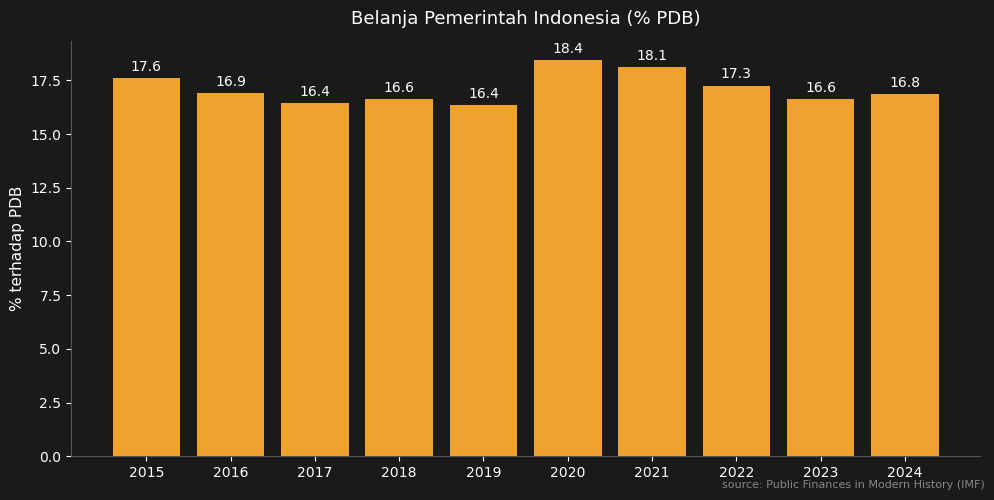

Saya bersama [Rizki Siregar](https://scholar.google.com/citations?user=RxSIqXMAAAAJ) dan [Riandy Laksono](https://scholar.google.com/citations?user=kPH8hCQAAAAJ) baru saja menerbitkan [Survey of Recent Developments](https://doi.org/10.1080/00074918.2025.2588819) di jurnal Bulletin of Indonesian Economic Studies (BIES). Di paper tersebut, kami menggambarkan situasi ekonomi Indonesia yang cukup pesimistis, terutama dari sisi fiskal.

Sayangnya, karena keterbatasan *word count*, ada beberapa grafik yang tidak bisa kami masukkan ke dalam paper. Post ini saya tulis untuk melengkapi narasi di paper kami dengan visualisasi tambahan. Datanya dari database [Public Finances in Modern History](https://www.imf.org/external/datamapper/datasets/FPP) milik IMF.

## Belanja pemerintah: kembali "normal"?

Sekilas, belanja pemerintah Indonesia (*government expenditure*) terlihat kembali ke level sebelum pandemi. Waktu COVID, belanja sempat melonjak. Wajar, karena kita butuh stimulus. Tapi makin ke belakang makin kembali ke normal.

    

    

## Tapi belanja yang "sesungguhnya" justru turun

Kalau kita lihat lebih dalam, situasinya bisa jadi agak lebih buruk. Belanja pemerintah terdiri dari dua komponen: belanja primer (*primary expenditure*, belanja pemeliharan dan untuk program-program pemerintah), dan pembayaran bunga utang (*interest payment*).

Tentu saja belanja yang dirasakan oleh ekonomi adalah utamanya yang primer. Tentu belanja bunga utang juga berasa, karena bunganya dibayarkan ke pengutang juga yang mana banyak penduduk Indonesia juga sebenernya. Tapi ada juga porsi yang ke BI dan asing. Jika porsi pembayaran bunga utang semakin besar, maka belanja primer yang notabene lebih berasa buat muter ekonomi justru mengalami tren penurunan. Ini artinya, meski total belanja terlihat stabil, ruang fiskal untuk program pembangunan, infrastruktur, dan perlindungan sosial semakin sempit.

    

    

## Masalah di sisi penerimaan

Masalah fiskal Indonesia bukan hanya soal belanja yang tergerus bunga utang, tapi juga soal penerimaan yang memang rendah. Di paper kami, ini adalah salah satu poin utama yang kami soroti.

Penerimaan pemerintah Indonesia secara konsisten berada di level yang rendah — bahkan sebelum pandemi. Grafik di bawah menunjukkan tren total penerimaan pemerintah (*government revenue*) sebagai persentase PDB.

    

    

Masalah penerimaan ini bukan rahasia. World Bank sendiri dalam laporan [Indonesia Economic Prospects edisi Desember 2024](https://www.worldbank.org/en/country/indonesia/publication/indonesia-economic-prospect) yang bertajuk "Funding Indonesia's Vision 2045" menyoroti rendahnya *tax ratio* Indonesia. Menurut World Bank, *tax ratio* Indonesia diproyeksikan hanya akan berada di kisaran 10% hingga 2027 — jauh di bawah rata-rata negara berpendapatan menengah. Bahkan, [studi terbaru World Bank](https://documents.worldbank.org/en/publication/documents-reports/documentdetail/099030225225027356) menemukan bahwa *tax gap* Indonesia rata-rata mencapai 6,4% dari PDB antara 2016-2021, sebagian besar berasal dari PPN dan PPh Badan.

## Bagaimana dibandingkan negara lain?

Masalah penerimaan Indonesia menjadi semakin jelas ketika kita bandingkan dengan negara-negara G20 dan ASEAN lainnya. Grafik di bawah menunjukkan total penerimaan pemerintah (*government revenue*) sebagai persentase PDB, dan Indonesia berada di posisi terbawah diantara negara-negara G20 dan Asia Tenggara.

    

    

## Penutup: konsolidasi fiskal dan kapabilitas pajak

Di paper kami, kami merekomendasikan dua hal. Pertama, **konsolidasi fiskal** tetap penting. Pemerintah harus sangat selektif terhadap program-program yang akan dilakukan, terutama yang skalanya terlalu besar dan regresif.

Kedua, dan ini yang lebih fundamental: Indonesia harus serius meningkatkan **kapabilitas pengumpulan pajak**. Dengan *tax ratio* yang masih berkutat di 10%, Indonesia tidak punya cukup ruang untuk mendanai program-program pembangunan yang ambisius — apalagi Visi 2045. Tanpa reformasi pajak yang substantif — mulai dari perluasan basis pajak, peningkatan kepatuhan, hingga pengurangan insentif yang tidak efektif — ruang fiskal akan terus menyempit, dan kualitas belanja pemerintah akan terus tergerus.

Paper lengkap kami bisa diakses di [sini](https://doi.org/10.1080/00074918.2025.2588819).
