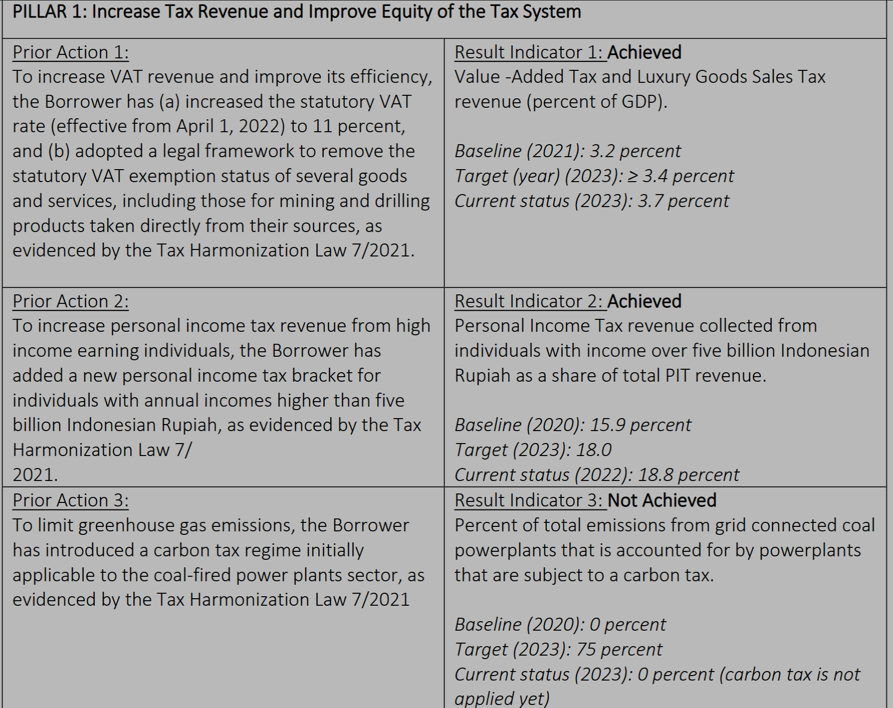

Saya belum lama ini menyelesaikan draft press release dari Center for Indonesian Policy Studies (CIPS) tentang Pajak Pertambahan Nilai (PPN) yang secara umum batal naik ke 12%. Konten _press release_ tersebut dapat dilihat di media, salah satunya adalah [Liputan 6](https://www.liputan6.com/bisnis/read/5864084/dongkrak-penerimaan-negara-ekonom-usul-menambah-jumlah-pkp?page=2). Tulisan di blog ini bermaksud mengelaborasi beberapa poin yang saya sampaikan pada siaran pers tersebut.

## PPN per PDB

Pertama adalah soal klaim saya bahwa peningkatan PPN dari 10% ke 11% pada April 2022 secara garis besar tidaklah signifikan mempengaruhi penambahan penerimaan PPN. Saya menghitung berapa besar secara persentase penerimaan PPN dan PPNBM terhadap PDB nominal Indonesia. Data PPN+PPNBM dan PDB nominal dapat diunduh di [situs BPS](https://www.bps.go.id/id/statistics-table/2/MTA3MCMy/realisasi-pendapatan-negara--milyar-rupiah-.html).

Datanya kurang lebih bentuknya seperti di bawah ini


```python
import pandas as pd

## Membuat dataframe ppn dan PDB nominal dari BPS
df = pd.DataFrame({'tahun': pd.Series(range(2016,2025)),
        'ppn': [412213,480724,537267,531577,450328,551900,687609,742264,811365],
        'pdbn':[12401728,13589825,14838756,15832657,15443353,16976751,19588089,20892376,22084570]})
## Membuat rasio (ppn+ppnbm)/pdbnominal x 100%
df['rasio']=df['ppn']/df['pdbn']*100
df

```


<div>
<style scoped>
    .dataframe tbody tr th:only-of-type {
        vertical-align: middle;
    }

    .dataframe tbody tr th {
        vertical-align: top;
    }

    .dataframe thead th {
        text-align: right;
    }
</style>
<table border="1" class="dataframe">
  <thead>
    <tr style="text-align: right;">
      <th></th>
      <th>tahun</th>
      <th>ppn</th>
      <th>pdbn</th>
      <th>rasio</th>
    </tr>
  </thead>
  <tbody>
    <tr>
      <th>0</th>
      <td>2016</td>
      <td>412213</td>
      <td>12401728</td>
      <td>3.323835</td>
    </tr>
    <tr>
      <th>1</th>
      <td>2017</td>
      <td>480724</td>
      <td>13589825</td>
      <td>3.537382</td>
    </tr>
    <tr>
      <th>2</th>
      <td>2018</td>
      <td>537267</td>
      <td>14838756</td>
      <td>3.620701</td>
    </tr>
    <tr>
      <th>3</th>
      <td>2019</td>
      <td>531577</td>
      <td>15832657</td>
      <td>3.357472</td>
    </tr>
    <tr>
      <th>4</th>
      <td>2020</td>
      <td>450328</td>
      <td>15443353</td>
      <td>2.915999</td>
    </tr>
    <tr>
      <th>5</th>
      <td>2021</td>
      <td>551900</td>
      <td>16976751</td>
      <td>3.250917</td>
    </tr>
    <tr>
      <th>6</th>
      <td>2022</td>
      <td>687609</td>
      <td>19588089</td>
      <td>3.510342</td>
    </tr>
    <tr>
      <th>7</th>
      <td>2023</td>
      <td>742264</td>
      <td>20892376</td>
      <td>3.552798</td>
    </tr>
    <tr>
      <th>8</th>
      <td>2024</td>
      <td>811365</td>
      <td>22084570</td>
      <td>3.673900</td>
    </tr>
  </tbody>
</table>
</div>


Jangan lupa bahwa tahun 2020 ada COVID, tahun 2021 recovery, lalu tahun 2022 adalah tahun kenaikan PPN dari 10% ke 11%. `ppn` itu adalah angka PPN+PPNBM dari BPS, sementara `pdbn` adalah PDB nominal. PDB nominal di tahun 2024 adalah perkiraan berdasarkan pertumbuhan PDB nominal tahun sebelumnya, tapi PPN di 2024 sudah fix karena angkanya udah ada di BPS. Angka PDB nominal 2024 sayangnya belum ada di BPS.

Dapat kita lihat bahwa rasio PPN+PPNBM per PDB nominal di 2022 dan 2023 meningkat dibandingkan 2021, sekitar 0.3 percentage points. Tapi jangan lupa bahwa angka ini cukup normal karena di 2017 dan 2018 juga sekitar segitu. 2020 dan 2021 masih bisa kita anggap COVID lah mungkin. yang jelas, peningkatan di 2022 dan 2023 nggak begitu clear.

Tapi let's say kita anggap peningkatan 0.3 percentage points itu beneran berkat naiknya PPN ya. PPN naik dari 10% ke 11%, atau 1 percentage points, berarti naiknya 10% (dari 10% ke 11% berarti naik 1/10). Sementara itu, kenaikan 10% dari 3.25% = 0.32 percentage points, yaaa mirip lah ya sama kenaikan PPN-nya. 

Meski begitu, gw rasa ini gak bisa dibilang konklusif, mengingat ya tadi, 2021 masih recover, dan kita pernah 3.6% PPN+PPNBM per PDB nominal di 2018, padahal waktu itu PPN kan masih 10%. Makanya gue bilang di _press release_ bahwa kenaikannya nggak efektif. Masih di dalam batas 1 standar deviasi, bahkan ketika kita hitung COVID.

Yang lebih penting, recovery Indonesia di 2022 tidak setinggi negara lain, padahal 2022 itu kita lagi mengalami ledakan harga komoditas. Ini mungkin sih bukan gara-gara PPN saja sih, jadi ya masih jauh dari konklusif.

<iframe src="https://data.worldbank.org/share/widget?end=2023&indicators=NY.GDP.MKTP.KD.ZG&locations=ID-MY-PH-VN&start=2016" width='450' height='300' frameBorder='0' scrolling="no" ></iframe>

Tapi sepertinya bagi World Bnak, kenaikan PPN ini sebenernya sudah cukup _justifiable_.

## Bantuan The World Bank
Yes, sebenernya rencana untuk memperbaiki penerimaan dan belanja negara sudah lama digaungkan Bu Sri Mulyani, tepatnya sejak 2019. Hal ini disampaikan di [siaran pers World Bank ini (2022)](https://www.worldbank.org/en/news/press-release/2022/06/24/new-support-will-help-strengthen-indonesia-tax-system-improve-development-spending). Siaran pers ini menyatakan support dari Bank Dunia terhadap program untuk memperbaiki penerimaan dan belanja negara. Support tersebut diwujudkan oleh Bank Dunia dalam bentuk pinjaman lunak \$750 juta untuk membantu pemerintah Indonesia mewujudkan penerimaan yang lebih tinggi, adil dan berkelanjutan, serta memperkuat efisiensi belanja negara. Nama programnya adalah "Indonesia Fiscal Reform Development Policy Loan" dan detailnya bisa baca di [sini](https://projects.worldbank.org/en/projects-operations/project-detail/P177726)

<blockquote class="twitter-tweet"><p lang="in" dir="ltr">Salah satu area fokus dalam kemitraan Bank Dunia dan Indonesia 2021-2025: memperkuat daya saing dan ketahanan ekonomi melalui pengumpulan pajak yang lebih baik dan belanja anggaran pemerintah yang lebih efektif.<br><br>Selengkapnya 👉<a href="https://t.co/Q9zsdxx6Zj">https://t.co/Q9zsdxx6Zj</a> <a href="https://t.co/R6xb06d1Lh">pic.twitter.com/R6xb06d1Lh</a></p>&mdash; World Bank Indonesia (@BankDunia) <a href="https://twitter.com/BankDunia/status/1399614261291368452?ref_src=twsrc%5Etfw">June 1, 2021</a></blockquote> <script async src="https://platform.twitter.com/widgets.js" charset="utf-8"></script> 

Bantuan bernilai fantastis itu mendorong 2 pilar, yaitu pilar penerimaan negara dan pilar belanja negara. Hasil reviewnya ([Report nomor ICRR0024178](https://documents1.worldbank.org/curated/en/099063024233521168/pdf/BOSIB1d7b7faba0131a0c91c259cca12295.pdf)) untuk pilar penerimaan negara lebih kurang tergambar di tabel di bawah ini.



Di 2023, rasio PPN/PDB menurut World Bank adalah 3.7%, lebih tinggi daripada hitungan saya, dan angka ini ada di atas target mereka yaitu 3.4%. Jadi meski angka saya lebih kecil, dia tetap ada di atas target World Bank, yang mana bisa dibilang kenaikan PPN dan penghilangan _exemption_ untuk produk minerba, sudah cukup berhasil menaikkan PPN.

Di samping kenaikan PPN, World Bank juga berhasil membantu Kemenkeu menaikkan PPh orang karena menciptakan _brackett_ baru sembari menaikkan _threshold_ PPh paling bawah, yang berarti lebih progresif. Sayangnya, World Bank gagal membantu Kemenkeu mewujudkan pajak karbon. Berhasil 2 dari 3 sih lumayan banget ya.

Nah yg saya belum clear adalah apakah \$750 juta nya cuma sampai sini atau ada kegiatan lanjutan lagi. Buat yang tertarik menggali lebih dalam, coba aja baca-baca dokumen dari World Bank yang link-nya dah saya taruh. Bagus kok World Bank, lumayan transparan.

Dah mungkin begitu aja detil yang mau saya share di tulisan ini. Semoga bermanfaat.


