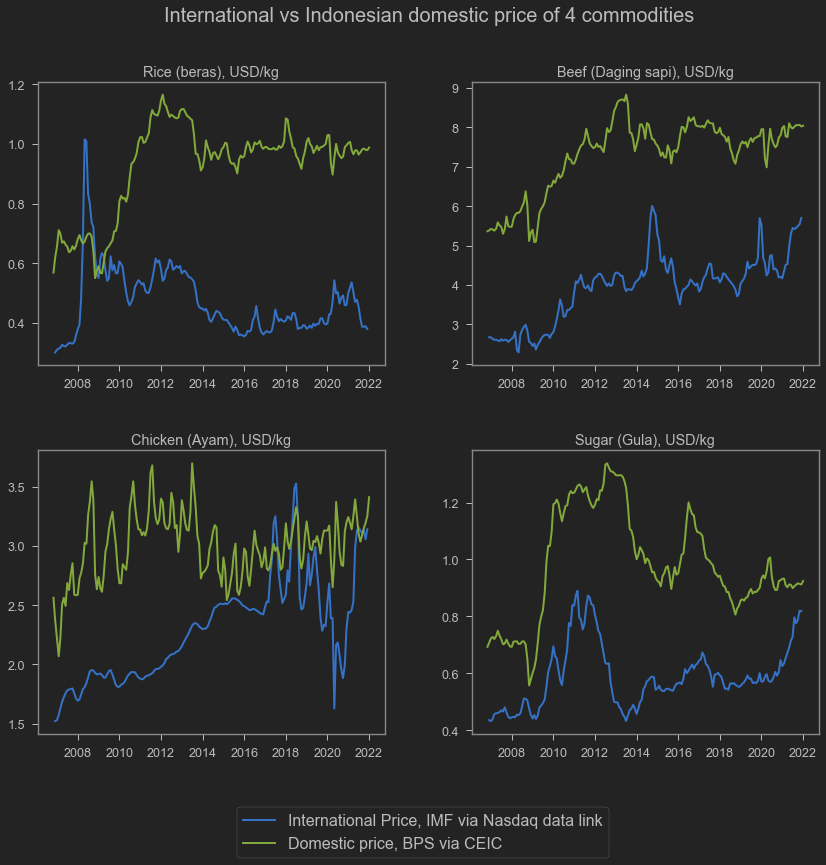

Apakah naiknya harga komoditas internasional akan berpengaruh besar pada harga sembako? Bisa jadi ya. Di acara ig live dengan merdeka beberapa waktu lalu, saya sempat menjelaskan bahwa kenaikan harga beberapa sembako kemungkinan akan cukup stabil. Hal ini akibat kebijakan quota impor yang diterapkan oleh Kementerian perdagangan.

Beberapa komoditas sembako dikenakan kuota impor demi menjaga nilai tukar petani dan juga menjaga volatilitas harga. Jadi kita tidak bisa semena-mena mengimpor. Jumlah impornya dibatasi. Ketika suplai domestik dirasa cukup, maka keran impor akan ditutup. Namun ketika harga mulai dirasa terlalu tinggi, maka keran impor dibuka.

Kuota impor mengakibatkan harga domestik selalu lebih tinggi daripada harga internasional secara konstan. Ketika harga domestik dirasa terlalu tinggi (mungkin ada gagal panen atau semacamnya), maka kuota impor segera dibuka supaya kenaikan harga dapat dibatasi. Selama harga internasional selalu lebih rendah daripada harga domestik, maka jurus ini akan selalu bisa dilakukan.

Akan tetapi, jika harga pangan dunia naik terlalu tinggi melebihi harga domestik, maka meskipun kuota impor dibuka sebebas-bebasnya, maka harga tidak akan turun. Jadi, jika harga domestik naik, kita tinggal buka keran impor. Selama harga internasional selalu lebih rendah daripada harga domestik, maka cara ini akan bisa mengendalikan inflasi.

Problemnya tentu saja ketika harga internasional naik lebih tinggi daripada harga domestik. Maka dibuka impor selebar apapun tetap tidak akan ngaruh ke harga.

Di bawah ini saya perlihatkan data harga internasional vs harga domestik dari 4 komoditas yang saya berhasil temukan, yaitu beras, ayam, daging sapi dan gula. keempatnya diatur perdagangannya dengan kuota.

```python
## Download international prices from Nasdaq Data Link (previously quandl)
rice = quandl.get("ODA/PRICENPQ_USD", paginate=True, start_date="2006-11-30")
chicken = quandl.get("ODA/PPOULT_USD", paginate=True, start_date="2006-11-30")
beef = quandl.get("ODA/PBEEF_USD", paginate=True, start_date="2006-11-30")
sugar = quandl.get("ODA/PSUGAUSA_USD", paginate=True, start_date="2006-11-30")
## Just remembering definitions from quandl
legends=[
    'Rice; 5 percent broken milled white rice; Thailand nominal price quote; US$ per metric ton',
    'Poultry (chicken); Whole bird spot price; Ready-to-cook; whole; iced; Georgia docks; US cents per pound',
    'Beef; Australian and New Zealand 85% lean fores; CIF U.S. import price; US cents per pound',
    'Sugar; U.S. import price; contract no.14 nearest futures position; US cents per pound (Footnote: No. 14 revised to No. 16)'
]
```

```python
### Turns everything to USD/kg
rice['USD']=rice['Value']/1000
chicken['USD']=chicken['Value']/100*2.20462
beef['USD']=beef['Value']/100*2.20462
sugar['USD']=sugar['Value']/100*2.20462
```

```python
## Download domestic prices from CEIC. I have the file in my local computer
sembako=pd.read_excel('harga_sembako.xlsx',index_col='Date')
```

```python
## Plotting
fig, axs = plt.subplots(figsize=(14,12),ncols=2,nrows=2)
fig.subplots_adjust(hspace=0.3, wspace=.25)
sns.lineplot(data=rice,x='Date',y='USD', 
             linewidth=2, ax=axs[0,0],legend=True)
sns.lineplot(data=beef,x='Date',y='USD',
             linewidth=2, ax=axs[0,1],legend=True)
sns.lineplot(data=chicken,x='Date',y='USD',
             linewidth=2, ax=axs[1,0],legend=True)
sns.lineplot(data=sugar,x='Date',y='USD',
             linewidth=2, ax=axs[1,1],legend=True)
sns.lineplot(data=sembako,x='Date',y='rice',
             linewidth=2, ax=axs[0,0],legend=True)
sns.lineplot(data=sembako,x='Date',y='beef',
             linewidth=2, ax=axs[0,1],legend=True)
sns.lineplot(data=sembako,x='Date',y='chicken',
             linewidth=2, ax=axs[1,0],legend=True)
sns.lineplot(data=sembako,x='Date',y='sugar',
             linewidth=2, ax=axs[1,1],legend=True)
axs[0,0].set_title('Rice (beras), USD/kg')
axs[0,0].set_ylabel('')
axs[0,0].set_xlabel('')
axs[0,1].set_title('Beef (Daging sapi), USD/kg')
axs[0,1].set_ylabel('')
axs[0,1].set_xlabel('')
axs[1,0].set_title('Chicken (Ayam), USD/kg')
axs[1,0].set_ylabel('')
axs[1,0].set_xlabel('')
axs[1,1].set_title('Sugar (Gula), USD/kg')
axs[1,1].set_ylabel('')
axs[1,1].set_xlabel('')
fig.text(x=0.25, y=0.95, s='International vs Indonesian domestic price of 4 commodities', fontsize=20)
fig.legend(bbox_to_anchor=(0.7,0.05),labels=['International Price, IMF via Nasdaq data link','Domestic price, BPS via CEIC'],fontsize=16)
```


    <matplotlib.legend.Legend at 0x1a7ebe45a00>


    

    


Bisa kita lihat bahwa harga internasional selalu lebih rendah daripada harga domestik. Kita juga bisa lihat bahwa harga internasional cenderung menanjak selama pandemi, tetapi harga domestik relatif stabil. Hal ini karena pemerintah tinggal naikin kuota aja jika harga domestik mulai naik. Semakin tipis gap antara harga domestik dengan harga internasional, maka semakin besar kuota yang dibuka.

**Ayam** agak berbeda ya. Harga domestik udah mirip sama harga internasional sejak 2014. Kenapa ya? Mungkin ini fenomena Amerika Serikat aja sih karena data IMF ngambil spot price-nya Georgia, Amerika Serikat. Ayam Indonesia kayaknya ga ngambil dari situ.

Harga-harga domestik diambil dari CEIC yang ngambil dari BPS. Kalo harga internasional dari IMF Cross Country Macroeconomic Statistics, di mana:

1. Beras: Rice; 5 percent broken milled white rice; Thailand nominal price quote; US$ per metric ton
1. Ayam: Poultry (chicken); Whole bird spot price; Ready-to-cook; whole; iced; Georgia docks; US cents per pound
1. Daging Sapi: Beef; Australian and New Zealand 85\% lean fores; CIF U.S. import price; US cents per pound
1. Gula: Sugar; U.S. import price; contract no.14 nearest futures position; US cents per pound (Footnote: No. 14 revised to No. 16)

Sekian postingan kali ini. Semoga bermanfaat.
