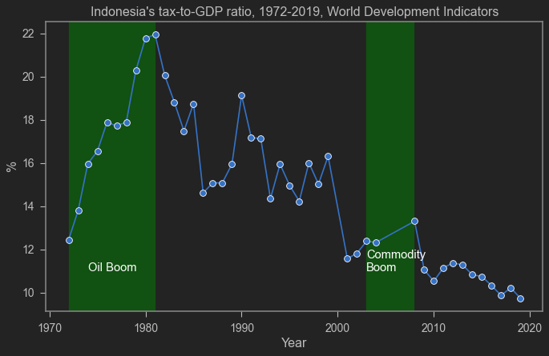

A couple of days ago, I was forwarded a [news](https://asia.nikkei.com/Spotlight/Asia-Insight/Indonesia-s-drive-to-lift-resource-curse-shakes-global-producers) from Asia Nikkei by my colleague, Deasy Pane. The news is about Indonesia's plan to ban exports of raw minerals (the likes of bauxite, tin, gold and copper) in the middle of 2023. This is not very surprising, knowing that nickel ore exports was banned in the start of 2020, with Indonesian President is willing to ["fight in any way"](https://www.thejakartapost.com/business/2021/11/18/jokowi-vows-to-fight-in-any-way-eu-lawsuit-over-nickel-export-ban.html) of possible WTO complaint. Based on the strong [export performance of nickel's downstream industries](), it is safe to say that the Indonesian President surely will expand the export ban.

What surprised me with the Asia Nikkei news, however, is the quote from Sri Mulyani Indrawati, the Indonesian Finance Minister.

> It is not nationalism. We are the biggest economy in ASEAN, and you cannot allow this economy to just depend on commodities without value added

As a former World Bank managing director as well as highly regarded economist in Indonesia, it is quite shocking that she believed an export ban on mineral is the most efficient way to improve value added.

## Tax Ratio?

This talk about increasing value added from commodities is interesting. Deasy suspect that the frustration comes from the fact that the Indonesian Government gets very little benefit from the exported minerals. This is unlike the oil boom in the 70s where Indonesia were able to finance its many programmes (like education, health, and Import Substitution Strategy (ISS)) mainly from exporting oil. Obviously that gets me thinking, as a person who also oversee Indonesia's taxation office, could it be the case that the Finance Minister feel that the same? That today's commodity boom doesn't improve Government revenue? It is true that the Finance Minister has been stating the needs to increase revenue for some time. Prolly her overseer asked too many super important program while she needs to keep the fiscal rule in check. Make sense.

I use World Development Indicators (WDI) to check this out. Thankfully it has option to embed the graph so readers can consult to the graph below.

<iframe src="https://data.worldbank.org/share/widget?indicators=GC.TAX.TOTL.GD.ZS&locations=ID" width='450' height='300' frameBorder='0' scrolling="no" ></iframe>

As you can see, unfortunately, the WDI's data has holes and I am too lazy to look at MoF's website to complete it. Sorry lol.

Anyway, to emphasize my point about the oil boom and the commodity boom, I downloaded the data and adds some shades which show the two booms.

```python
import wbdata as wb
import datetime
```

```python
## Downloading data from World Development Indicators
tanggal=(datetime.datetime(1960,1,1), datetime.datetime(2020,1,1))
a=wb.get_dataframe({"GC.TAX.TOTL.GD.ZS" : "TAX"}, country=["IDN"], data_date=tanggal, convert_date=True, keep_levels=True)
a=a.reset_index()
```

```python
## Plotting
plt.figure(figsize=(10,6),dpi=80)
sns.lineplot(data=a,x='date',y='TAX',marker="o")
plt.axvspan(datetime.datetime(1972,1,1), datetime.datetime(1981,1,1),alpha=.5,color='green')
plt.axvspan(datetime.datetime(2003,1,1), datetime.datetime(2008,1,1),alpha=.5,color='green')
plt.annotate('Commodity\nBoom', xy=(datetime.datetime(2003,1,1),11), xytext=(datetime.datetime(2003,1,1),11),color='white')
plt.annotate('Oil Boom', xy=(datetime.datetime(1974,1,1),11), xytext=(datetime.datetime(1974,1,1),11),color='white')
plt.title("Indonesia's tax-to-GDP ratio, 1972-2019, World Development Indicators")
plt.xlabel('Year')
plt.ylabel('%')
```


    Text(0, 0.5, '%')


    

    


The oil boom shade range from 1972 to 1981, while the commodity boom shade is 2003-2008. Obviously, Indonesia's tax ratio since the Asian Financial Crisis is significantly lower. However, as you can see that the tax ratio keeps declining since the Global Financial Crisis in 2008 and the [taper tantrum](https://doi.org/10.1080/00074918.2017.1392922) episode in 2013.

But the picture is clear. When the oil boom started, Indonesia's tax-to-GDP ratio climbed significantly. The same cannot be said on the Commodity Boom. If you are the person overseeing the taxation office, I think it kinda makes sense to think that the raw material exports contribute very little to Indonesia's welfare.

## Caveats and conclusion

This graph, of course, simplify a lot of things. Indonesia's oil company was (still is) a monoply, unlike mining and palm oil where private players are abundant (by private of course including individuals with strong political connection). SOEs revenue might also not included in the World Bank's tax ratio calculation, but that emphasize an even stronger point on raw materials contribution to the general government revenue.

Surely there are more things to consider if one wants to take a deeper look in this issue (ie., raw material exports to the country's welfare). But at least one thing is clear. Indonesia is ridden with many problems within its ease of doing business from red tapes, corruption, inconsistent rule of law, etc. In fact, [nickel mining](https://majalah.tempo.co/read/investigasi/165149/suap-dan-permainan-izin-pertambangan-nikel-sulawesi) is ridden with this problem as well. Fixing these stuff will surely help Indonesia's investment climate much more efficiently than any kind of restrictive trade policy. The fact that Sri Mulyani agrees with export ban as a tool to attract foreign investment and improve value added suggests that even her does not know how to fix those other problems.

If the best finance minister in the world can't save us all, then who can? Certainly not me and you. Lol.
