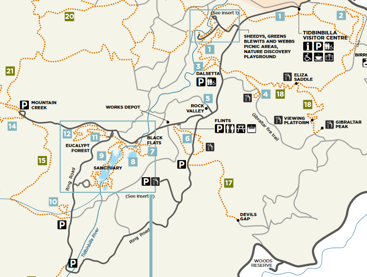
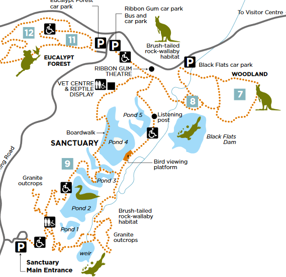
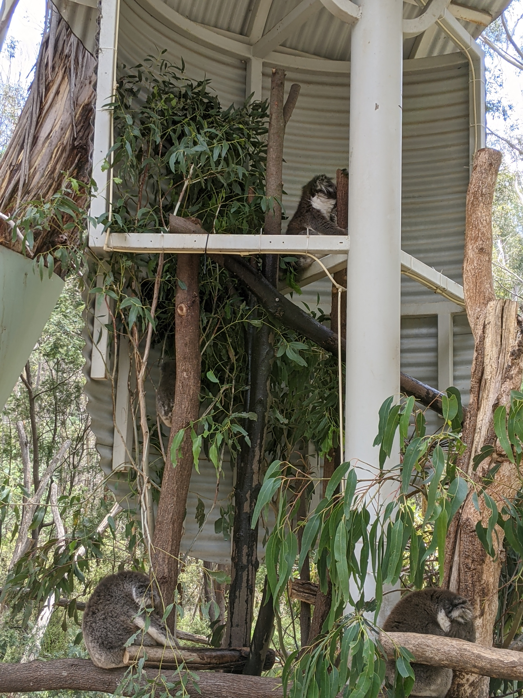
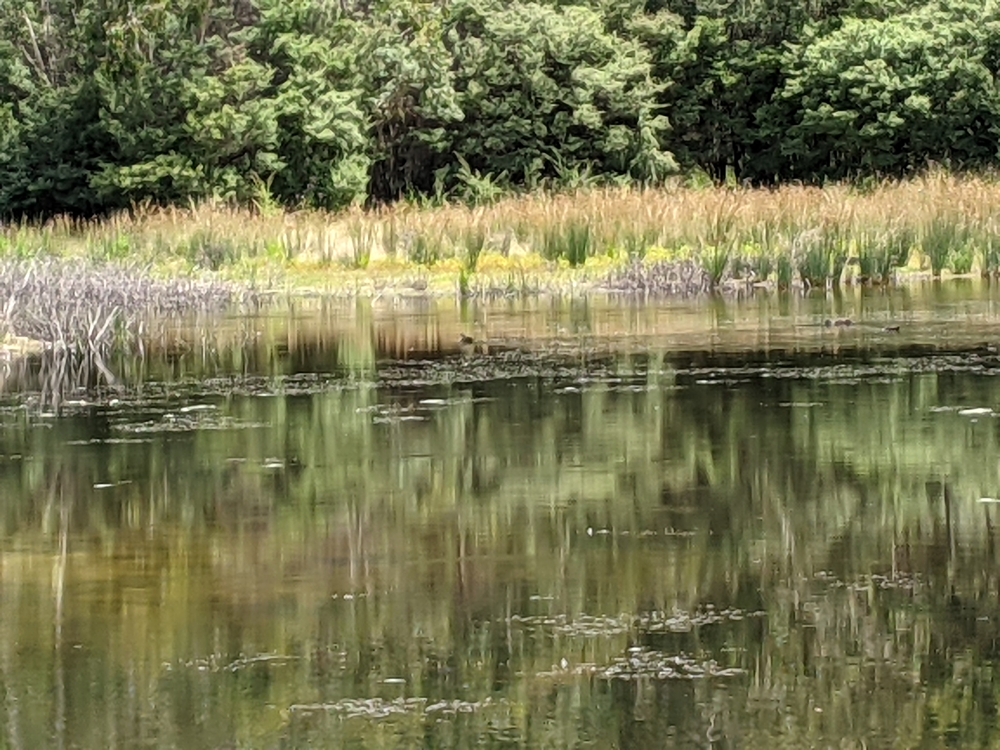

Saya kurang suka jalan-jalan, apalagi yang jauh-jauh. Tapi sepertinya kesempatan kali ini agak sayang untuk dilewatkan karena Tidbinbilla lagi ada promo gratis masuk sampai tahun baru.

[Tidbinbilla](https://www.tidbinbilla.act.gov.au/) adalah semacam cagar alam di kawasan Canberra, ibu kota Australia. Dia lokasinya di agak gunung gitu. Kalau dari kota, nyetir dulu sekitar 40an menit. Di sana, kita bisa lihat berbagai vegetasi khas Australia seperti hutan _eucalyptus_. Di sini juga banyak hewan-hewan khas Australia seperti Kangguru, Wallabies, Koala, Platypus, dan berbagai jenis burung, serangga dan reptil. Tidbinbilla cocok banget buat orang yang seneng jalan-jalan di alam gitu. Banyak _walking trail_ dari yang mudah, beraspal, cuma 1-2 km-an, sampe yang sulit, nanjak dan berbatu-batu.

Tidbinbilla ini luas banget! Kalau mau menjelajah semuanya, harus seharian ada di sini kayaknya. Sebelum datang ke sini, sebaiknya memang baca-baca dulu mau ke mana aja. Lihat petanya dan jalur-jalurnya. Sama lah kayak merencanakan jalan-jalan pada umumnya. Kalau mau lihat peta fullnya, lihat [di sini](https://www.tidbinbilla.act.gov.au/__data/assets/pdf_file/0005/572288/Tidbinbilla-Map-and-Guide.pdf).

Saya dan istri hanya pergi ke daerah hutan eukaliptus dan tempat yang namanya Sanctuary. Walking trail-nya gampang.

Pertama mampir dulu di visitor center (kanan atas kalo di peta). Di sini bisa nanya-nanya Ranger-nya soal kondisi di Tidbinbilla, hewan apa yang lagi aktif, mana yg lagi ngumpet, lagi musim apa dll. Beli kopi sama suvenir juga bisa di sini. Dari visitor center juga ada beberapa walking trail yang lucu dan gampang. Kalo walking trail yang di visitor center, kita bisa lihat emu (semacem burung unta gitu) dan kangguru.

Kebetulan kami lihat dua-duanya!

Lucu ya! Asal jangan deket-deket wkkw. Ini aslinya video, kubikin gif pake [ezgif](https://ezgif.com/video-to-gif). Paling atas kalo search "make a gif from video" di google.

Nah, dari visitor center, pergi ke tempat namanya sanctuary. Gede banget sih ni tempat. Ga bisa pergi ke semuanya. Harus pilih-pilih.

Pertama ke [hutan eukaliptus](https://www.tidbinbilla.act.gov.au/do/the-eucalypt-forest) dulu. Di pintu masuk langsung dikasi liat penangkaran koala. Jadi koala masi kecil dibesarin di sini.

Kami ambil jalur yang namanya Koala Path. Cuma sekitar 500m aja. Baunya minyak kayu putih banget!

Berikutnya kami pergi ke Sanctuary. Tempatnya keren banget. Di sini katanya ada Wallabies (semacem kangguru juga tapi kecil) dan platypus. Sayangnya kagak keliatan Wallabies dan platypusnya 😢

Tracknya lumayan dan dapat banyak foto-foto bagus. Udaranya juga seger banget. Overall, tripnya asik deh. Sayangnya ga dapet liat Platypus. Kalo kata Ranger-nya, Platypus (dan hewan lain pada umumnya) lebih suka muncul pagi-pagi banget atau sore-sore banget. Kata webnya, Platypus pada nongol di musim semi, bulan-bulan Agustus gitu. Sepertinya harus ke sini lagi di musim yang berbeda biar bisa liat Platypus. wkwkkw