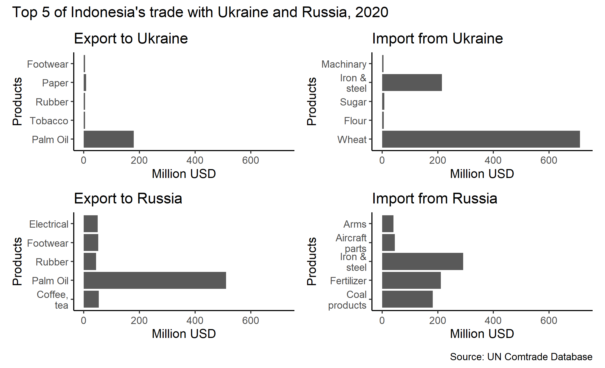
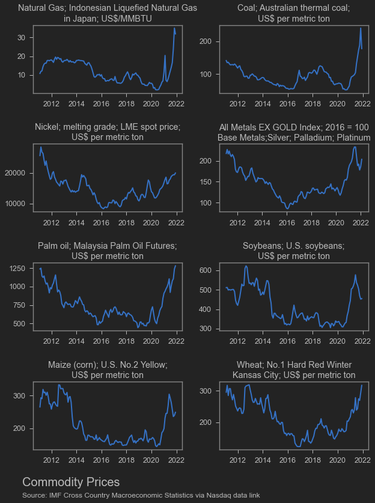

Pada tanggal 24 Februari 2021, Rusia tiba-tiba menyerang Ukraina. Sebenernya ga bisa dibilang tiba-tiba juga sih soalnya sepertinya [intelijen Amerika Serikat](https://www.bbc.com/news/world-europe-60355295) udah tau Rusia bakal nyerang Ukraina dalam waktu dekat. Saat blog ini ditulis, perang masih berjalan. Pihak Rusia menyerang dari [3 arah](https://www.aljazeera.com/news/2022/2/28/us-announces-plan-to-expel-russian-diplomats-from-un-liveblog), dan sisi laut hitam dari Ukraina sudah hampir sepenuhnya dikuasai Rusia.

Sementara itu, Rusia mendapatkan sanksi dari negara-negara barat yang membuat Rusia kesulitan untuk berdagang dengan dunia luar. Hal ini membuat nilai mata uang Rusia, Ruble, [jatuh](https://www.aljazeera.com/news/2022/2/28/us-announces-plan-to-expel-russian-diplomats-from-un-liveblog) cukup dalam dan memaksa bank sentral Rusia untuk menaikkan tingkat suku bunga dari 9.5% ke 20% hanya dalam sehari.

Bagaimana dampak dari hal ini ke ekonomi Indonesia?

## Dampak dari perdagangan

Indonesia memiliki hubungan dagang yang cukup jauh dengan Ukraina dan Rusia. Total [impor](https://nasional.kontan.co.id/news/mengukur-efek-perang-rusia-ukraina-terhadap-ekonomi-indonesia) kedua negara hanya sekitar 1% dari total impor Indonesia, sementara [investasi](https://ekonomi.bisnis.com/read/20220225/9/1504814/daftar-investasi-rusia-di-indonesia-terpengaruh-konflik-dengan-ukraina) Rusia maupun Ukraina ke Indonesia juga jauh dari signifikan.

Meski demikian, keduanya merupakan sumber utama beberapa barang impor. Ukraina memasok sekitar lebih kurang 24% dari total impor gandum Indonesia pada tahun 2020. Sementara itu, pupuk impor asal Rusia menyumbang sekitar 15% dari total pupuk impor Indonesia. Rusia adalah negara utama pemasok persenjataan ke Indonesia. Sementara itu, meski keduanya banyak membeli produk minyak nabati Indonesia (sawit lah intinya), tapi transaksi keduanya hanya sekitar 0,5% dari total ekspor sawit Indonesia pada tahun 2020.

Artinya, jika Indonesia tidak berhasil mencari sumber pemasok gandum lain, maka ada kemungkinan harga bahan pangan yang bersumber dari gandum akan mengalami kenaikan. Gandum sebagian besar digunakan untuk penggilingan tepung terigu yang tidak hanya dipakai oleh konsumen, tapi juga produsen mie instan, pasta, roti, hingga kue-kue dan jajanan pasar. Padahal, tanpa perang inipun, harga gandum dunia sedang naik-naiknya karena _bottleneck_ supply akibat [masalah cuaca](https://www.marketwatch.com/story/why-prices-for-wheat-have-climbed-to-their-highest-level-since-2012-11636653340).

Untuk gandum, sepertinya di 2021 kontribusi Ukraina sudah berkurang jadi sekitar 10%.

<blockquote class="twitter-tweet">
I also tried looking at the 2021 data (from BPS), apparently the Ukrainian share in 2021 for wheat is lower, at around ~10%, mainly due to stronger production from AUS
&mdash; Faris Abdurrachman (@faris_sina) <a href="https://twitter.com/faris_sina/status/1497859814327996419?ref_src=twsrc%5Etfw">February 27, 2022</a></blockquote>  

Tidak hanya gandum, komoditas pertanian sepertinya akan naik makin tinggi. Terganggunya pasokan pupuk dunia berpotensi menaikkan harga pupuk yang sudah mahal gara-gara [harga gas](https://www.spglobal.com/commodity-insights/en/market-insights/blogs/agriculture/011922-fertilizer-costs-natural-gas-prices) dan [larangan ekspor pupuk](https://www.reuters.com/article/us-china-exports-fertilisers-idUSKBN2F007W) oleh China. Kita sudah melihat tingginya harga-harga komoditas seperti jagung dan kedelai yang naik dengan cepat. Kekurangan pupuk akan membuat kenaikan ini lebih cepat lagi.

Terkait harga gas, Rusia sebagai pemasok gas dan minyak nomor 3 dunia memiliki peranan yang sangat penting. Perang dan sanksi ini akan mengakibatkan Rusia kesulitan untuk menjual minyak, gas dan batubara ke dunia internasional, apalagi jika Amerika Serikat gagal membujuk negara-negara OPEC untuk menaikkan produksi. Di samping itu, Harga gas memang lagi naik-naiknya.

<!-- Crude Price Script - OILCRUDEPRICE.COM -->

<a href="https://www.oilcrudeprice.com/" style="font-size:20px; color:#FFFFFF;text-decoration:none;" rel="nofollow">WTI Crude Price</a>

<!-- End of Crude Price Script -->

Invasi Rusia ke Ukraina juga diramalkan akan mengganggu jalur perkapalan di laut mati serta pengubahan rute penerbangan. Akibatnya, logistik negara-negara sekitar sana, terutama pemasok gandum dan pemasok minyak, akan terganggu. Di samping itu, Indonesia yang sedang gencar-gencarnya membuka Bali untuk wisatawan [tanpa karantina](https://travel.tempo.co/read/1565796/bali-jadi-lokasi-uji-coba-kedatangan-wisatawan-asing-tanpa-karantina) tentu bisa terpukul jika terganggunya jalur penerbangan mengurangi minat wisatawan asing untuk berkunjung.

<blockquote class="twitter-tweet">
Flights are being rerouted around Russia.   I took the Tokyo to Anchorage and then onto London flight 35 years ago (cold war era?).   It was spectacular. Midnight sun the entire trip. The icebergs were amazing too. <a href="https://t.co/yJijJiFvH1">pic.twitter.com/yJijJiFvH1</a>
&mdash; Harrison Bergeron (@GranPelotas) <a href="https://twitter.com/GranPelotas/status/1497801899659055106?ref_src=twsrc%5Etfw">February 27, 2022</a></blockquote>  

Intinya, inflasi yang memang sedang naik-naiknya, akan semakin tinggi akibat invasi Rusia ke Ukraina.

Di sisi lain, Indonesia merupakan negara yang juga diuntungkan dari naiknya harga-harga komoditas. Batu bara, minyak nabati dan nikel adalah barang-barang ekspor Indonesia secara tradisional. Tentu saja program larangan ekspor nikel dan larangan ekspor produk lainnya di masa datang menjadi mahal harganya karena _opportunity cost_ yang tinggi.

Di samping itu, naiknya harga-harga komoditas ini akan meningkatkan insentif bagi perusahaan di bidang ekspor komoditas untuk menjual barangnya ke luar negeri. Siap-siap potensi perpanjangan krisis minyak goreng dan PLN ke depannya.

## Climate change & tech

Perang ini memaksa negara-negara lain, khususnya eropa daratan, untuk mengalihkan sumber dayanya dari isu-isu lain. Uni Eropa yang tengah mengalami krisis energi diramalkan akan semakin terpukul dengan terputusnya pasokan dari Rusia. Ada kemungkinan mereka harus mengandalkan subsidi Pemerintah untuk menekan gejolak inflasi dari energi dan pangan. Mereka juga mungkin harus mengandalkan sumber energi lain yang lebih banyak tersedia seperti batu bara, yang mana Indonesia punya banyak dan berpotensi mengerek naik harga batu bara lebih jauh.

Di samping itu, negara-negara eropa mulai sadar untuk meningkatkan kemampuan militernya, dan menaikkan belanja negara untuk keperluan militer. tentunya ini mengurangi anggaran untuk alokasi lain seperti _climate change_.Padahal, Harga-harga komoditas yang tinggi (Rusia adalah pemasok tembaga yang cukup penting) berpotensi meningkatkan harga barang-barang yang penting untuk membuat panel surya dan pembangkit listrik tenaga angin.

Ukraina adalah pemasok penting [material](https://asia.nikkei.com/Politics/Ukraine-conflict/How-Russia-s-Ukraine-attack-affects-Asian-business-5-things-to-know2) untuk pembuatan semikonduktor seperti gas neon, argon, krypton dan xenon. Gas-gas ini berpotensi mengganggu rantai pasok semikonduktor di jangka menengah.

Pembuatan mobil baru saat ini tengah terganggu pasokannya akibat kekurangan semikonduktor (salah satu alasan kenapa mobil bekas harganya naik tahun kemaren). Sekarang, rantai pasok baja untuk mobil akan makin terganggu karena Rusia dan Ukraina adalah pemasok penting nikel, palladium dan baja pada umumnya.

## The C-factor

Beberapa orang membanding-bandingkan Ukraina-Rusia dengan Taiwan-Cina. Tentunya konflik Taiwan-Cina maupun klaim 9-dash-line Cina di Laut Cina Selatan adalah konflik geopolitik yang lebih dekat ke kita. Cina dan Taiwan juga lebih dekat secara ekonomi dengan Indonesia daripada Ukraina dan Rusia. Sejauh ini, Cina adalah tetangga yang paling bisa diandalkan oleh Rusia untuk menghadapi sanksi-sanksi ekonomi dari negara-negara barat. Seandainya Cina ikut terseret, atau misalnya Cina terinspirasi untuk makin macem-macem di Laut Cina Selatan, maka dampaknya bisa sangat-sangat serem tidak cuma buat Indonesia tapi juga dunia.

Moga-moga nggak ya cyn...

## Indonesia mesti ngapain?

Sejauh ini inflasi Indonesia masih [cukup terkendali](https://www.bps.go.id/statictable/2009/06/15/907/indeks-harga-konsumen-dan-inflasi-bulanan-indonesia-2006-2022.html). produk-produk sembako yang selama ini memang dikontrol perdagangannya bisa direlaksasi kuotanya jika memang inflasi mulai menekan. Kebetulan selama ini sembako di Indonesia emang udah lebih mahal daripada pasar dunia akibat pembatasan impor dan berbagai hal pelik lainnya. Jadi, relaksasi keran impor bisa digunakan untuk menjaga kestabilan perubahan harga. Di samping itu, sepertinya kenaikan harga beras masih lebih terkendali dibandingkan gandum, jagung ataupun kedelai. Selama beras masih jadi makanan pokok, mestinya aman.

Pupuk sepertinya lebih meresahkan, karena pupuk digunakan oleh semua tanaman. Harga gas Indonesia juga terus naik seiring meningkatnya kebutuhan pabrik-pabrik smelter yang mulai beroperasi. Di samping itu, jika pupuk non-subsidi semakin mahal, maka insentif untuk menyelundupkan pupuk bersubsidi semakin tinggi. Padahal, tata niaga [pupuk bersubsidi](https://www.kompas.id/label/investigasi-pupuk-bersubsidi) saat ini juga banyak masalah.

Pemerintah Indonesia sendiri harus berusaha mendapatkan benefit lebih dari naiknya harga-harga komoditas yang banyak diekspor oleh Indonesia. Belakangan ini memang tax ratio Indonesia sedang bermasalah, dan kapasitas negara untuk [memajaki komoditas]() tidak setinggi jalan oil boom dulu. Padahal, Indonesia lagi butuh-butuhnya duit buat macem-macem, mulai dari food estate sampai Ibu Kota Baru (IKN). Lalu bagaimana meningkatkan _revenue_ pemerintah? Daripada menggunakan _Domestic Market Obligation_ ataupun _export ban_ yang efektivitasnya meragukan, mungkin lebih baik pemerintah menaikkan bea keluar saja. Uang hasil bea keluarnya bisa digunakan untuk mengurangi dampak inflasi.

Mungkin klise, tapi koordinasi global saat ini lebih dibutuhkan lebih dari sebelumnya. Dengan terputusnya Rusia (dan mungkin China? _who knows_) dari pasar global, maka negara yang bisa berkoordinasi akan semakin sedikit lagi (malah mungkin bakal jadi blok-blok? _who knows_). Indonesia saat ini ada di posisi yang cukup unik: negara anggota RCEP, perjanjian dagang terbesar di dunia, dan presidensi G-20, negara-negara dengan GDP lebih dari 80% dunia. Indonesia mesti memanfaatkan kesempatan ini untuk bekerja sama di berbagai isu. Tentunya nomor satu saat ini adalah bagaimana membatasi dampak invasi Rusia ke Ukraina terhadap Ukraina, Uni Eropa, dan dunia secara keseluruhan. Tapi tidak hanya itu, saat ini kerjasama global juga sangat diperlukan untuk me-_manage_ current account balance berbagai negara, meningkatkan produksi dan distribusi vaksin dan perlengkapan perang melawan pandemi, serta mempercepat usaha mengatasi krisis iklim global.