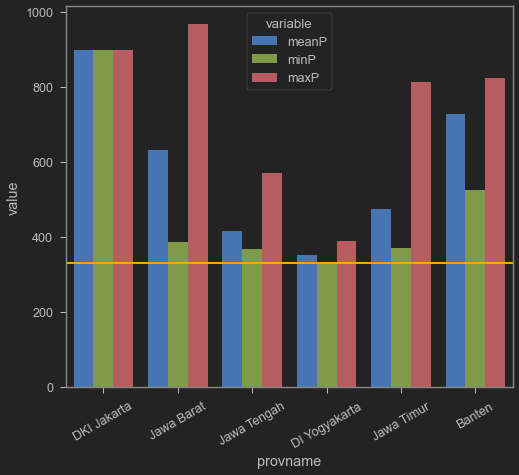
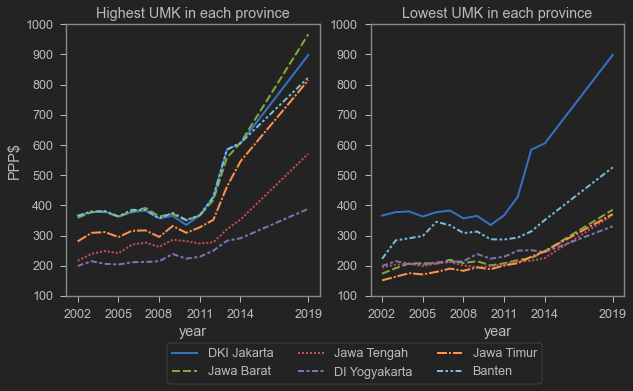
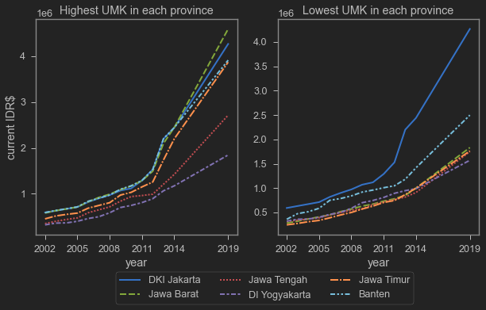
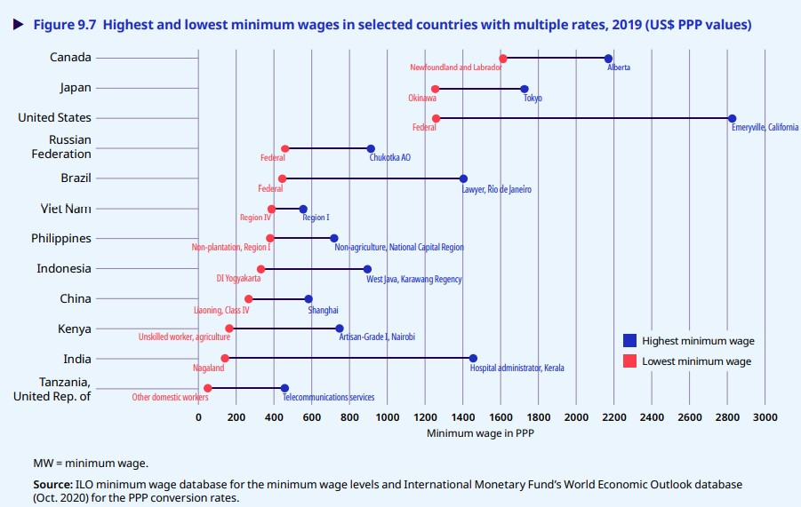
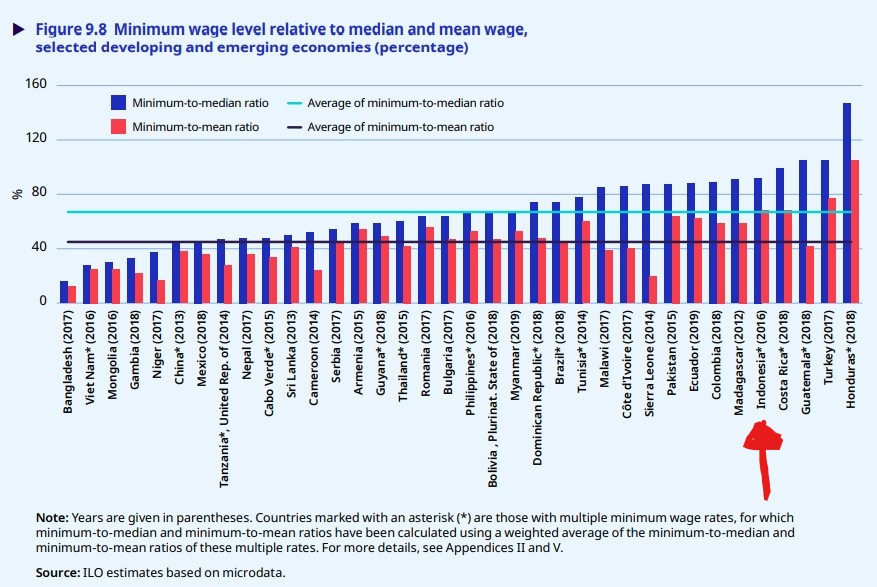

Beberapa waktu yang lalu, twitter sempat ramai soal upah minimum. Sepertinya gara-garanya adalah berita tentang Menteri Ketenagakerjaan Ida Fauziyah yang berkomentar tentang tingginya upah minimum di Indonesia. Salah satu berita yang sangat ramai adalah yang ditwitkan oleh CNN Indonesia di bawah ini.

<blockquote class="twitter-tweet"><p lang="in" dir="ltr">Menaker Sebut Upah Minimum di Indonesia Terlalu Tinggi <a href="https://t.co/QcN7DKj8bx">https://t.co/QcN7DKj8bx</a></p>&mdash; CNN Indonesia (@CNNIndonesia) <a href="https://twitter.com/CNNIndonesia/status/1461177882315685888?ref_src=twsrc%5Etfw">November 18, 2021</a></blockquote> <script async src="https://platform.twitter.com/widgets.js" charset="utf-8"></script>

Seperti bisa dilihat, reply yang ada di twit tersebut mencapai 1k, jauh di atas *engagement* akun twitter CNN Indonesia biasanya.

Tapi yang lebih menarik sebenernya adalah twit dari sebuah akun yang sangat berpengaruh berikut ini:

<blockquote class="twitter-tweet"><p lang="in" dir="ltr">Menteri Tenaga Kerja Ida Fauziyah mengatakan tak layak buruh menuntut kenaikan upah karena upah minimum di Indonesia sudah terlalu tinggi. Benarkah terlalu tinggi? Menurut Global Wage Report 2020-2021: upah minimum RI ada di papan bawah negara2 Asean, hanya menang dari Myanmar. <a href="https://t.co/16PDZcAB7M">pic.twitter.com/16PDZcAB7M</a></p>&mdash; Farid Gaban (@faridgaban) <a href="https://twitter.com/faridgaban/status/1460954416576536577?ref_src=twsrc%5Etfw">November 17, 2021</a></blockquote> <script async src="https://platform.twitter.com/widgets.js" charset="utf-8"></script>

Pemegang akun tersebut adalah salah seorang yang cukup disegani di jagat pertwitteran dan seringkali menelurkan opini yang menurut saya sangat kritis, tajam dan menarik. Gambar yang ia twitkan diambil dari [Global Wage Report 2020-2021](https://www.ilo.org/global/publications/books/WCMS_762534/lang--en/index.htm) terbitan International Labour Organization (ILO).

Gambar yang ditwitkan tersebut menunjukkan upah minimum beberapa negara menggunakan satuan Dolar Amerika dan Dolar PPP. Pada gambar tersebut, dapat dilihat bahwa upah minimum Indonesia sangat rendah, hanya sedikit di atas Myanmar. Hal ini membuktikan bahwa keadaan upah minimum di Indonesia tidak sesuai dengan pertanyaan Menaker yang mengatakan bahwa upah minimum di Indonesia terlalu tinggi.

Lalu apa dasar pernyataan Menaker kalau begitu? Apakah ada *missing link*? Melihat-lihat replies dan quote-twit dari twit di atas, kita akan mendapatkan beberapa clue. Ini salah satunya:

<blockquote class="twitter-tweet"><p lang="in" dir="ltr">UMR $111 itu UMR Yogya bukan Indonesia. Jabar sudah Rp4.7 jt ($337). Lebih tinggi dari Cina, Thailand, Malaysia.. <a href="https://t.co/MIhUJfgSOJ">https://t.co/MIhUJfgSOJ</a></p>&mdash; ARK (@ngabdul) <a href="https://twitter.com/ngabdul/status/1461127855119679493?ref_src=twsrc%5Etfw">November 18, 2021</a></blockquote> <script async src="https://platform.twitter.com/widgets.js" charset="utf-8"></script> 

Sepertinya Global Wage Report, pada gambar yang diambil oleh @fgaban tersebut, menggunakan upah terendah di suatu negara tersebut. Padahal, peraturan upah minimum di Indonesia memiliki variasi yang tidak kecil. Ada daerah yang UMK-nya rendah, tapi ada juga yang tinggi. Nah, sepertinya yang dibilang "mahal" oleh Menaker adalah upah minimum di daerah-daerah yang menjadi pusat industri, bukan yang paling rendah. Tapi ya seperti dapat diduga, cuplikan gambar tersebut, dengan konteks yang disajikan, [udah keburu ramai](https://twitter.com/faridgaban/status/1460954416576536577/retweets/with_comments).

Jadi sebenarnya upah minimum di Indonesia ini tinggi atau rendah ya? Well, mungkin tergantung dengan pembandingnya. Tinggi/rendah dibandingkan apa?

## Sampling UMK di Pulau Jawa tahun 2019

Saya coba cek kebenarannya sedikit, minimal di Pulau Jawa lah ya. Sesuai dengan gambar yang ditwitkan @fgaban, kita akan pakai tahun 2019 dan angka Dolar PPP sebagai satuannya. Menurut gambar yang ditwitkan @fgaban, upah minimum di Indonesia adalah 331 PPP Dolar. Saya coba cari peraturan UMK tahun 2019 di berbagai Kabupaten/Kota di Pulau Jawa. PPP conversion factor diambil dari [World Bank databank](https://data.worldbank.org/indicator/PA.NUS.PPP?end=2019&locations=ID&start=2012), sementara data UMK dari:

- Banten	https://indolabourdatabase.files.wordpress.com/2018/12/SK-UMK-Banten-2019.pdf
- Jatim	https://surabaya.tribunnews.com/2https://indolabourdatabase.files.wordpress.com/2018/12/SK-UMK-Banten-2019.pdf018/11/16/berikut-ini-nilai-umk-2019-di-jawa-timur-surabaya-tertinggi
- DIY	https://maucash.id/umr-yogyakarta
- Jateng	https://jatengprov.go.id/publik/umk-35-kabupaten-kota-ditetapkan-semarang-tertinggi-banjarnegara-terendah/
- Jabar	https://databoks.katadata.co.id/datapublish/2019/11/29/daftar-umk-di-jawa-barat-karawang-cetak-tertinggi
- DKI	https://www.kompas.com/tren/read/2019/11/22/161505465/membandingkan-ump-dki-jakarta-dengan-umk-daerah-sekitarnya?page=all


```python
umk19=pd.read_csv('gabung.csv').query('year == 2019')
umk19=pd.melt(umk19, id_vars=['provname'], value_vars=['meanP','minP','maxP'])
sns.barplot(data=umk19,x="provname",y='value',hue='variable')
plt.axhline(331,color='orange',linewidth=2)
plt.xticks(rotation=30)
```


    (array([0, 1, 2, 3, 4, 5]),
     [Text(0, 0, 'DKI Jakarta'),
      Text(1, 0, 'Jawa Barat'),
      Text(2, 0, 'Jawa Tengah'),
      Text(3, 0, 'DI Yogyakarta'),
      Text(4, 0, 'Jawa Timur'),
      Text(5, 0, 'Banten')])


    

    


Garis oranye di atas adalah 331, sesuai dengan upah minimum di Indonesia menurut Global Wage Report 2020-2021. Iya sepertinya upah paling rendah di Indonesia ada di DIY, seperti kata beberapa orang yang membalas twit @fgaban di atas. Akan tetapi, rata-rata UMK di Pulau Jawa sepertinya cukup tinggi. Paling deket sama DIY adalah Jateng dan disusul Jatim. Akan tetapi, Jabar dan Banten memiliki rata-rata UMK yang jauh lebih tinggi. Efek kabupaten/kota yang deket Jakarta?

BTW UMK Jakarta sama aja ya rata-rata dan maximum dan minimumnya. Ya iyalah soalnya kan dia cuma punya UMP wkwkkw. Kalau yang lain, UMK-nya sesuai dengan Kabupaten/Kota. Variasinya cukup berbeda di tiap provinsi. 

Beberapa tambahan fakta tentang UMK 2019 (dalam rupiah):

| Provinsi | UMK tertinggi | Berapa? | UMK Terendah | Berapa? |
| -------- | ------------- | ------- | ------------ | ------- |
| Banten | Kota Cilegon | 3.913.078 | Lebak | 2.498.068 |
| Jawa Barat | Karawang | 4.594.324 | Kota Banjar | 1.831.884 |
| Jawa Tengah | Kota Semarang | 2.715.000 | Banjarnegara | 1.748.000 |
| D.I. Yogyakarta | Kota Yogyakarta | 1.846.400 | Gunung Kidul | 1.571.000 |
| Jawa Timur | Kota Surabaya | 3.871.052.6 | banyak | 1.763.267 | 

UMK tertinggi adalah bar merah, terendah adalah yang hijau, dan biru adalah rata-rata. Di Jawa Timur, Kab/Kota yang paling rendah UMK-nya antara lain adalah PAMEKASAN, NGAWI, PONOROGO, SITUBONDO, MADIUN, MAGETAN, PACITAN, SAMPANG, dan TRENGGALEK (maaf hurup gede semua gara-gara label di Stata-nya wkwk. males kukecilin).

Seperti dilihat di atas ya, variasinya luar biasa antara yang paling tinggi dan paling rendah. Yang paling besar jaraknya mungkin adalah Jawa Barat, yang katanya merupakan rumah dari [60% perusahaan manufaktur di Indonesia](http://bappeda.jabarprov.go.id/uu-arahkan-pelaku-industri-jabar-beralih-ke-segitiga-rebana/). UMK Karawang aja lebih tinggi daripada DKI! Mungkin ga aneh [banyak pabrik memilih relokasi ke Jawa Tengah](https://www.idxchannel.com/economics/incar-upah-rendah-sedikitnya-100-pabrik-sudah-pindah-ke-jawa-tengah).


## Tren UMK di Pulau Jawa tahun 2002-2014 (+2019)

Upah minimum bukanlah konsentrasi dari riset saya. Untungnya saya punya kolega di kampus yang risetnya berkisar tentang upah minimum. Beliau adalah [Nurina Merdikawati](https://crawford.anu.edu.au/people/phd/nurina-merdikawati) yang biasa saya panggil dengan nama Dika. Belum lama ini, beliau baru mempresentasikan [penelitiannya](https://crawford.anu.edu.au/news-events/events/19298/minimum-wage-policy-and-poverty-developing-country) tentang dampak upah minimum terhadap kemiskinan. Dia pake data UMK Pulau jawa dari 2002 sampai 2014, dan cukup berbaik hati untuk meminjamkannya pada saya wkwk.

Di bawah ini saya plot tren UMK di Pulau Jawa tahun 2002-2014 berdasarkan data UMK yang dari Dika. Saya tambahin data 2019 yang saya kumpulin sendiri. Saya ga punya angka 2015 sampai 2018, karena itu di gambar di bawah ini, anda akan melihat garis lurus antara 2014-2019. Saya sertakan gambar yang sama tapi dalam PPP Dolar dan Rupiah.


```python
umk=pd.read_csv('gabung.csv')
fig, axs = plt.subplots(figsize=(10,5),ncols=2)
sns.lineplot(data=umk,x='year',y='maxP',hue='provname', 
             style='provname',linewidth=2, ax=axs[0],legend=False)
sns.lineplot(data=umk,x='year',y='minP',hue='provname', 
             style='provname',linewidth=2, ax=axs[1],legend=False)
axs[0].set_title('Highest UMK in each province')
axs[0].set_ylabel('PPP$')
axs[0].set_xticks([2002,2005,2008,2011,2014,2019])
axs[1].set_title('Lowest UMK in each province')
axs[1].set_ylabel('')
axs[1].set_xticks([2002,2005,2008,2011,2014,2019])
axs[0].set_ylim(100,1000) #a
axs[1].set_ylim(100,1000) #b
labels=['DKI Jakarta','Jawa Barat','Jawa Tengah','DI Yogyakarta','Jawa Timur','Banten']
plt.legend(title='',labels=labels, bbox_to_anchor=(0.7,-0.15), ncol=3)
```


    <matplotlib.legend.Legend at 0x238ae9840d0>


    

    


```python
fig, axs = plt.subplots(figsize=(10,5),ncols=2)
sns.lineplot(data=umk,x='year',y='maximum',hue='provname', 
             style='provname',linewidth=2, ax=axs[0],legend=False)
sns.lineplot(data=umk,x='year',y='minimum',hue='provname', 
             style='provname',linewidth=2, ax=axs[1],legend=False)
axs[0].set_title('Highest UMK in each province')
axs[0].set_ylabel('current IDR')
axs[0].set_xticks([2002,2005,2008,2011,2014,2019])
axs[1].set_title('Lowest UMK in each province')
axs[1].set_ylabel('')
axs[1].set_xticks([2002,2005,2008,2011,2014,2019])
labels=['DKI Jakarta','Jawa Barat','Jawa Tengah','DI Yogyakarta','Jawa Timur','Banten']
plt.legend(title='',labels=labels, bbox_to_anchor=(0.7,-0.15), ncol=3)
```


    <matplotlib.legend.Legend at 0x238ac3f8730>


    

    


Dari kedua gambar di atas, kita bisa lihat bahwa UMK naik terus secara perlahan, akan tetapi tiba-tiba naik drastis sejak sekitar tahun 2012/2013, lalu makin tinggi kenaikannya pada 2019. Sayangnya saya kurang tertarik lebih jauh untuk mengisi data 2015-2018, tapi rasanya ga mungkin ya UMK turun, jadi kayaknya insight yg akan saya dapat dari 2015-2018 gak akan terlalu banyak. Trennya pasti naik menuju 2019.

Tapi ya, mungkin plot di atas cukup menggambarkan cepatnya kenaikan UMK di Pulau Jawa, mungkin jauh di atas inflasi.

## Jadi UMK Indonesia ini tinggi atau rendah?

Sebenarnya perlu investigasi lebih jauh daripada cuma Pulau Jawa aja dan cuma 2019 hehe. Saya sangat merekomendasikan teman-teman yang tertarik untuk memperdalam UMK agar lihat riset yang lebih komprehensif atau kontak Dika untuk ngobrol-ngobrol wkwk. Akan tetapi, saya rasa *exercise* kita ini cukup valid lah ya, apalagi UMK tertinggi dan terendah sama-sama di Pulau Jawa. Pulau Jawa juga masih jadi primadona investor industri manufaktur, jadi kurasa Pulau Jawa sudah memberikan insight yang cukup baik untuk melanjutkan diskusi.

Jika kita kembali ke pertanyaan soal tinggi atau rendah, saya rasa minimal kita bisa lihat dari 2 sisi. Pertama, membandingkan upah antara Indonesia dengan negara lain. Kedua, membandingkan upah antara Indonesia saat ini dengan Indonesia dulu (dengan kata lain, kecepatan kenaikan).

Untuk poin pertama, membandingkan UMK terendah di Indonesia dengan UMK terendah di negara lain dengan menggunakan PPP dolar adalah hal yang tepat menurut saya. Inilah kelebihan PPP dolar, di mana inflasi dan harga barang konsumsi di setiap negara sudah dimasukkan ke dalam perhitungan, sehingga cukup valid untuk dibandingkan dengan negara lain.

Akan tetapi, UMK terendah tentunya tidak memberikan konteks yang menyeluruh. Jika kita lihat lebih jauh isi report-nya, sebenarnya ada banyak informasi yang bisa kita lihat terkait distribusi upah minimum tersebut. Gambar 7.16 di report tersebut memberikan sedikit gambaran tentang distribusi UMK di Indonesia. Jika gambar ini dibaca bersama dengan gambar yang ditwitkan oleh @fgaban, maka akan langsung kebayang distribusi UMK di Indonesia dan komen Menaker juga akan sedikit tergambar konteksnya.

Tapi yang paling penting adalah gambar 9.7 di report yang sama. gambar ini sekitar 3 halaman setelah gambar 9.3 yang diposting @fgaban. Gambar ini menunjukkan UMK paling rendah dan paling tinggi di beberapa negara.



Dari gambar di atas, memang kita bisa lihat bahwa upah minimum di propinsi paling rendah di Indonesia ternyata relatif lebih rendah dibandingkan Filipina, Vietnam dan Brazil. Akan tetapi, jika kita lihat upah minimum di provinsi paling tinggi, Karawang punya UMK yang lebih tinggi daripada upah minimum di Vietnam dan Filipina, bahkan lebih tinggi daripada upah minimumnya Shanghai!

Konteks kedua adalah soal membandingkan UMK saat ini dengan sebelumnya. Ya kita bisa lihat bahwa di Pulau Jawa, UMK meningkat dengan cepat sekali terutama di DKI Jakarta dan sekitarnya. Ini memberikan pengusaha sebuah gambaran ke depan bahwa kemungkinan secara *long-term*, daerah tersebut akan terus naik UMK-nya, dan di satu saat akan membuat produksi di sana tidak lagi menarik.

Sebenarnya ada yang ke-3 (wkwk maaf), dan itu adalah membandingkan peraturan upah minimum dengan upah median dan/atau upah rata-rata. Mungkin anda masih ingat pelajaran SMA soal statistik yah tentang rata-rata dan median (nilai tengah). Upah minimum itu kan sebenernya adalah upah paling kecil yang harusnya dibayarkan di suatu daerah. Karena dia upah terkecil, maka sewajarnya dia memiliki jarak dengan rata-rata maupun nilai tengahnya. Kalau terlalu dekat dengan nilai tengah ataupun rata-ratanya, bisa jadi indikasi bahwa upah minimum ini bisa jadi terlalu tinggi bagi dunia usaha.

Untungnya hal ini juga bisa dilihat di report yang sama.



Gambar di atas menunjukkan $\frac{\text{upah minimum}}{\text{upah rata-rata}}$ (bar merah) dan $\frac{\text{upah minimum}}{\text{upah median}}$ (bar biru). 100% artinya upah minimum sama dengan upah rata-rata atau upah median. Seperti kita lihat, upah minimum Indonesia berada di atas rata-rata dunia jika kita mengukur tinggi/rendahnya upah minimum dengan rasio $\frac{\text{upah minimum}}{\text{upah rata-rata}}$ dan $\frac{\text{upah minimum}}{\text{upah median}}$. Dengan instrumen ini, bisa dikatakan peraturan upah minimum Indonesia agak-agak ketinggian dibandingkan dengan level upah regionalnya (rata-rata atau median), jika kita bandingkan dengan Vietnam, China, Filipina dan Thailand.

Dengan kata lain, ada banyak indikator untuk mengatakan apakah peraturan upah minimum di Indonesia ini "ketinggian" atau "kerendahan". Kita gak terlalu tau Menaker menggunakan alat ukur yang mana ketika dia bilang upah minimum di Indonesia ketinggian. Ada banyak *layering* sampai ke keramaian di twitter kan. Menaker mengucapkannya pada siaran pers, yang mana sebagian besar dari kita tidak datang ke acaranya. Pers menuliskannya dalam berita, pasang judul yang "representatif", lalu dipost ditwitter dan disebarluaskan oleh para netizen dengan konteks masing-masing. Distorsi komunikasi bisa datang dari level manapun pada proses barusan. Kita nggak tau apakah yang baca hasil cuitan netizen ini buka beritanya atau tidak, buka reportnya atau tidak, dst.

Nah, kalau menurut berita di [idxchannel ini](https://www.idxchannel.com/economics/menaker-sebut-upah-minimum-di-indonesia-terlalu-tinggi-ini-penjelasannya), Menaker menggunakan Kaitz Index. Kaitz Index sendiri lebih cocok kita kaitkan dengan $\frac{\text{upah minimum}}{\text{upah median}}$. Sepertinya sih kalau pakai instrumen yang ini, pernyataan Menaker cukup valid.

Sekian postingan kali ini. Jadi apakah UMK ketinggian apa kerendahan? Hahaha tanya Dika aja ya jangan tanya saya wkwkwk. Intinya sih selalu kritis dalam menerima informasi baik dari postingan di twitter maupun sumber lainnya (termasuk blog ini!). Selalu kroscek dan rajin-rajin baca studi yang lebih mendalam, atau bahkan lebih baik lagi, buatlah studinya sendiri!

n.b.: Data UMK Pulau Jawa 2019 lihat di bawah ini yaa. Untuk yang 2002-2014 boleh coba kontak Dika hahaha.


```python
pd.set_option('display.max_rows', None)
umk.query('year==2019')
```


<div>
<style scoped>
    .dataframe tbody tr th:only-of-type {
        vertical-align: middle;
    }

    .dataframe tbody tr th {
        vertical-align: top;
    }

    .dataframe thead th {
        text-align: right;
    }
</style>
<table border="1" class="dataframe">
  <thead>
    <tr style="text-align: right;">
      <th></th>
      <th>kabid</th>
      <th>year</th>
      <th>umk</th>
      <th>prov</th>
      <th>kabname</th>
      <th>provname</th>
      <th>rerata</th>
      <th>minimum</th>
      <th>maximum</th>
      <th>PPPC</th>
      <th>inflation</th>
      <th>PPP</th>
      <th>meanP</th>
      <th>minP</th>
      <th>maxP</th>
    </tr>
  </thead>
  <tbody>
    <tr>
      <th>2002</th>
      <td>3101</td>
      <td>2019</td>
      <td>4267349.00</td>
      <td>31</td>
      <td>KEPULAUAN SERIBU</td>
      <td>DKI Jakarta</td>
      <td>4267349.0</td>
      <td>4267349.0</td>
      <td>4267349.0</td>
      <td>4751.936</td>
      <td>3.031</td>
      <td>898.02325</td>
      <td>898.02325</td>
      <td>898.02325</td>
      <td>898.02325</td>
    </tr>
    <tr>
      <th>2003</th>
      <td>3171</td>
      <td>2019</td>
      <td>4267349.00</td>
      <td>31</td>
      <td>KODYA JAKARTA SELATAN</td>
      <td>DKI Jakarta</td>
      <td>4267349.0</td>
      <td>4267349.0</td>
      <td>4267349.0</td>
      <td>4751.936</td>
      <td>3.031</td>
      <td>898.02325</td>
      <td>898.02325</td>
      <td>898.02325</td>
      <td>898.02325</td>
    </tr>
    <tr>
      <th>2004</th>
      <td>3172</td>
      <td>2019</td>
      <td>4267349.00</td>
      <td>31</td>
      <td>KODYA JAKARTA TIMUR</td>
      <td>DKI Jakarta</td>
      <td>4267349.0</td>
      <td>4267349.0</td>
      <td>4267349.0</td>
      <td>4751.936</td>
      <td>3.031</td>
      <td>898.02325</td>
      <td>898.02325</td>
      <td>898.02325</td>
      <td>898.02325</td>
    </tr>
    <tr>
      <th>2005</th>
      <td>3173</td>
      <td>2019</td>
      <td>4267349.00</td>
      <td>31</td>
      <td>KODYA JAKARTA PUSAT</td>
      <td>DKI Jakarta</td>
      <td>4267349.0</td>
      <td>4267349.0</td>
      <td>4267349.0</td>
      <td>4751.936</td>
      <td>3.031</td>
      <td>898.02325</td>
      <td>898.02325</td>
      <td>898.02325</td>
      <td>898.02325</td>
    </tr>
    <tr>
      <th>2006</th>
      <td>3174</td>
      <td>2019</td>
      <td>4267349.00</td>
      <td>31</td>
      <td>KODYA JAKARTA BARAT</td>
      <td>DKI Jakarta</td>
      <td>4267349.0</td>
      <td>4267349.0</td>
      <td>4267349.0</td>
      <td>4751.936</td>
      <td>3.031</td>
      <td>898.02325</td>
      <td>898.02325</td>
      <td>898.02325</td>
      <td>898.02325</td>
    </tr>
    <tr>
      <th>2007</th>
      <td>3175</td>
      <td>2019</td>
      <td>4267349.00</td>
      <td>31</td>
      <td>KODYA JAKARTA UTARA</td>
      <td>DKI Jakarta</td>
      <td>4267349.0</td>
      <td>4267349.0</td>
      <td>4267349.0</td>
      <td>4751.936</td>
      <td>3.031</td>
      <td>898.02325</td>
      <td>898.02325</td>
      <td>898.02325</td>
      <td>898.02325</td>
    </tr>
    <tr>
      <th>2008</th>
      <td>3201</td>
      <td>2019</td>
      <td>4083670.00</td>
      <td>32</td>
      <td>BOGOR</td>
      <td>Jawa Barat</td>
      <td>3005915.3</td>
      <td>1831884.0</td>
      <td>4594324.0</td>
      <td>4751.936</td>
      <td>3.031</td>
      <td>859.36975</td>
      <td>632.56641</td>
      <td>385.50266</td>
      <td>966.83203</td>
    </tr>
    <tr>
      <th>2009</th>
      <td>3202</td>
      <td>2019</td>
      <td>3028531.00</td>
      <td>32</td>
      <td>SUKABUMI</td>
      <td>Jawa Barat</td>
      <td>3005915.3</td>
      <td>1831884.0</td>
      <td>4594324.0</td>
      <td>4751.936</td>
      <td>3.031</td>
      <td>637.32568</td>
      <td>632.56641</td>
      <td>385.50266</td>
      <td>966.83203</td>
    </tr>
    <tr>
      <th>2010</th>
      <td>3203</td>
      <td>2019</td>
      <td>2534798.00</td>
      <td>32</td>
      <td>CIANJUR</td>
      <td>Jawa Barat</td>
      <td>3005915.3</td>
      <td>1831884.0</td>
      <td>4594324.0</td>
      <td>4751.936</td>
      <td>3.031</td>
      <td>533.42426</td>
      <td>632.56641</td>
      <td>385.50266</td>
      <td>966.83203</td>
    </tr>
    <tr>
      <th>2011</th>
      <td>3204</td>
      <td>2019</td>
      <td>3139275.00</td>
      <td>32</td>
      <td>BANDUNG</td>
      <td>Jawa Barat</td>
      <td>3005915.3</td>
      <td>1831884.0</td>
      <td>4594324.0</td>
      <td>4751.936</td>
      <td>3.031</td>
      <td>660.63074</td>
      <td>632.56641</td>
      <td>385.50266</td>
      <td>966.83203</td>
    </tr>
    <tr>
      <th>2012</th>
      <td>3205</td>
      <td>2019</td>
      <td>1961085.00</td>
      <td>32</td>
      <td>GARUT</td>
      <td>Jawa Barat</td>
      <td>3005915.3</td>
      <td>1831884.0</td>
      <td>4594324.0</td>
      <td>4751.936</td>
      <td>3.031</td>
      <td>412.69180</td>
      <td>632.56641</td>
      <td>385.50266</td>
      <td>966.83203</td>
    </tr>
    <tr>
      <th>2013</th>
      <td>3206</td>
      <td>2019</td>
      <td>2251787.00</td>
      <td>32</td>
      <td>TASIKMALAYA</td>
      <td>Jawa Barat</td>
      <td>3005915.3</td>
      <td>1831884.0</td>
      <td>4594324.0</td>
      <td>4751.936</td>
      <td>3.031</td>
      <td>473.86728</td>
      <td>632.56641</td>
      <td>385.50266</td>
      <td>966.83203</td>
    </tr>
    <tr>
      <th>2014</th>
      <td>3207</td>
      <td>2019</td>
      <td>1880654.00</td>
      <td>32</td>
      <td>CIAMIS</td>
      <td>Jawa Barat</td>
      <td>3005915.3</td>
      <td>1831884.0</td>
      <td>4594324.0</td>
      <td>4751.936</td>
      <td>3.031</td>
      <td>395.76584</td>
      <td>632.56641</td>
      <td>385.50266</td>
      <td>966.83203</td>
    </tr>
    <tr>
      <th>2015</th>
      <td>3208</td>
      <td>2019</td>
      <td>1882642.00</td>
      <td>32</td>
      <td>KUNINGAN</td>
      <td>Jawa Barat</td>
      <td>3005915.3</td>
      <td>1831884.0</td>
      <td>4594324.0</td>
      <td>4751.936</td>
      <td>3.031</td>
      <td>396.18420</td>
      <td>632.56641</td>
      <td>385.50266</td>
      <td>966.83203</td>
    </tr>
    <tr>
      <th>2016</th>
      <td>3209</td>
      <td>2019</td>
      <td>2196416.00</td>
      <td>32</td>
      <td>CIREBON</td>
      <td>Jawa Barat</td>
      <td>3005915.3</td>
      <td>1831884.0</td>
      <td>4594324.0</td>
      <td>4751.936</td>
      <td>3.031</td>
      <td>462.21497</td>
      <td>632.56641</td>
      <td>385.50266</td>
      <td>966.83203</td>
    </tr>
    <tr>
      <th>2017</th>
      <td>3210</td>
      <td>2019</td>
      <td>1944166.00</td>
      <td>32</td>
      <td>MAJALENGKA</td>
      <td>Jawa Barat</td>
      <td>3005915.3</td>
      <td>1831884.0</td>
      <td>4594324.0</td>
      <td>4751.936</td>
      <td>3.031</td>
      <td>409.13135</td>
      <td>632.56641</td>
      <td>385.50266</td>
      <td>966.83203</td>
    </tr>
    <tr>
      <th>2018</th>
      <td>3211</td>
      <td>2019</td>
      <td>3139275.00</td>
      <td>32</td>
      <td>SUMEDANG</td>
      <td>Jawa Barat</td>
      <td>3005915.3</td>
      <td>1831884.0</td>
      <td>4594324.0</td>
      <td>4751.936</td>
      <td>3.031</td>
      <td>660.63074</td>
      <td>632.56641</td>
      <td>385.50266</td>
      <td>966.83203</td>
    </tr>
    <tr>
      <th>2019</th>
      <td>3212</td>
      <td>2019</td>
      <td>2297931.00</td>
      <td>32</td>
      <td>INDRAMAYU</td>
      <td>Jawa Barat</td>
      <td>3005915.3</td>
      <td>1831884.0</td>
      <td>4594324.0</td>
      <td>4751.936</td>
      <td>3.031</td>
      <td>483.57785</td>
      <td>632.56641</td>
      <td>385.50266</td>
      <td>966.83203</td>
    </tr>
    <tr>
      <th>2020</th>
      <td>3213</td>
      <td>2019</td>
      <td>2965468.00</td>
      <td>32</td>
      <td>SUBANG</td>
      <td>Jawa Barat</td>
      <td>3005915.3</td>
      <td>1831884.0</td>
      <td>4594324.0</td>
      <td>4751.936</td>
      <td>3.031</td>
      <td>624.05469</td>
      <td>632.56641</td>
      <td>385.50266</td>
      <td>966.83203</td>
    </tr>
    <tr>
      <th>2021</th>
      <td>3214</td>
      <td>2019</td>
      <td>4039067.00</td>
      <td>32</td>
      <td>PURWAKARTA</td>
      <td>Jawa Barat</td>
      <td>3005915.3</td>
      <td>1831884.0</td>
      <td>4594324.0</td>
      <td>4751.936</td>
      <td>3.031</td>
      <td>849.98346</td>
      <td>632.56641</td>
      <td>385.50266</td>
      <td>966.83203</td>
    </tr>
    <tr>
      <th>2022</th>
      <td>3215</td>
      <td>2019</td>
      <td>4594324.00</td>
      <td>32</td>
      <td>KARAWANG</td>
      <td>Jawa Barat</td>
      <td>3005915.3</td>
      <td>1831884.0</td>
      <td>4594324.0</td>
      <td>4751.936</td>
      <td>3.031</td>
      <td>966.83203</td>
      <td>632.56641</td>
      <td>385.50266</td>
      <td>966.83203</td>
    </tr>
    <tr>
      <th>2023</th>
      <td>3216</td>
      <td>2019</td>
      <td>4498961.00</td>
      <td>32</td>
      <td>BEKASI</td>
      <td>Jawa Barat</td>
      <td>3005915.3</td>
      <td>1831884.0</td>
      <td>4594324.0</td>
      <td>4751.936</td>
      <td>3.031</td>
      <td>946.76379</td>
      <td>632.56641</td>
      <td>385.50266</td>
      <td>966.83203</td>
    </tr>
    <tr>
      <th>2024</th>
      <td>3217</td>
      <td>2019</td>
      <td>3145427.00</td>
      <td>32</td>
      <td>BANDUNG BARAT</td>
      <td>Jawa Barat</td>
      <td>3005915.3</td>
      <td>1831884.0</td>
      <td>4594324.0</td>
      <td>4751.936</td>
      <td>3.031</td>
      <td>661.92535</td>
      <td>632.56641</td>
      <td>385.50266</td>
      <td>966.83203</td>
    </tr>
    <tr>
      <th>2025</th>
      <td>3271</td>
      <td>2019</td>
      <td>4169806.00</td>
      <td>32</td>
      <td>KOTA BOGOR</td>
      <td>Jawa Barat</td>
      <td>3005915.3</td>
      <td>1831884.0</td>
      <td>4594324.0</td>
      <td>4751.936</td>
      <td>3.031</td>
      <td>877.49622</td>
      <td>632.56641</td>
      <td>385.50266</td>
      <td>966.83203</td>
    </tr>
    <tr>
      <th>2026</th>
      <td>3272</td>
      <td>2019</td>
      <td>2530182.00</td>
      <td>32</td>
      <td>KOTA SUKABUMI</td>
      <td>Jawa Barat</td>
      <td>3005915.3</td>
      <td>1831884.0</td>
      <td>4594324.0</td>
      <td>4751.936</td>
      <td>3.031</td>
      <td>532.45288</td>
      <td>632.56641</td>
      <td>385.50266</td>
      <td>966.83203</td>
    </tr>
    <tr>
      <th>2027</th>
      <td>3273</td>
      <td>2019</td>
      <td>3623778.00</td>
      <td>32</td>
      <td>KOTA BANDUNG</td>
      <td>Jawa Barat</td>
      <td>3005915.3</td>
      <td>1831884.0</td>
      <td>4594324.0</td>
      <td>4751.936</td>
      <td>3.031</td>
      <td>762.58978</td>
      <td>632.56641</td>
      <td>385.50266</td>
      <td>966.83203</td>
    </tr>
    <tr>
      <th>2028</th>
      <td>3274</td>
      <td>2019</td>
      <td>2219487.00</td>
      <td>32</td>
      <td>KOTA CIREBON</td>
      <td>Jawa Barat</td>
      <td>3005915.3</td>
      <td>1831884.0</td>
      <td>4594324.0</td>
      <td>4751.936</td>
      <td>3.031</td>
      <td>467.07004</td>
      <td>632.56641</td>
      <td>385.50266</td>
      <td>966.83203</td>
    </tr>
    <tr>
      <th>2029</th>
      <td>3275</td>
      <td>2019</td>
      <td>4589708.00</td>
      <td>32</td>
      <td>KOTA BEKASI</td>
      <td>Jawa Barat</td>
      <td>3005915.3</td>
      <td>1831884.0</td>
      <td>4594324.0</td>
      <td>4751.936</td>
      <td>3.031</td>
      <td>965.86066</td>
      <td>632.56641</td>
      <td>385.50266</td>
      <td>966.83203</td>
    </tr>
    <tr>
      <th>2030</th>
      <td>3276</td>
      <td>2019</td>
      <td>4202105.00</td>
      <td>32</td>
      <td>KOTA DEPOK</td>
      <td>Jawa Barat</td>
      <td>3005915.3</td>
      <td>1831884.0</td>
      <td>4594324.0</td>
      <td>4751.936</td>
      <td>3.031</td>
      <td>884.29327</td>
      <td>632.56641</td>
      <td>385.50266</td>
      <td>966.83203</td>
    </tr>
    <tr>
      <th>2031</th>
      <td>3277</td>
      <td>2019</td>
      <td>3139274.00</td>
      <td>32</td>
      <td>KOTA CIMAHI</td>
      <td>Jawa Barat</td>
      <td>3005915.3</td>
      <td>1831884.0</td>
      <td>4594324.0</td>
      <td>4751.936</td>
      <td>3.031</td>
      <td>660.63055</td>
      <td>632.56641</td>
      <td>385.50266</td>
      <td>966.83203</td>
    </tr>
    <tr>
      <th>2032</th>
      <td>3278</td>
      <td>2019</td>
      <td>2264093.00</td>
      <td>32</td>
      <td>KOTA TASIKMALAYA</td>
      <td>Jawa Barat</td>
      <td>3005915.3</td>
      <td>1831884.0</td>
      <td>4594324.0</td>
      <td>4751.936</td>
      <td>3.031</td>
      <td>476.45697</td>
      <td>632.56641</td>
      <td>385.50266</td>
      <td>966.83203</td>
    </tr>
    <tr>
      <th>2033</th>
      <td>3279</td>
      <td>2019</td>
      <td>1831884.00</td>
      <td>32</td>
      <td>KOTA BANJAR</td>
      <td>Jawa Barat</td>
      <td>3005915.3</td>
      <td>1831884.0</td>
      <td>4594324.0</td>
      <td>4751.936</td>
      <td>3.031</td>
      <td>385.50266</td>
      <td>632.56641</td>
      <td>385.50266</td>
      <td>966.83203</td>
    </tr>
    <tr>
      <th>2034</th>
      <td>3301</td>
      <td>2019</td>
      <td>2158327.00</td>
      <td>33</td>
      <td>CILACAP</td>
      <td>Jawa Tengah</td>
      <td>1977745.6</td>
      <td>1748000.0</td>
      <td>2715000.0</td>
      <td>4751.936</td>
      <td>3.031</td>
      <td>454.19949</td>
      <td>416.19788</td>
      <td>367.85007</td>
      <td>571.34607</td>
    </tr>
    <tr>
      <th>2035</th>
      <td>3302</td>
      <td>2019</td>
      <td>1900000.00</td>
      <td>33</td>
      <td>BANYUMAS</td>
      <td>Jawa Tengah</td>
      <td>1977745.6</td>
      <td>1748000.0</td>
      <td>2715000.0</td>
      <td>4751.936</td>
      <td>3.031</td>
      <td>399.83704</td>
      <td>416.19788</td>
      <td>367.85007</td>
      <td>571.34607</td>
    </tr>
    <tr>
      <th>2036</th>
      <td>3303</td>
      <td>2019</td>
      <td>1940800.00</td>
      <td>33</td>
      <td>PURBALINGGA</td>
      <td>Jawa Tengah</td>
      <td>1977745.6</td>
      <td>1748000.0</td>
      <td>2715000.0</td>
      <td>4751.936</td>
      <td>3.031</td>
      <td>408.42300</td>
      <td>416.19788</td>
      <td>367.85007</td>
      <td>571.34607</td>
    </tr>
    <tr>
      <th>2037</th>
      <td>3304</td>
      <td>2019</td>
      <td>1748000.00</td>
      <td>33</td>
      <td>BANJARNEGARA</td>
      <td>Jawa Tengah</td>
      <td>1977745.6</td>
      <td>1748000.0</td>
      <td>2715000.0</td>
      <td>4751.936</td>
      <td>3.031</td>
      <td>367.85007</td>
      <td>416.19788</td>
      <td>367.85007</td>
      <td>571.34607</td>
    </tr>
    <tr>
      <th>2038</th>
      <td>3305</td>
      <td>2019</td>
      <td>1835000.00</td>
      <td>33</td>
      <td>KEBUMEN</td>
      <td>Jawa Tengah</td>
      <td>1977745.6</td>
      <td>1748000.0</td>
      <td>2715000.0</td>
      <td>4751.936</td>
      <td>3.031</td>
      <td>386.15839</td>
      <td>416.19788</td>
      <td>367.85007</td>
      <td>571.34607</td>
    </tr>
    <tr>
      <th>2039</th>
      <td>3306</td>
      <td>2019</td>
      <td>1845000.00</td>
      <td>33</td>
      <td>PURWOREJO</td>
      <td>Jawa Tengah</td>
      <td>1977745.6</td>
      <td>1748000.0</td>
      <td>2715000.0</td>
      <td>4751.936</td>
      <td>3.031</td>
      <td>388.26279</td>
      <td>416.19788</td>
      <td>367.85007</td>
      <td>571.34607</td>
    </tr>
    <tr>
      <th>2040</th>
      <td>3307</td>
      <td>2019</td>
      <td>1859000.00</td>
      <td>33</td>
      <td>WONOSOBO</td>
      <td>Jawa Tengah</td>
      <td>1977745.6</td>
      <td>1748000.0</td>
      <td>2715000.0</td>
      <td>4751.936</td>
      <td>3.031</td>
      <td>391.20898</td>
      <td>416.19788</td>
      <td>367.85007</td>
      <td>571.34607</td>
    </tr>
    <tr>
      <th>2041</th>
      <td>3308</td>
      <td>2019</td>
      <td>1853000.00</td>
      <td>33</td>
      <td>MAGELANG</td>
      <td>Jawa Tengah</td>
      <td>1977745.6</td>
      <td>1748000.0</td>
      <td>2715000.0</td>
      <td>4751.936</td>
      <td>3.031</td>
      <td>389.94632</td>
      <td>416.19788</td>
      <td>367.85007</td>
      <td>571.34607</td>
    </tr>
    <tr>
      <th>2042</th>
      <td>3309</td>
      <td>2019</td>
      <td>1942500.00</td>
      <td>33</td>
      <td>BOYOLALI</td>
      <td>Jawa Tengah</td>
      <td>1977745.6</td>
      <td>1748000.0</td>
      <td>2715000.0</td>
      <td>4751.936</td>
      <td>3.031</td>
      <td>408.78076</td>
      <td>416.19788</td>
      <td>367.85007</td>
      <td>571.34607</td>
    </tr>
    <tr>
      <th>2043</th>
      <td>3310</td>
      <td>2019</td>
      <td>1947821.00</td>
      <td>33</td>
      <td>KLATEN</td>
      <td>Jawa Tengah</td>
      <td>1977745.6</td>
      <td>1748000.0</td>
      <td>2715000.0</td>
      <td>4751.936</td>
      <td>3.031</td>
      <td>409.90051</td>
      <td>416.19788</td>
      <td>367.85007</td>
      <td>571.34607</td>
    </tr>
    <tr>
      <th>2044</th>
      <td>3311</td>
      <td>2019</td>
      <td>1938000.00</td>
      <td>33</td>
      <td>SUKOHARJO</td>
      <td>Jawa Tengah</td>
      <td>1977745.6</td>
      <td>1748000.0</td>
      <td>2715000.0</td>
      <td>4751.936</td>
      <td>3.031</td>
      <td>407.83377</td>
      <td>416.19788</td>
      <td>367.85007</td>
      <td>571.34607</td>
    </tr>
    <tr>
      <th>2045</th>
      <td>3312</td>
      <td>2019</td>
      <td>1797000.00</td>
      <td>33</td>
      <td>WONOGIRI</td>
      <td>Jawa Tengah</td>
      <td>1977745.6</td>
      <td>1748000.0</td>
      <td>2715000.0</td>
      <td>4751.936</td>
      <td>3.031</td>
      <td>378.16165</td>
      <td>416.19788</td>
      <td>367.85007</td>
      <td>571.34607</td>
    </tr>
    <tr>
      <th>2046</th>
      <td>3313</td>
      <td>2019</td>
      <td>1989000.00</td>
      <td>33</td>
      <td>KARANGANYAR</td>
      <td>Jawa Tengah</td>
      <td>1977745.6</td>
      <td>1748000.0</td>
      <td>2715000.0</td>
      <td>4751.936</td>
      <td>3.031</td>
      <td>418.56625</td>
      <td>416.19788</td>
      <td>367.85007</td>
      <td>571.34607</td>
    </tr>
    <tr>
      <th>2047</th>
      <td>3314</td>
      <td>2019</td>
      <td>1815914.00</td>
      <td>33</td>
      <td>SRAGEN</td>
      <td>Jawa Tengah</td>
      <td>1977745.6</td>
      <td>1748000.0</td>
      <td>2715000.0</td>
      <td>4751.936</td>
      <td>3.031</td>
      <td>382.14194</td>
      <td>416.19788</td>
      <td>367.85007</td>
      <td>571.34607</td>
    </tr>
    <tr>
      <th>2048</th>
      <td>3315</td>
      <td>2019</td>
      <td>1830000.00</td>
      <td>33</td>
      <td>GROBOGAN</td>
      <td>Jawa Tengah</td>
      <td>1977745.6</td>
      <td>1748000.0</td>
      <td>2715000.0</td>
      <td>4751.936</td>
      <td>3.031</td>
      <td>385.10620</td>
      <td>416.19788</td>
      <td>367.85007</td>
      <td>571.34607</td>
    </tr>
    <tr>
      <th>2049</th>
      <td>3316</td>
      <td>2019</td>
      <td>1834000.00</td>
      <td>33</td>
      <td>BLORA</td>
      <td>Jawa Tengah</td>
      <td>1977745.6</td>
      <td>1748000.0</td>
      <td>2715000.0</td>
      <td>4751.936</td>
      <td>3.031</td>
      <td>385.94797</td>
      <td>416.19788</td>
      <td>367.85007</td>
      <td>571.34607</td>
    </tr>
    <tr>
      <th>2050</th>
      <td>3317</td>
      <td>2019</td>
      <td>1802000.00</td>
      <td>33</td>
      <td>REMBANG</td>
      <td>Jawa Tengah</td>
      <td>1977745.6</td>
      <td>1748000.0</td>
      <td>2715000.0</td>
      <td>4751.936</td>
      <td>3.031</td>
      <td>379.21387</td>
      <td>416.19788</td>
      <td>367.85007</td>
      <td>571.34607</td>
    </tr>
    <tr>
      <th>2051</th>
      <td>3318</td>
      <td>2019</td>
      <td>1891000.00</td>
      <td>33</td>
      <td>PATI</td>
      <td>Jawa Tengah</td>
      <td>1977745.6</td>
      <td>1748000.0</td>
      <td>2715000.0</td>
      <td>4751.936</td>
      <td>3.031</td>
      <td>397.94305</td>
      <td>416.19788</td>
      <td>367.85007</td>
      <td>571.34607</td>
    </tr>
    <tr>
      <th>2052</th>
      <td>3319</td>
      <td>2019</td>
      <td>2218451.00</td>
      <td>33</td>
      <td>KUDUS</td>
      <td>Jawa Tengah</td>
      <td>1977745.6</td>
      <td>1748000.0</td>
      <td>2715000.0</td>
      <td>4751.936</td>
      <td>3.031</td>
      <td>466.85202</td>
      <td>416.19788</td>
      <td>367.85007</td>
      <td>571.34607</td>
    </tr>
    <tr>
      <th>2053</th>
      <td>3320</td>
      <td>2019</td>
      <td>2040000.00</td>
      <td>33</td>
      <td>JEPARA</td>
      <td>Jawa Tengah</td>
      <td>1977745.6</td>
      <td>1748000.0</td>
      <td>2715000.0</td>
      <td>4751.936</td>
      <td>3.031</td>
      <td>429.29871</td>
      <td>416.19788</td>
      <td>367.85007</td>
      <td>571.34607</td>
    </tr>
    <tr>
      <th>2054</th>
      <td>3321</td>
      <td>2019</td>
      <td>2432000.00</td>
      <td>33</td>
      <td>DEMAK</td>
      <td>Jawa Tengah</td>
      <td>1977745.6</td>
      <td>1748000.0</td>
      <td>2715000.0</td>
      <td>4751.936</td>
      <td>3.031</td>
      <td>511.79141</td>
      <td>416.19788</td>
      <td>367.85007</td>
      <td>571.34607</td>
    </tr>
    <tr>
      <th>2055</th>
      <td>3322</td>
      <td>2019</td>
      <td>2229880.00</td>
      <td>33</td>
      <td>SEMARANG</td>
      <td>Jawa Tengah</td>
      <td>1977745.6</td>
      <td>1748000.0</td>
      <td>2715000.0</td>
      <td>4751.936</td>
      <td>3.031</td>
      <td>469.25717</td>
      <td>416.19788</td>
      <td>367.85007</td>
      <td>571.34607</td>
    </tr>
    <tr>
      <th>2056</th>
      <td>3323</td>
      <td>2019</td>
      <td>1825200.00</td>
      <td>33</td>
      <td>TEMANGGUNG</td>
      <td>Jawa Tengah</td>
      <td>1977745.6</td>
      <td>1748000.0</td>
      <td>2715000.0</td>
      <td>4751.936</td>
      <td>3.031</td>
      <td>384.09607</td>
      <td>416.19788</td>
      <td>367.85007</td>
      <td>571.34607</td>
    </tr>
    <tr>
      <th>2057</th>
      <td>3324</td>
      <td>2019</td>
      <td>2261775.00</td>
      <td>33</td>
      <td>KENDAL</td>
      <td>Jawa Tengah</td>
      <td>1977745.6</td>
      <td>1748000.0</td>
      <td>2715000.0</td>
      <td>4751.936</td>
      <td>3.031</td>
      <td>475.96915</td>
      <td>416.19788</td>
      <td>367.85007</td>
      <td>571.34607</td>
    </tr>
    <tr>
      <th>2058</th>
      <td>3325</td>
      <td>2019</td>
      <td>2061700.00</td>
      <td>33</td>
      <td>BATANG</td>
      <td>Jawa Tengah</td>
      <td>1977745.6</td>
      <td>1748000.0</td>
      <td>2715000.0</td>
      <td>4751.936</td>
      <td>3.031</td>
      <td>433.86526</td>
      <td>416.19788</td>
      <td>367.85007</td>
      <td>571.34607</td>
    </tr>
    <tr>
      <th>2059</th>
      <td>3326</td>
      <td>2019</td>
      <td>2072000.00</td>
      <td>33</td>
      <td>PEKALONGAN</td>
      <td>Jawa Tengah</td>
      <td>1977745.6</td>
      <td>1748000.0</td>
      <td>2715000.0</td>
      <td>4751.936</td>
      <td>3.031</td>
      <td>436.03281</td>
      <td>416.19788</td>
      <td>367.85007</td>
      <td>571.34607</td>
    </tr>
    <tr>
      <th>2060</th>
      <td>3327</td>
      <td>2019</td>
      <td>1865000.00</td>
      <td>33</td>
      <td>PEMALANG</td>
      <td>Jawa Tengah</td>
      <td>1977745.6</td>
      <td>1748000.0</td>
      <td>2715000.0</td>
      <td>4751.936</td>
      <td>3.031</td>
      <td>392.47162</td>
      <td>416.19788</td>
      <td>367.85007</td>
      <td>571.34607</td>
    </tr>
    <tr>
      <th>2061</th>
      <td>3328</td>
      <td>2019</td>
      <td>1925000.00</td>
      <td>33</td>
      <td>TEGAL</td>
      <td>Jawa Tengah</td>
      <td>1977745.6</td>
      <td>1748000.0</td>
      <td>2715000.0</td>
      <td>4751.936</td>
      <td>3.031</td>
      <td>405.09805</td>
      <td>416.19788</td>
      <td>367.85007</td>
      <td>571.34607</td>
    </tr>
    <tr>
      <th>2062</th>
      <td>3329</td>
      <td>2019</td>
      <td>1807614.00</td>
      <td>33</td>
      <td>BREBES</td>
      <td>Jawa Tengah</td>
      <td>1977745.6</td>
      <td>1748000.0</td>
      <td>2715000.0</td>
      <td>4751.936</td>
      <td>3.031</td>
      <td>380.39526</td>
      <td>416.19788</td>
      <td>367.85007</td>
      <td>571.34607</td>
    </tr>
    <tr>
      <th>2063</th>
      <td>3371</td>
      <td>2019</td>
      <td>1853000.00</td>
      <td>33</td>
      <td>KOTA MAGELANG</td>
      <td>Jawa Tengah</td>
      <td>1977745.6</td>
      <td>1748000.0</td>
      <td>2715000.0</td>
      <td>4751.936</td>
      <td>3.031</td>
      <td>389.94632</td>
      <td>416.19788</td>
      <td>367.85007</td>
      <td>571.34607</td>
    </tr>
    <tr>
      <th>2064</th>
      <td>3372</td>
      <td>2019</td>
      <td>1956200.00</td>
      <td>33</td>
      <td>KOTA SURAKARTA</td>
      <td>Jawa Tengah</td>
      <td>1977745.6</td>
      <td>1748000.0</td>
      <td>2715000.0</td>
      <td>4751.936</td>
      <td>3.031</td>
      <td>411.66379</td>
      <td>416.19788</td>
      <td>367.85007</td>
      <td>571.34607</td>
    </tr>
    <tr>
      <th>2065</th>
      <td>3373</td>
      <td>2019</td>
      <td>2034915.00</td>
      <td>33</td>
      <td>KOTA SALATIGA</td>
      <td>Jawa Tengah</td>
      <td>1977745.6</td>
      <td>1748000.0</td>
      <td>2715000.0</td>
      <td>4751.936</td>
      <td>3.031</td>
      <td>428.22861</td>
      <td>416.19788</td>
      <td>367.85007</td>
      <td>571.34607</td>
    </tr>
    <tr>
      <th>2066</th>
      <td>3374</td>
      <td>2019</td>
      <td>2715000.00</td>
      <td>33</td>
      <td>KOTA SEMARANG</td>
      <td>Jawa Tengah</td>
      <td>1977745.6</td>
      <td>1748000.0</td>
      <td>2715000.0</td>
      <td>4751.936</td>
      <td>3.031</td>
      <td>571.34607</td>
      <td>416.19788</td>
      <td>367.85007</td>
      <td>571.34607</td>
    </tr>
    <tr>
      <th>2067</th>
      <td>3375</td>
      <td>2019</td>
      <td>2072000.00</td>
      <td>33</td>
      <td>KOTA PEKALONGAN</td>
      <td>Jawa Tengah</td>
      <td>1977745.6</td>
      <td>1748000.0</td>
      <td>2715000.0</td>
      <td>4751.936</td>
      <td>3.031</td>
      <td>436.03281</td>
      <td>416.19788</td>
      <td>367.85007</td>
      <td>571.34607</td>
    </tr>
    <tr>
      <th>2068</th>
      <td>3376</td>
      <td>2019</td>
      <td>1925000.00</td>
      <td>33</td>
      <td>KOTA TEGAL</td>
      <td>Jawa Tengah</td>
      <td>1977745.6</td>
      <td>1748000.0</td>
      <td>2715000.0</td>
      <td>4751.936</td>
      <td>3.031</td>
      <td>405.09805</td>
      <td>416.19788</td>
      <td>367.85007</td>
      <td>571.34607</td>
    </tr>
    <tr>
      <th>2069</th>
      <td>3401</td>
      <td>2019</td>
      <td>1613200.00</td>
      <td>34</td>
      <td>KULON PROGO</td>
      <td>DI Yogyakarta</td>
      <td>1676280.0</td>
      <td>1571000.0</td>
      <td>1846400.0</td>
      <td>4751.936</td>
      <td>3.031</td>
      <td>339.48270</td>
      <td>352.75726</td>
      <td>330.60208</td>
      <td>388.55740</td>
    </tr>
    <tr>
      <th>2070</th>
      <td>3402</td>
      <td>2019</td>
      <td>1649800.00</td>
      <td>34</td>
      <td>BANTUL</td>
      <td>DI Yogyakarta</td>
      <td>1676280.0</td>
      <td>1571000.0</td>
      <td>1846400.0</td>
      <td>4751.936</td>
      <td>3.031</td>
      <td>347.18481</td>
      <td>352.75726</td>
      <td>330.60208</td>
      <td>388.55740</td>
    </tr>
    <tr>
      <th>2071</th>
      <td>3403</td>
      <td>2019</td>
      <td>1571000.00</td>
      <td>34</td>
      <td>GUNUNG KIDUL</td>
      <td>DI Yogyakarta</td>
      <td>1676280.0</td>
      <td>1571000.0</td>
      <td>1846400.0</td>
      <td>4751.936</td>
      <td>3.031</td>
      <td>330.60208</td>
      <td>352.75726</td>
      <td>330.60208</td>
      <td>388.55740</td>
    </tr>
    <tr>
      <th>2072</th>
      <td>3404</td>
      <td>2019</td>
      <td>1701000.00</td>
      <td>34</td>
      <td>SLEMAN</td>
      <td>DI Yogyakarta</td>
      <td>1676280.0</td>
      <td>1571000.0</td>
      <td>1846400.0</td>
      <td>4751.936</td>
      <td>3.031</td>
      <td>357.95935</td>
      <td>352.75726</td>
      <td>330.60208</td>
      <td>388.55740</td>
    </tr>
    <tr>
      <th>2073</th>
      <td>3471</td>
      <td>2019</td>
      <td>1846400.00</td>
      <td>34</td>
      <td>KOTA YOGYAKARTA</td>
      <td>DI Yogyakarta</td>
      <td>1676280.0</td>
      <td>1571000.0</td>
      <td>1846400.0</td>
      <td>4751.936</td>
      <td>3.031</td>
      <td>388.55740</td>
      <td>352.75726</td>
      <td>330.60208</td>
      <td>388.55740</td>
    </tr>
    <tr>
      <th>2074</th>
      <td>3501</td>
      <td>2019</td>
      <td>1763267.65</td>
      <td>35</td>
      <td>PACITAN</td>
      <td>Jawa Timur</td>
      <td>2254300.5</td>
      <td>1763267.6</td>
      <td>3871052.5</td>
      <td>4751.936</td>
      <td>3.031</td>
      <td>371.06299</td>
      <td>474.39624</td>
      <td>371.06299</td>
      <td>814.62640</td>
    </tr>
    <tr>
      <th>2075</th>
      <td>3502</td>
      <td>2019</td>
      <td>1763267.65</td>
      <td>35</td>
      <td>PONOROGO</td>
      <td>Jawa Timur</td>
      <td>2254300.5</td>
      <td>1763267.6</td>
      <td>3871052.5</td>
      <td>4751.936</td>
      <td>3.031</td>
      <td>371.06299</td>
      <td>474.39624</td>
      <td>371.06299</td>
      <td>814.62640</td>
    </tr>
    <tr>
      <th>2076</th>
      <td>3503</td>
      <td>2019</td>
      <td>1763267.65</td>
      <td>35</td>
      <td>TRENGGALEK</td>
      <td>Jawa Timur</td>
      <td>2254300.5</td>
      <td>1763267.6</td>
      <td>3871052.5</td>
      <td>4751.936</td>
      <td>3.031</td>
      <td>371.06299</td>
      <td>474.39624</td>
      <td>371.06299</td>
      <td>814.62640</td>
    </tr>
    <tr>
      <th>2077</th>
      <td>3504</td>
      <td>2019</td>
      <td>1805219.94</td>
      <td>35</td>
      <td>TULUNGAGUNG</td>
      <td>Jawa Timur</td>
      <td>2254300.5</td>
      <td>1763267.6</td>
      <td>3871052.5</td>
      <td>4751.936</td>
      <td>3.031</td>
      <td>379.89148</td>
      <td>474.39624</td>
      <td>371.06299</td>
      <td>814.62640</td>
    </tr>
    <tr>
      <th>2078</th>
      <td>3505</td>
      <td>2019</td>
      <td>1801406.09</td>
      <td>35</td>
      <td>BLITAR</td>
      <td>Jawa Timur</td>
      <td>2254300.5</td>
      <td>1763267.6</td>
      <td>3871052.5</td>
      <td>4751.936</td>
      <td>3.031</td>
      <td>379.08887</td>
      <td>474.39624</td>
      <td>371.06299</td>
      <td>814.62640</td>
    </tr>
    <tr>
      <th>2079</th>
      <td>3506</td>
      <td>2019</td>
      <td>1850986.07</td>
      <td>35</td>
      <td>KEDIRI</td>
      <td>Jawa Timur</td>
      <td>2254300.5</td>
      <td>1763267.6</td>
      <td>3871052.5</td>
      <td>4751.936</td>
      <td>3.031</td>
      <td>389.52252</td>
      <td>474.39624</td>
      <td>371.06299</td>
      <td>814.62640</td>
    </tr>
    <tr>
      <th>2080</th>
      <td>3507</td>
      <td>2019</td>
      <td>2781564.24</td>
      <td>35</td>
      <td>MALANG</td>
      <td>Jawa Timur</td>
      <td>2254300.5</td>
      <td>1763267.6</td>
      <td>3871052.5</td>
      <td>4751.936</td>
      <td>3.031</td>
      <td>585.35388</td>
      <td>474.39624</td>
      <td>371.06299</td>
      <td>814.62640</td>
    </tr>
    <tr>
      <th>2081</th>
      <td>3508</td>
      <td>2019</td>
      <td>1826312.72</td>
      <td>35</td>
      <td>LUMAJANG</td>
      <td>Jawa Timur</td>
      <td>2254300.5</td>
      <td>1763267.6</td>
      <td>3871052.5</td>
      <td>4751.936</td>
      <td>3.031</td>
      <td>384.33023</td>
      <td>474.39624</td>
      <td>371.06299</td>
      <td>814.62640</td>
    </tr>
    <tr>
      <th>2082</th>
      <td>3509</td>
      <td>2019</td>
      <td>2170917.60</td>
      <td>35</td>
      <td>JEMBER</td>
      <td>Jawa Timur</td>
      <td>2254300.5</td>
      <td>1763267.6</td>
      <td>3871052.5</td>
      <td>4751.936</td>
      <td>3.031</td>
      <td>456.84909</td>
      <td>474.39624</td>
      <td>371.06299</td>
      <td>814.62640</td>
    </tr>
    <tr>
      <th>2083</th>
      <td>3510</td>
      <td>2019</td>
      <td>2132779.35</td>
      <td>35</td>
      <td>BANYUWANGI</td>
      <td>Jawa Timur</td>
      <td>2254300.5</td>
      <td>1763267.6</td>
      <td>3871052.5</td>
      <td>4751.936</td>
      <td>3.031</td>
      <td>448.82324</td>
      <td>474.39624</td>
      <td>371.06299</td>
      <td>814.62640</td>
    </tr>
    <tr>
      <th>2084</th>
      <td>3511</td>
      <td>2019</td>
      <td>1801406.09</td>
      <td>35</td>
      <td>BONDOWOSO</td>
      <td>Jawa Timur</td>
      <td>2254300.5</td>
      <td>1763267.6</td>
      <td>3871052.5</td>
      <td>4751.936</td>
      <td>3.031</td>
      <td>379.08887</td>
      <td>474.39624</td>
      <td>371.06299</td>
      <td>814.62640</td>
    </tr>
    <tr>
      <th>2085</th>
      <td>3512</td>
      <td>2019</td>
      <td>1763267.65</td>
      <td>35</td>
      <td>SITUBONDO</td>
      <td>Jawa Timur</td>
      <td>2254300.5</td>
      <td>1763267.6</td>
      <td>3871052.5</td>
      <td>4751.936</td>
      <td>3.031</td>
      <td>371.06299</td>
      <td>474.39624</td>
      <td>371.06299</td>
      <td>814.62640</td>
    </tr>
    <tr>
      <th>2086</th>
      <td>3513</td>
      <td>2019</td>
      <td>2306944.93</td>
      <td>35</td>
      <td>PROBOLINGGO</td>
      <td>Jawa Timur</td>
      <td>2254300.5</td>
      <td>1763267.6</td>
      <td>3871052.5</td>
      <td>4751.936</td>
      <td>3.031</td>
      <td>485.47473</td>
      <td>474.39624</td>
      <td>371.06299</td>
      <td>814.62640</td>
    </tr>
    <tr>
      <th>2087</th>
      <td>3514</td>
      <td>2019</td>
      <td>3861518.00</td>
      <td>35</td>
      <td>PASURUAN</td>
      <td>Jawa Timur</td>
      <td>2254300.5</td>
      <td>1763267.6</td>
      <td>3871052.5</td>
      <td>4751.936</td>
      <td>3.031</td>
      <td>812.61993</td>
      <td>474.39624</td>
      <td>371.06299</td>
      <td>814.62640</td>
    </tr>
    <tr>
      <th>2088</th>
      <td>3515</td>
      <td>2019</td>
      <td>3864696.20</td>
      <td>35</td>
      <td>SIDOARJO</td>
      <td>Jawa Timur</td>
      <td>2254300.5</td>
      <td>1763267.6</td>
      <td>3871052.5</td>
      <td>4751.936</td>
      <td>3.031</td>
      <td>813.28876</td>
      <td>474.39624</td>
      <td>371.06299</td>
      <td>814.62640</td>
    </tr>
    <tr>
      <th>2089</th>
      <td>3516</td>
      <td>2019</td>
      <td>3851983.38</td>
      <td>35</td>
      <td>MOJOKERTO</td>
      <td>Jawa Timur</td>
      <td>2254300.5</td>
      <td>1763267.6</td>
      <td>3871052.5</td>
      <td>4751.936</td>
      <td>3.031</td>
      <td>810.61346</td>
      <td>474.39624</td>
      <td>371.06299</td>
      <td>814.62640</td>
    </tr>
    <tr>
      <th>2090</th>
      <td>3517</td>
      <td>2019</td>
      <td>2445945.88</td>
      <td>35</td>
      <td>JOMBANG</td>
      <td>Jawa Timur</td>
      <td>2254300.5</td>
      <td>1763267.6</td>
      <td>3871052.5</td>
      <td>4751.936</td>
      <td>3.031</td>
      <td>514.72620</td>
      <td>474.39624</td>
      <td>371.06299</td>
      <td>814.62640</td>
    </tr>
    <tr>
      <th>2091</th>
      <td>3518</td>
      <td>2019</td>
      <td>1801406.09</td>
      <td>35</td>
      <td>NGANJUK</td>
      <td>Jawa Timur</td>
      <td>2254300.5</td>
      <td>1763267.6</td>
      <td>3871052.5</td>
      <td>4751.936</td>
      <td>3.031</td>
      <td>379.08887</td>
      <td>474.39624</td>
      <td>371.06299</td>
      <td>814.62640</td>
    </tr>
    <tr>
      <th>2092</th>
      <td>3519</td>
      <td>2019</td>
      <td>1763267.65</td>
      <td>35</td>
      <td>MADIUN</td>
      <td>Jawa Timur</td>
      <td>2254300.5</td>
      <td>1763267.6</td>
      <td>3871052.5</td>
      <td>4751.936</td>
      <td>3.031</td>
      <td>371.06299</td>
      <td>474.39624</td>
      <td>371.06299</td>
      <td>814.62640</td>
    </tr>
    <tr>
      <th>2093</th>
      <td>3520</td>
      <td>2019</td>
      <td>1763267.65</td>
      <td>35</td>
      <td>MAGETAN</td>
      <td>Jawa Timur</td>
      <td>2254300.5</td>
      <td>1763267.6</td>
      <td>3871052.5</td>
      <td>4751.936</td>
      <td>3.031</td>
      <td>371.06299</td>
      <td>474.39624</td>
      <td>371.06299</td>
      <td>814.62640</td>
    </tr>
    <tr>
      <th>2094</th>
      <td>3521</td>
      <td>2019</td>
      <td>1763267.65</td>
      <td>35</td>
      <td>NGAWI</td>
      <td>Jawa Timur</td>
      <td>2254300.5</td>
      <td>1763267.6</td>
      <td>3871052.5</td>
      <td>4751.936</td>
      <td>3.031</td>
      <td>371.06299</td>
      <td>474.39624</td>
      <td>371.06299</td>
      <td>814.62640</td>
    </tr>
    <tr>
      <th>2095</th>
      <td>3522</td>
      <td>2019</td>
      <td>1858613.77</td>
      <td>35</td>
      <td>BOJONEGORO</td>
      <td>Jawa Timur</td>
      <td>2254300.5</td>
      <td>1763267.6</td>
      <td>3871052.5</td>
      <td>4751.936</td>
      <td>3.031</td>
      <td>391.12769</td>
      <td>474.39624</td>
      <td>371.06299</td>
      <td>814.62640</td>
    </tr>
    <tr>
      <th>2096</th>
      <td>3523</td>
      <td>2019</td>
      <td>2333641.85</td>
      <td>35</td>
      <td>TUBAN</td>
      <td>Jawa Timur</td>
      <td>2254300.5</td>
      <td>1763267.6</td>
      <td>3871052.5</td>
      <td>4751.936</td>
      <td>3.031</td>
      <td>491.09286</td>
      <td>474.39624</td>
      <td>371.06299</td>
      <td>814.62640</td>
    </tr>
    <tr>
      <th>2097</th>
      <td>3524</td>
      <td>2019</td>
      <td>2233641.85</td>
      <td>35</td>
      <td>LAMONGAN</td>
      <td>Jawa Timur</td>
      <td>2254300.5</td>
      <td>1763267.6</td>
      <td>3871052.5</td>
      <td>4751.936</td>
      <td>3.031</td>
      <td>470.04880</td>
      <td>474.39624</td>
      <td>371.06299</td>
      <td>814.62640</td>
    </tr>
    <tr>
      <th>2098</th>
      <td>3525</td>
      <td>2019</td>
      <td>3867874.40</td>
      <td>35</td>
      <td>GRESIK</td>
      <td>Jawa Timur</td>
      <td>2254300.5</td>
      <td>1763267.6</td>
      <td>3871052.5</td>
      <td>4751.936</td>
      <td>3.031</td>
      <td>813.95758</td>
      <td>474.39624</td>
      <td>371.06299</td>
      <td>814.62640</td>
    </tr>
    <tr>
      <th>2099</th>
      <td>3526</td>
      <td>2019</td>
      <td>1801406.09</td>
      <td>35</td>
      <td>BANGKALAN</td>
      <td>Jawa Timur</td>
      <td>2254300.5</td>
      <td>1763267.6</td>
      <td>3871052.5</td>
      <td>4751.936</td>
      <td>3.031</td>
      <td>379.08887</td>
      <td>474.39624</td>
      <td>371.06299</td>
      <td>814.62640</td>
    </tr>
    <tr>
      <th>2100</th>
      <td>3527</td>
      <td>2019</td>
      <td>1763267.65</td>
      <td>35</td>
      <td>SAMPANG</td>
      <td>Jawa Timur</td>
      <td>2254300.5</td>
      <td>1763267.6</td>
      <td>3871052.5</td>
      <td>4751.936</td>
      <td>3.031</td>
      <td>371.06299</td>
      <td>474.39624</td>
      <td>371.06299</td>
      <td>814.62640</td>
    </tr>
    <tr>
      <th>2101</th>
      <td>3528</td>
      <td>2019</td>
      <td>1763267.65</td>
      <td>35</td>
      <td>PAMEKASAN</td>
      <td>Jawa Timur</td>
      <td>2254300.5</td>
      <td>1763267.6</td>
      <td>3871052.5</td>
      <td>4751.936</td>
      <td>3.031</td>
      <td>371.06299</td>
      <td>474.39624</td>
      <td>371.06299</td>
      <td>814.62640</td>
    </tr>
    <tr>
      <th>2102</th>
      <td>3529</td>
      <td>2019</td>
      <td>1801406.09</td>
      <td>35</td>
      <td>SUMENEP</td>
      <td>Jawa Timur</td>
      <td>2254300.5</td>
      <td>1763267.6</td>
      <td>3871052.5</td>
      <td>4751.936</td>
      <td>3.031</td>
      <td>379.08887</td>
      <td>474.39624</td>
      <td>371.06299</td>
      <td>814.62640</td>
    </tr>
    <tr>
      <th>2103</th>
      <td>3571</td>
      <td>2019</td>
      <td>1899294.78</td>
      <td>35</td>
      <td>KOTA KEDIRI</td>
      <td>Jawa Timur</td>
      <td>2254300.5</td>
      <td>1763267.6</td>
      <td>3871052.5</td>
      <td>4751.936</td>
      <td>3.031</td>
      <td>399.68863</td>
      <td>474.39624</td>
      <td>371.06299</td>
      <td>814.62640</td>
    </tr>
    <tr>
      <th>2104</th>
      <td>3572</td>
      <td>2019</td>
      <td>1801406.09</td>
      <td>35</td>
      <td>KOTA BLITAR</td>
      <td>Jawa Timur</td>
      <td>2254300.5</td>
      <td>1763267.6</td>
      <td>3871052.5</td>
      <td>4751.936</td>
      <td>3.031</td>
      <td>379.08887</td>
      <td>474.39624</td>
      <td>371.06299</td>
      <td>814.62640</td>
    </tr>
    <tr>
      <th>2105</th>
      <td>3573</td>
      <td>2019</td>
      <td>2668420.18</td>
      <td>35</td>
      <td>KOTA MALANG</td>
      <td>Jawa Timur</td>
      <td>2254300.5</td>
      <td>1763267.6</td>
      <td>3871052.5</td>
      <td>4751.936</td>
      <td>3.031</td>
      <td>561.54376</td>
      <td>474.39624</td>
      <td>371.06299</td>
      <td>814.62640</td>
    </tr>
    <tr>
      <th>2106</th>
      <td>3574</td>
      <td>2019</td>
      <td>2137864.48</td>
      <td>35</td>
      <td>KOTA PROBOLINGGO</td>
      <td>Jawa Timur</td>
      <td>2254300.5</td>
      <td>1763267.6</td>
      <td>3871052.5</td>
      <td>4751.936</td>
      <td>3.031</td>
      <td>449.89337</td>
      <td>474.39624</td>
      <td>371.06299</td>
      <td>814.62640</td>
    </tr>
    <tr>
      <th>2107</th>
      <td>3575</td>
      <td>2019</td>
      <td>2575616.61</td>
      <td>35</td>
      <td>KOTA PASURUAN</td>
      <td>Jawa Timur</td>
      <td>2254300.5</td>
      <td>1763267.6</td>
      <td>3871052.5</td>
      <td>4751.936</td>
      <td>3.031</td>
      <td>542.01416</td>
      <td>474.39624</td>
      <td>371.06299</td>
      <td>814.62640</td>
    </tr>
    <tr>
      <th>2108</th>
      <td>3576</td>
      <td>2019</td>
      <td>2263665.07</td>
      <td>35</td>
      <td>KOTA MOJOKERTO</td>
      <td>Jawa Timur</td>
      <td>2254300.5</td>
      <td>1763267.6</td>
      <td>3871052.5</td>
      <td>4751.936</td>
      <td>3.031</td>
      <td>476.36691</td>
      <td>474.39624</td>
      <td>371.06299</td>
      <td>814.62640</td>
    </tr>
    <tr>
      <th>2109</th>
      <td>3577</td>
      <td>2019</td>
      <td>1801406.09</td>
      <td>35</td>
      <td>KOTA MADIUN</td>
      <td>Jawa Timur</td>
      <td>2254300.5</td>
      <td>1763267.6</td>
      <td>3871052.5</td>
      <td>4751.936</td>
      <td>3.031</td>
      <td>379.08887</td>
      <td>474.39624</td>
      <td>371.06299</td>
      <td>814.62640</td>
    </tr>
    <tr>
      <th>2110</th>
      <td>3578</td>
      <td>2019</td>
      <td>3871052.61</td>
      <td>35</td>
      <td>KOTA SURABAYA</td>
      <td>Jawa Timur</td>
      <td>2254300.5</td>
      <td>1763267.6</td>
      <td>3871052.5</td>
      <td>4751.936</td>
      <td>3.031</td>
      <td>814.62640</td>
      <td>474.39624</td>
      <td>371.06299</td>
      <td>814.62640</td>
    </tr>
    <tr>
      <th>2111</th>
      <td>3579</td>
      <td>2019</td>
      <td>2575616.61</td>
      <td>35</td>
      <td>KOTA BATU</td>
      <td>Jawa Timur</td>
      <td>2254300.5</td>
      <td>1763267.6</td>
      <td>3871052.5</td>
      <td>4751.936</td>
      <td>3.031</td>
      <td>542.01416</td>
      <td>474.39624</td>
      <td>371.06299</td>
      <td>814.62640</td>
    </tr>
    <tr>
      <th>2112</th>
      <td>3601</td>
      <td>2019</td>
      <td>2542539.13</td>
      <td>36</td>
      <td>PANDEGLANG</td>
      <td>Banten</td>
      <td>3462480.8</td>
      <td>2498068.5</td>
      <td>3913078.5</td>
      <td>4751.936</td>
      <td>3.031</td>
      <td>535.05334</td>
      <td>728.64630</td>
      <td>525.69489</td>
      <td>823.47034</td>
    </tr>
    <tr>
      <th>2113</th>
      <td>3602</td>
      <td>2019</td>
      <td>2498068.44</td>
      <td>36</td>
      <td>LEBAK</td>
      <td>Banten</td>
      <td>3462480.8</td>
      <td>2498068.5</td>
      <td>3913078.5</td>
      <td>4751.936</td>
      <td>3.031</td>
      <td>525.69489</td>
      <td>728.64630</td>
      <td>525.69489</td>
      <td>823.47034</td>
    </tr>
    <tr>
      <th>2114</th>
      <td>3603</td>
      <td>2019</td>
      <td>3841368.19</td>
      <td>36</td>
      <td>TANGERANG</td>
      <td>Banten</td>
      <td>3462480.8</td>
      <td>2498068.5</td>
      <td>3913078.5</td>
      <td>4751.936</td>
      <td>3.031</td>
      <td>808.37958</td>
      <td>728.64630</td>
      <td>525.69489</td>
      <td>823.47034</td>
    </tr>
    <tr>
      <th>2115</th>
      <td>3604</td>
      <td>2019</td>
      <td>3827193.39</td>
      <td>36</td>
      <td>SERANG</td>
      <td>Banten</td>
      <td>3462480.8</td>
      <td>2498068.5</td>
      <td>3913078.5</td>
      <td>4751.936</td>
      <td>3.031</td>
      <td>805.39667</td>
      <td>728.64630</td>
      <td>525.69489</td>
      <td>823.47034</td>
    </tr>
    <tr>
      <th>2116</th>
      <td>3671</td>
      <td>2019</td>
      <td>3869717.00</td>
      <td>36</td>
      <td>KOTA TANGERANG</td>
      <td>Banten</td>
      <td>3462480.8</td>
      <td>2498068.5</td>
      <td>3913078.5</td>
      <td>4751.936</td>
      <td>3.031</td>
      <td>814.34534</td>
      <td>728.64630</td>
      <td>525.69489</td>
      <td>823.47034</td>
    </tr>
    <tr>
      <th>2117</th>
      <td>3672</td>
      <td>2019</td>
      <td>3913078.44</td>
      <td>36</td>
      <td>KOTA CILEGON</td>
      <td>Banten</td>
      <td>3462480.8</td>
      <td>2498068.5</td>
      <td>3913078.5</td>
      <td>4751.936</td>
      <td>3.031</td>
      <td>823.47034</td>
      <td>728.64630</td>
      <td>525.69489</td>
      <td>823.47034</td>
    </tr>
    <tr>
      <th>2118</th>
      <td>3673</td>
      <td>2019</td>
      <td>3366512.71</td>
      <td>36</td>
      <td>KOTA SERANG</td>
      <td>Banten</td>
      <td>3462480.8</td>
      <td>2498068.5</td>
      <td>3913078.5</td>
      <td>4751.936</td>
      <td>3.031</td>
      <td>708.45074</td>
      <td>728.64630</td>
      <td>525.69489</td>
      <td>823.47034</td>
    </tr>
    <tr>
      <th>2119</th>
      <td>3674</td>
      <td>2019</td>
      <td>3841368.19</td>
      <td>36</td>
      <td>KOTA TANGERANG SELATAN</td>
      <td>Banten</td>
      <td>3462480.8</td>
      <td>2498068.5</td>
      <td>3913078.5</td>
      <td>4751.936</td>
      <td>3.031</td>
      <td>808.37958</td>
      <td>728.64630</td>
      <td>525.69489</td>
      <td>823.47034</td>
    </tr>
  </tbody>
</table>
</div>


```python

```
