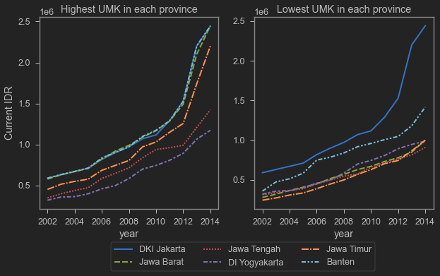
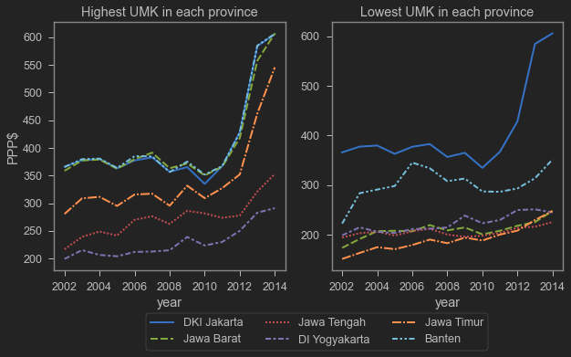

<blockquote class="twitter-tweet">
UMR $111 itu UMR Yogya bukan Indonesia. Jabar sudah Rp4.7 jt ($337). Lebih tinggi dari Cina, Thailand, Malaysia.. <a href="https://t.co/MIhUJfgSOJ">https://t.co/MIhUJfgSOJ</a>
&mdash; ARK (@ngabdul) <a href="https://twitter.com/ngabdul/status/1461127855119679493?ref_src=twsrc%5Etfw">November 18, 2021</a></blockquote>  

[penelitian](https://crawford.anu.edu.au/news-events/events/19298/minimum-wage-policy-and-poverty-developing-country) [Dika](https://crawford.anu.edu.au/people/phd/nurina-merdikawati)

