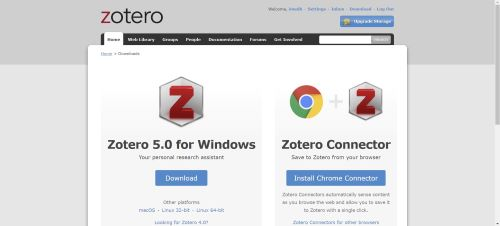
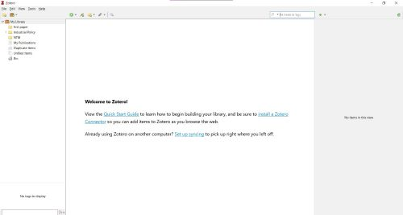
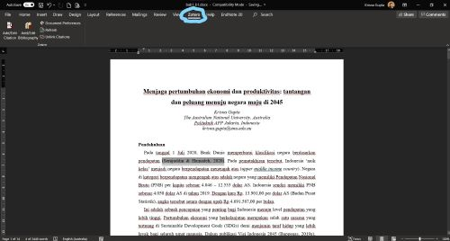

## Menggunakan Zotero di dalam penulisan ilmiah  
#### 16 Januari 2021, 16.00 WIB  

Krisna Gupta  
Ketua Komisi Ekonomi Ditlitka 2020/2021  
Australian National University  

---

## Slide apa ini?

- Instruksi untuk menginstall Zotero, salah satu reference manager untuk menulis artikel ilmiah.
- kenapa zotero:
  - gratis
  - mudah
  - bekerja juga di google docs
- lebih lengkap tentang dokumentasi zotero dapat dibaca di [sini](https://www.zotero.org/support/quick_start_guide)

---

## Our goal

- Membuat reference manager yang cantiq dan otomatis.
- membuat menjadi plain text agar mudah digabung.

---

## What you need

- Laptop / komputer pribadi
  - contoh ini menggunakan windows 10
- Zotero account
  - bikin di [sini](https://www.google.com/search?client=firefox-b-d&q=zotero+account)
- Program zotero
- reference list untuk latihan

---

## Download Zotero for Windows & Chrome plug-in

- Klik [link ini](https://www.zotero.org/download/), anda akan melihat seperti ini

download installer-nya (kiri), lalu install plug-innya utk browser kesayangan anda (kanan).

---

## Install Zotero

- install zotero seperti anda menginstall program-program lain.
- buka zotero, lalu login dengan akun yang sudah anda buat.

"set up syncing" untuk pakai cloud, "install a zotero connector" hanya jika anda belum install browser plug-in 

---

## Cek word plugin

- Zotero menginstall plugin microsoft word secara otomatis ketika anda sudah selesai install zotero.
- dicek aja. Buka word, anda akan melihat tab zotero.

---

## Jadwal Workshop

- Memakai browser plug-in
- input references
  - setelah input tetap harus edit
- membuat reference list di word
  - memilih format APA 7
- export library utk dikasi ke orang lain
- membuang metadata
  - alias save as plain text

---

# Other notes

- siapkan referensi sekitar 5 referensi. kita akan latihan dengan referensi anda masing-masing.
- kalau bisa macem-macem jenisnya: ada yang artikel jurnal, report, website, database dll.
- Estimasi workshop selama 1 jam - 1.5 jam tergantung diskusi.
- See you then!