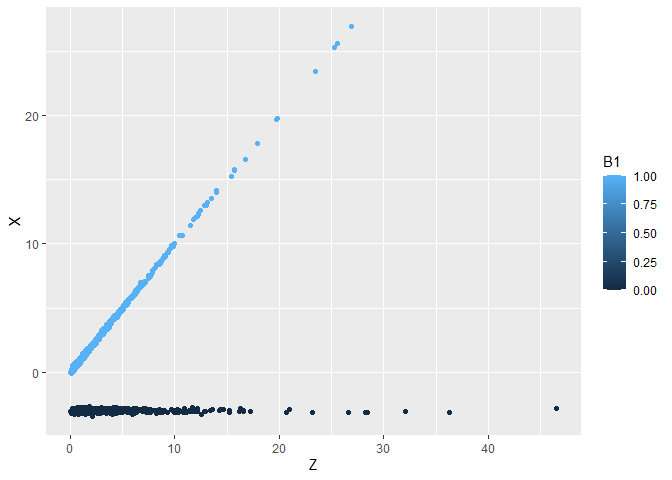
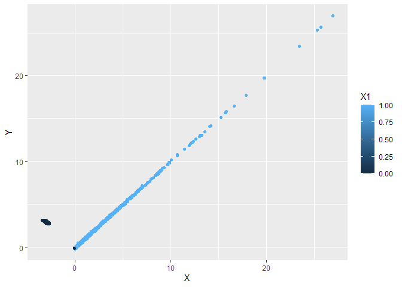
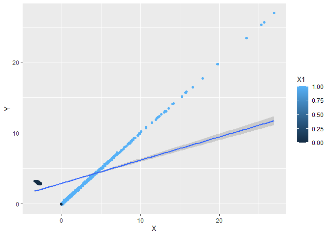

Salah satu kebahagiaan utama dari bekerja sebagai tutor untuk AAS dan
ANU adalah saya jadi belajar konten mata kuliah yang saya tutor yang
tidak saya ikuti semasa saya kuliah di ANU. Di ANU banyak banget mata
kuliah yang isinya sangat menarik yang tidak mungkin semua diikuti.
Menjadi tutor membuat saya ‘mengikuti’ perkuliahan lebih banyak daripada
seharusnya ha ha.

Kali ini, saya mau berbagi ilmu tentang kelemahan Instrumental Variable
(IV) regression, salah satu teknik di ekonometri untuk melakukan
*treatment* terhadap bias OLS. Ilmu ini saya dapatkan ketika menutor dua
mahasiswa keren saya, Grani dan Riza.

Apa itu IV?
-----------

Salah satu problem yang dapat menjangkiti OLS adalah *endogeneity* atau
*reverse causality*. Ini terjadi ketika variabel independen anda
ternyata tidak independen, alias variabel *X* nya ternyata terpengaruh
oleh variabel lain yang tidak ada di regresi, alias ada informasi yang
terkandung di variabel *X* ternyata masih tersimpan di error term, alias
$E[MXM\epsilon] \neq 0$.

Akibatnya, kita tidak dapat mengatakan dengan yakin bahwa *X*
mempengaruhi *Y*, karena bisa saja hubungan kausalitasnya ternyata
terbalik, yaitu *Y* mempengaruhi *X*. Jika anda seorang pengambil
keputusan, *reverse causality* sungguh problematis. Bayangkan pertanyaan
berikut: gaji mempengaruhi kinerja, atau kinerja mempengaruhi gaji?

IV adalah salah satu treatment untuk masalah ini. IV adalah sebuah
variabel ke-3 *Z*, yang punya korelasi kuat dengan variabel independen
*X*, tapi tidak punya korelasi dengan *Y*. Jadi di sini, *Z* menjadi
variabel independen yang paling independen (haha) untuk menangkap
variasi dari *X*. Jika setelah ditangkap oleh *Z* lalu *X* masih
terkorelasi kuat dengan *Y*, kita bisa katakan dengan lebih yakin bahwa
*X* *causes* *Y* dan tidak sebaliknya.

Problem IV
----------

IV sendiri punya banyak problem (huft). Salah satunya adalah IV bisa
jadi malah bikin bias OLS jika hubungan *Z* dan *X* tidak linear. Kita
coba dengan melakukan generasi data untuk $Z,X$ dan $Y$ lalu kita
regresi hasilnya.

Setting
-------

Di sini kita coba bikin kasus mencari kausalitas apakah *cash flow*
mempengaruhi *firm’s borrowing*. Sebuah perusahaan yang *cash flow*-nya
sedang negatif akan meminjam dari bank atau dari masyarakat untuk
bertahan, dan akan dibayar di masa datang ketika sudah dapat *revenue*.
Namun perusahaan yang *cash flow*-nya sedang positif juga bisa saja
meminjam karena *cash flow* positif menandakan perusahaan sedang tumbuh
dan butuh modal lebih. Artinya, hubungan antara *cash flow* dan
*borrowing* tidak jelas kalau di-OLS kan. Salah satu caranya adalah
menggunakan *productivity* untuk memprediksi *cash flow* (perusahaan
yang sedang kena negative shock otomatis *cash flow*-nya negatif) baru
diregresi ke *borrowing*.

Kita buat 2,000 observasi, di mana separuhnya mengalami shock negatif
yang rata $( − 3 + rand())$ sementara yang shock positif memiliki
fungsi $X = Z + rand()$ alias koefisien beta untuk Z adalah 1.

    data <- data.frame(
      id=c(1:2000)
    )

    # generate data observation
    data$lnz <- rnorm(2000, mean = 0.5, sd=1)
    data$Z <- exp(data$lnz)
    data$U <- rnorm(2000,mean = 0, sd=0.1)
    data$B1 <- rbinom (2000, 1, 0.5)  # to explain about probability 1
    data$B2 <- 1-data$B1  # to explain about probability 1

    # generate firm cashflow
    data$X <- data$B1*data$Z - 3*data$B2 + data$U

    # generate firm borrowing
    data$E <- rnorm(2000,mean = 0, sd=0.1)
    data$R <- 0.5*data$U + 0.5*data$E
    data$X1 <- ifelse (data$X>0, 1, 0)
    data$X2 <- ifelse (data$X<0, 1, 0)
    data$Y <- (data$X*data$X1) - (data$X*data$X2) + data$R
    head(data)

    ##   id         lnz         Z           U B1 B2         X           E           R
    ## 1  1  0.53446900 1.7065418 -0.02069438  1  0  1.685847 -0.16523761 -0.09296600
    ## 2  2 -0.25843412 0.7722599 -0.01968836  0  1 -3.019688 -0.09326667 -0.05647752
    ## 3  3  0.58658233 1.7978335  0.05513357  0  1 -2.944866 -0.10034947 -0.02260795
    ## 4  4  1.48663543 4.4221917 -0.18736333  0  1 -3.187363 -0.10648732 -0.14692532
    ## 5  5  1.07463211 2.9289152  0.04403934  0  1 -2.955961  0.03063488  0.03733711
    ## 6  6  0.05710789 1.0587700  0.03335503  1  0  1.092125  0.07427162  0.05381333
    ##   X1 X2        Y
    ## 1  1  0 1.592881
    ## 2  0  1 2.963211
    ## 3  0  1 2.922258
    ## 4  0  1 3.040438
    ## 5  0  1 2.993298
    ## 6  1  0 1.145938

Kode di atas membuat *cash flow* *X* memiliki karakteristik bahwa cash
flow positif punya hubungan linear dengan koefisien 1 terhadap
*productivity shock* positif, tapi hubungan konstan  − 3 terhadap
*productivity shock* negatif. Shock positif tu misalnya kayak tiba-tiba
ada klien duit banyak banget datang ke anda nawarin proyek (misalnya
anda tukang sablon, pemilu adalah shock positif). negatif shock ya
sebaliknya, misalnya pandemik. wabah wereng di masa pemilu mengakibatkan
shock yang tidak rata: positif buat tukang sablon tapi negatif untuk
petani.

Coba kita plot *Z* di sumbu horizontal, *X* di sumbu vertikal:

    library(ggplot2)
    a<-ggplot(data, aes(Z,X, colour=B1)) +
        geom_point()
    a

Di mana warna biru menandakan shock positif sementara hitam menandakan
shock negatif. keliatan ya? Shock positif sesuai 45∘ dari
*X* = 1, sementara shock negatif garis lurus aja di sekitar *X* =  − 3.
Patternnya keliatan banget ya? wkwk ya wajar karena ini adalah data
hasil generasi, bukan survey atau sejenisnya.

Sekarang kita coba plot *X* di sumbu datar, dan *Y* di sumbu tegak:

    b<-ggplot(data,aes(X,Y,colour=X1)) +
      geom_point()
    b

*Firm’s borrowing* sudah pasti positif, dan kita buat sedemikian
sehingga perusahaan meminjam sesuai *cash flow* (alias koefisien
beta-nya = 1). Nah, ketika *X* =  − 3, mereka minjamnya *Y* = 3, makanya
yang hitam ngumpul di (*X*, *Y*) = ( − 3, 3) semua, sementara yang biru
punya tren lurus dengan sudut 45∘ alias *Y* = *X*.

Jika kita, ceritanya nggak tau hubungan *x*, *Y* dan *Z* di dunia nyata,
meregresikan *X* dan *Y* dengan OLS biasa, kira-kira seperti apa
bentuknya?

    b +
      geom_smooth(method = "lm")

Keliatan bias banget yah?

Bagaimana dengan koefisiennya? Coba anda bisa nebak gak? ingat bahwa
ketika *X* positif, *X* naik 1 beriringan dengan *Y* naik sebanyak 1,
sementara ketika *X* negatif, *X* turun 1 beriringan dengan *Y* naik 1
juga. Sementara itu ada 50% *X* yang negatif, dan 50% *X* yang positif.
Jika kita regresi biasa, kira-kira koefisiennya berapa? Coba tebak!

    # Regression
    mod <- lm(Y~X, data = data)
    summary(mod)

    ## 
    ## Call:
    ## lm(formula = Y ~ X, data = data)
    ## 
    ## Residuals:
    ##     Min      1Q  Median      3Q     Max 
    ## -3.0007 -1.7264  0.9776  1.1259 15.2347 
    ## 
    ## Coefficients:
    ##             Estimate Std. Error t value Pr(>|t|)    
    ## (Intercept)  2.88313    0.04075   70.76   <2e-16 ***
    ## X            0.32862    0.01145   28.70   <2e-16 ***
    ## ---
    ## Signif. codes:  0 '***' 0.001 '**' 0.01 '*' 0.05 '.' 0.1 ' ' 1
    ## 
    ## Residual standard error: 1.82 on 1998 degrees of freedom
    ## Multiple R-squared:  0.2919, Adjusted R-squared:  0.2916 
    ## F-statistic: 823.7 on 1 and 1998 DF,  p-value: < 2.2e-16

Jawabannya (hampir) benar! (hampir) 0.5! Jadi sebenarnya dengan OLS, kita sudah
mendapatkan koefisien yang (hampir) sesuai dengan data yang kita regenerasi,
yaitu (hampir) 0.5! Yah tentu saja hasilnya masih salah wkwkwk karena 0.32 masih agak jauh dari 0.5 yha, tapi kan ceritanya kita gak tau dunia nyata bentuknya kayak gimana he he he.

Regresi IV malah bikin tambah jelek
-----------------------------------

Tentu saja OLS belum ngasih kita koefisien yang kita inginkan ya (tentu saja masalah bias masih ada). Yang jadi masalah, regresi IV malah bikin koefisiennya makin menjauh dari 0.5!

Coba kita regresi *Y* dan *X* dengan menggunakan *Z* sebagai instrumen:

    library (AER)

    modelIV <- ivreg(formula=data$Y~data$X | data$Z)
    summary(modelIV)

    ## 
    ## Call:
    ## ivreg(formula = data$Y ~ data$X | data$Z)
    ## 
    ## Residuals:
    ##    Min     1Q Median     3Q    Max 
    ## -5.366 -3.175 -2.877  3.252  3.884 
    ## 
    ## Coefficients:
    ##             Estimate Std. Error t value Pr(>|t|)    
    ## (Intercept)  3.01206    0.07358   40.94   <2e-16 ***
    ## data$X       1.08897    0.05915   18.41   <2e-16 ***
    ## ---
    ## Signif. codes:  0 '***' 0.001 '**' 0.01 '*' 0.05 '.' 0.1 ' ' 1
    ## 
    ## Residual standard error: 3.26 on 1998 degrees of freedom
    ## Multiple R-Squared: -1.271,  Adjusted R-squared: -1.272 
    ## Wald test:   339 on 1 and 1998 DF,  p-value: < 2.2e-16

Setelah di-*treat* dengan IV, koefisien X dan Y malah bermasalah. Tapi
sebenernya kan memang kita meregresikan X dan Y dengan koefisien 1
(meskipun aslinya 50 doang, 50-nya lagi koefisien -1) Tentu saja, IV-nya
hanya menangkap 50 dari fenomena, dan 50-nya lagi akhirnya diserahkan ke
*intercept*. OLS emang masih ada bias, tapi IV malah bikin tambah parah.
Inilah salah satu contoh problem menggunakan IV, jika hubungan IV nya
sendiri bias.

Cara terbaik? Tentu saja memisahkan regresinya jadi dua. Contoh jika
kita regresi hanya shock positif saja:

    dataX<-data
    dataX<-dataX[!(dataX$B2=="1"),]

    modelIV2 <- ivreg(formula=dataX$Y~dataX$X | dataX$Z)
    summary(modelIV2)

    ## 
    ## Call:
    ## ivreg(formula = dataX$Y ~ dataX$X | dataX$Z)
    ## 
    ## Residuals:
    ##       Min        1Q    Median        3Q       Max 
    ## -0.228315 -0.047317  0.002166  0.045417  0.201270 
    ## 
    ## Coefficients:
    ##              Estimate Std. Error  t value Pr(>|t|)    
    ## (Intercept) 0.0020950  0.0028174    0.744    0.457    
    ## dataX$X     0.9997967  0.0006977 1432.905   <2e-16 ***
    ## ---
    ## Signif. codes:  0 '***' 0.001 '**' 0.01 '*' 0.05 '.' 0.1 ' ' 1
    ## 
    ## Residual standard error: 0.06716 on 999 degrees of freedom
    ## Multiple R-Squared: 0.9995,  Adjusted R-squared: 0.9995 
    ## Wald test: 2.053e+06 on 1 and 999 DF,  p-value: < 2.2e-16

Ini benar. Intercept = 0, dan koefisiennya 1, sesuai dengan yang kita
buat. Tentu saja yang negatif tidak perlu kita IV karena ketika negatif,
*X* akan otomatis -3. Artinya, untuk yang negatif, *X* sudah eksogen!
Tidak perlu ditreatment apa-apa (meskipun, coba lihat bagaimana saya
*generate* error term?)

Intinya, hati-hati menggunakan IV
---------------------------------

IV dapat berbahaya jika instrumennya tidak menjelaskan dengan baik
penyebaran dari variabel endogen yang di-*treat*, atau jika anda tidak
tau-tau banget hubungan si instrumen dengan variabel yang di-*treat*.
Bukannya memperbaiki, malah bikin OLS tambah parah. Tentu saja masalah
lainnya adalah jika ternyata instrumennya punya korelasi dengan Y. Di
contoh kita ini tentu saya Y independen terhadap Z, tapi di dunia nyata,
sulit banget cari instrumen yang benar-benar independen. Contoh, jika
ternyata *shock*-nya berpengaruh ke sektor finansial, otomatis
si-*shock* ini akan punya pengaruh ke *borrowing*. Wkkwkwk.

Biasanya yang kita lakukan di paper adalah menunjukkan hasil regresi OLS
dan IV, sehingga bisa dilihat pola-nya apakah IV memperbaiki OLS atau
tidak. Tentu saja justifikasi dari publikasi lain soal keabsahan IV juga
harus ditulis di paper kita wkwk

IV memang ribet. Moga-moga kita tidak harus berurusan dengan IV. wwkwkw.
Ok sekian semoga postingannya berguna.
