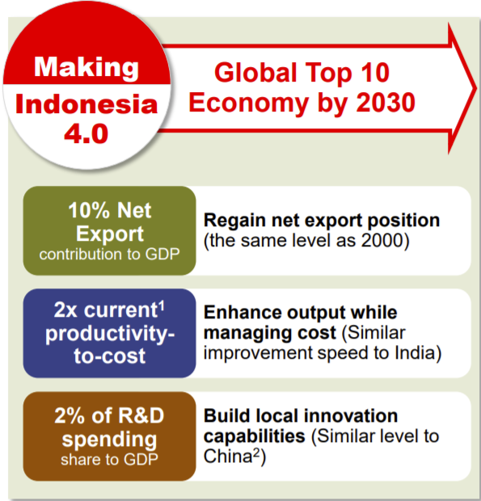
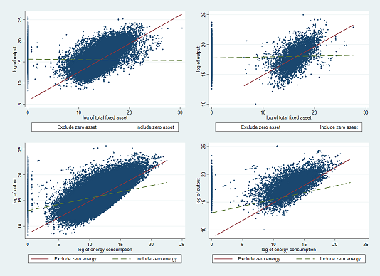

background-image: url(title.png)
class: middle

.center[
# The heterogenous impact of tariff and NTM on total factor productivity of Indonesian firms
]
<br />
<br />
<br />
<br />


Krisna Gupta  
Crawford PhD Seminar  
October 2, 2020  
Arianto Patunru, Paul Gretton, Budy Resosudarmo


---

background-image: url(normal.png)

<br />

# Content

- intro
- literature review
- data
- method
- results
- discussion & Policy recommendations

---

background-image: url(normal.png)
class:center,middle

# Introduction

---

background-image: url(normal.png)

<br />

# Introduction

.pull-left[
- Indonesia insists on relying to manufacturing to boost its growth  
<br />
- Emphasize on tech upgrade  
<br />
- also on export-led  
<br />
- The role of openness will be greater
 - financing R&D
 - import $\Rightarrow$ tech-upgrade (Castellani and Fassio 2019)
]

.pull-right[
  
Source: [kemenperin.go.id](https://www.kemenperin.go.id/download/19347)
] 

---

background-image: url(normal.png)

<br />

# Introduction

- However, Protectionism is on the rise, including in Indonesia (Patunru 2018)

- While overall tariff went down, Non-Tariff Measures went up

- The role of Ministry of Industry is on the rise from National Standards (SNI) and Local Content Requirement (LCR) (Munadi 2018)

- Pandemic accelerates the trend, potentially using tariff as well
> "Roadmap sedang disusun. Nanti output-nya **subtitusi impor** pada akhir **2022** sebesar **35%**," kata Menteri Perindustrian Agus Gumiwang dalam sebuah webinar, Selasa (28/7).  
<br />
Source: [katadata.co.id](https://katadata.co.id/happyfajrian/berita/5f2026bce0f69/siapkan-roadmap-kemenperin-optimis-subtitusi-impor-capai-35-di-2022?utm_source=Direct&utm_medium=Tags%20Kementerian%20Perindustrian&utm_campaign=Indeks%20Pos%201)

- Protectionism policies may lead to more policies:
 - US Case: iron $\Rightarrow$ appliances
 - Indonesian Case: corn & soybean $\Rightarrow$ chicken, mobile phone

---

background-image: url(normal.png)

<br />

# Introduction

- The straight forward question:

> To what extent tariff and NTM affects firm's productivity?

- Further investigation is conducted:

 - does size matters? (core question since Melitz (2003))
 
 - how protectionism affects employment?
 
 - can NTM reduces firm's import in general?
 
- Building from Amiti and Konnings (2007), I estimate TFP and use it as dependent variable

- Tariff is scrapped from MoF regulations, NTM from TRAINS database

- Other databases: Survey Industri and Customs data from BPS from 2008 to 2012

---

background-image: url(normal.png)
class:center,middle

# Literature Review

---

background-image: url(normal.png)

<br />

# Some literatures

---

background-image: url(normal.png)
class:center,middle

# Data

---

background-image: url(normal.png)

<br />

# Firms

- Survey Industri (SI), BPS
  - follows many Indonesian manufacturing since 1970s
  - infos include factor used, foreign ownership, output, fraction of export and import
  - unbalanced, unfortunately
  - Inconsistent fixed asset and energy consumption
  
- Customs data
  - 2008-2012 with firm id to integrate with SI
  - varies with countries and HS-8-digit
  - not exactly match one-on-one with SI
  - can't say for sure if the import is directly used for production

- Not all firms reporting export and import in SI exist in the customs data, and vice-versa
  - may be using third party
  
---

background-image: url(normal.png)

<br />

# What Indonesian firms are trading?

.pull-left[
Table 1a. Import
```{r echo=FALSE}
library(kableExtra)
library(formattable)
HS2<-c(72,84,85,29,39,23,52)
Description<-c('Iron and steel','Mechanical Machinery','Electrical Machinery','Organic Chemicals','Plastics and articles','Food Waste','Cotton')
M2008<-comma(c(2060,2030 ,1610 ,1180 ,875 ,642 ,571), format="d")
M2009<-comma(c(1070,1520,1580 ,925 ,753,616,465),format="d")
M2010<-comma(c(1810,2580,2300,1250,1110,597,710),format="d")
M2011<-comma(c(2280,3360,2880,1560,1560,1080,1090),format="d")
M2012<-comma(c(2660,4130,2540,1850,1680,1270,854),format="d")
tab1a<-data.frame(HS2,Description,M2008,M2009,M2010,M2011,M2012)
kbl(tab1a,'html') %>%
  kable_styling(bootstrap_options = "striped", font_size = 11)
```
]

.pull-right[
Table 1b. Export
```{r echo=FALSE}
library(kableExtra)
library(formattable)
HS2<-c(85,40,15,87,84,61,62)
Description<-c('Electrical Machinery','Rubber and Articles','Animal or Vegetable Fats','Non-railway Vehicles','Mechanical Machinery','Knitted apparels','Non-knitted apparels')
X2008<-comma(c(2070,1760,1330,1150,986,636,643), format="d")
X2009<-comma(c(2990,1590,1700,1370,993,989,1150),format="d")
X2010<-comma(c(4340,3680,2730,2060,1440,1040,1360),format="d")
X2011<-comma(c(4890,5770,4270,2290,1790,1370,1560),format="d")
X2012<-comma(c(4750,4130,4540,3500,1660,1320,1290),format="d")
tab1b<-data.frame(HS2,Description,X2008,X2009,X2010,X2011,X2012)
kbl(tab1b,'html') %>%
  kable_styling(bootstrap_options = "striped", font_size = 11)
```
]

<Br />

Suggests integration with Global Value Chain, which is not surprising.

---

background-image: url(normal.png)

<br />

### Firm's Characteristics

Table 2. Firm's characteristics, 2018-2012
```{r echo=F}
Characteristics<-c('foreign ownership (%)','foreign ownership (%)','fraction of output exported (%)','fraction of output exported (%)','fraction of input imported (%)','fraction of input imported (%)','no. of labour employed','no. of labour employed','capital stock (Million IDR)','capital stock (Million IDR)','total intermediate input (Million IDR)','total intermediate input (Million IDR)','total output (Million IDR)','total output (Million IDR)','total value added (Million IDR)','total value added (Million IDR)','value added per labour (IDR)','value added per labour (IDR)','No. of observation')
All_SI<-c(8.15,'(26.17)',22.51,'(37.52)',0.08,'(0.24)',191.07,'(711.73)',198.00,'(44,800.00)',50.80,'(617.00)',90.30,'(958.00)',38.50,'(455.00)','137,987.10','(2,515,300.00)','117,598')
Non_customs<-c(5.96,'(22.60)',0.21,'(0.37)',0.07,'(0.21)',162.75,'(602.46)',194,'(46,500)',41,'(515)',73.30,'(861)',31.60,'(414)','126,074','(2,600,177)','108,662')
Customs_only<-c(34.77,'(45.06)',0.40,'(0.42)',0.31,'(0.38)',535.44,'(1,457.65)',250,'(10,400)',170,'(1,330)',296,'(1,740)',123,'(789)','282,857','(1,012,159)','8,915')
tab2<-data.frame(Characteristics,All_SI,Non_customs,Customs_only)
kbl(tab2,'html') %>%
  kable_styling(bootstrap_options = "striped", font_size = 9) %>%
  collapse_rows()
  
```

---

background-image: url(normal.png)

<br />

## Trade Policies

##### Tariff
- Tariff is scrapped from Ministry of Finance's regulations from 2008 to 2012.
- For practicality, also used are source from FTA partners.
- FTAs during 2008-2012 includes with ASEAN, China, Japan, South Korea, India, Australia and New Zealand.

##### NTMs
- TRAINS (UNCTAD 2017) is used for NTM
- Count data (=1 if an NTM is applied to a good in HS-6-Digit)
  - neutral, but lack depth
- Doesn't really follow (cross section)
  - but do have `Start Date` and `End Date`

---

background-image: url(normal.png)

<br />

# TRAINS database

Table 3. Indonesia's NTM, TRAINS 2015 set
```{r echo=F}
NTM<-c('Sanitary & Phytosanitary (SPS)','Sanitary & Phytosanitary (SPS)','Technical Barrier to Trade (TBT)','Technical Barrier to Trade (TBT)','Pre-shipment inspections and other formalities','Pre-shipment inspections and other formalities','Non-automatic licensing, quotas, QC, etc','Non-automatic licensing, quotas, QC, etc','Price-control measures, extra taxes, charges','Price-control measures, extra taxes, charges','Measures affecting competition','Measures affecting competition','Export-related measures','Export-related measures','observations')
N2008<-c(1.715,'(2.644)',0.481,'(0.962)',0.562,'(1.202)',0.623,'(0.809)',0.000,'(0.000)',0.019,'(0.139)',0.901,'(1.172)','1,675')
N2009<-c(2.337,'(4.018)',0.455,'(0.978)',0.466,'(1.081)',0.560,'(0.818)',0.000,'(0.000)',0.052,'(0.238)',0.704,'(1.132)','2,204')
N2010<-c(2.222,'(3.950)',0.641,'(1.334)',0.443,'(1.059)',0.605,'(0.873)',0.015,'(0.168)',0.050,'(0.233)',0.708,'(1.109)','2,318')
N2011<-c(2.255,'(4.054)',0.682,'(1.361)',0.462,'(1.046)',0.618,'(0.861)',0.014,'(0.165)',0.048,'(0.229)',0.683,'(1.098)','2,400')
N2012<-c(2.774,'(5.128)',0.663,'(1.352)',0.776,'(1.075)',0.594,'(0.853)',0.016,'(0.168)',0.046,'(0.224)',1.172,'(1.465)','2,510')
tab3<-data.frame(NTM,N2008,N2009,N2010,N2011,N2012)
kbl(tab3,'html') %>%
  kable_styling(bootstrap_options = "striped", font_size = 11) %>%
  collapse_rows()
```

---

background-image: url(normal.png)

<br />

# Tariff from 2008-2012

.center[
Table 4. Tariff from MoF regulations (left) compared to WITS (right)
]

.pull-left[
```{r echo=F}
Kind<-c('MFN','MFN','ASEAN','ASEAN','China','China','South Korea','South Korea','India','India','Japan','Japan','ANZ','ANZ')
T2008<-c(7.049,'(12.213)',2.478,'(11.094)',7.049,'(12.213)',7.049,'(12.213)',7.049,'(12.213)',6.110,'(11.967)',7.049,'(12.213)')
T2009<-c(7.612,'(12.536)',2.490,'(11.206)',3.819,'(12.673)',2.624,'(12.265)',7.612,'(12.536)',4.639,'(12.356)',6.446,'(11.922)')
T2010<-c(6.928,'(8.037)',0.150,'(4.559)',2.193,'(7.941)',1.912,'(7.131)',6.394,'(7.809)',3.274,'(7.353)',2.948,'(6.765)')
T2011<-c(6.975,'(7.231)',0.150,'(4.559)',2.208,'(7.941)',1.912,'(7.131)',5.874,'(7.517)',2.618,'(7.114)',2.278,'(6.318)')
T2012<-c(6.960,'(7.145)',0.150,'(4.559)',1.941,'(7.927)',1.542,'(7.102)',5.341,'(7.322)',2.230,'(6.487)',1.545,'(6.065)')
tab4a<-data.frame(Kind,T2008,T2009,T2010,T2011,T2012)
kbl(tab4a,'html') %>%
  kable_styling(bootstrap_options = "striped", font_size = 11) %>%
  collapse_rows()
```
]

.pull-right[
```{r echo=F}
T2008<-c(7.762,'(12.631)','-','-','-','-','-','-','-','-','-','-','-','-')
T2009<-c(7.595,'(12.456)',1.840,'(11.079)',3.665,'(12.342)',2.564,'(12.087)','-','-','-','-','-','-')
T2010<-c(7.564,'(12.412)',1.843,'(11.067)',2.743,'(12.392)',2.560,'(12.084)','-','-','-','-','-','-')
T2011<-c(7.051,'(7.015)',0.152,'(4.285)',1.850,'(6.853)',1.698,'(6.395)',5.409,'(6.726)','-','-','-','-')
T2012<-c(7.053,'(7.016)',0.152,'(4.287)',1.579,'(6.823)',1.326,'(6.349)',4.991,'(6.620)','-','-','-','-')
tab4b<-data.frame(Kind,T2008,T2009,T2010,T2011,T2012)
kbl(tab4b,'html') %>%
  kable_styling(bootstrap_options = "striped", font_size = 11) %>%
  collapse_rows()
```
]

---

background-image: url(normal.png)
class:center,middle

# Method

---

background-image: url(normal.png)

<br />

# TFP estimation

The framework is using two-stage regression:  
first, estimating TFP

$$y_{it}=\beta_0 + \beta_ll_{it}+\beta_kk_{it}+\beta_mm_{it}+\beta_nn_{it}+\epsilon_{it}$$
where:  
$y_{it}$  &nbsp; = Revenue of firm i at time t  
$l_{it}$  &nbsp;&nbsp;&nbsp;= number of labour  
$k_{it}$ &nbsp; = fixed assets  
$m_{it}$ &nbsp;= intermediate materials  
$n_{it}$ &nbsp; = energy consumption

Use the coefficient to predict TFP:

$$TFP_{it}=y_{it}-\hat{\beta}_{l}l_{it}-\hat{\beta}_kk_{it}-\hat{\beta}_mm_{it}-\hat{\beta}_nn_{it}$$
then estimate the second stage:

$$TFP_{it}=\gamma_0+\gamma_{tariff}tariff_{it}+\gamma_{NTM}NTM_{it}+\eta_{it}$$

---

background-image: url(normal.png)

<br />

# Some problems

error term contains a productivity shock observed only by managers, and may correlates with production decisions.

$$\epsilon_{it}=\omega_{it}+\mu_{it}$$
where $\mu_{it}$ is iid. Meanwhile:

Olley and Pakes (1996) suggest $\omega_{it}$ can be observed via investment.

$$I_{it}=i(k_{it},\omega_{it})$$
inverse, then let $\omega$ follows a first order markov process:

$$\omega_{it}=\phi(I_{it},k_{it})$$
Weaknesses of using investment (Levinsohn and Petrin 2003):
- zero reported investment $\neq$ shock
- less flexible compared to intermediate input

---

background-image: url(normal.png)

<br />

# LP Method

Levinsohn and Petrin (2003) suggest using intermediate input

$$\omega_{it}=\phi(m_{it},k_{it})$$
Therefore, the first-stage becomes:

$$y_{it}=\beta_0 + \beta_ll_{it}+\beta_nn_{it}+\phi(m_{it},k_{it})+\mu_{it}$$
Then proceed as follows to estimate TFP.

$$TFP_{it}=y_{it}-\hat{\beta}_{l}l_{it}-\hat{\beta}_kk_{it}-\hat{\beta}_mm_{it}-\hat{\beta}_nn_{it}$$
The command `levpet` in STATA allows for practical use of the LP method (Petrin, Poi and Levinsohn 2005).

---

background-image: url(normal.png)
<br />

# Trade policy variable

The dataset allows for multiple goods imported for each firm. The most practical way is to use coverage ratios.

$$T_{it}=\frac{\sum tariff_{sc}V_{sc}}{\sum V_{sc}}*100$$
where:
- $T_{it}=$ tariff coverage ratio of firm i at time t,
- $tariff_{sc}=$ tariff imposed on good s from country c at time t
- $V_{sc}=$ value of good s imported from country c by firm i at time t

And for NTMs:

$$C_{\theta it}=\frac{\sum NTM_{\theta sc}V_{sc}}{\sum V_{sc}}*100$$

where $NTM_{\theta sc}$ is the number of NTM $\theta$ imposed on good $s$ from country $c$

---

background-image: url(normal.png)

<br />

# Second-Stage

The second stage regression then:

$$tfp_{it}=\gamma_0+\gamma_Tt_{it}+\sum_\theta c_{\theta it}+FO_{it}+\alpha_i+ISIC_i+\eta_{it}$$
Where:
- $tfp_{it} = log(TFP_{it})$
- $t_{it} = log(1+T_{it})$
- $c_{\theta it} = log(1+C_{\theta it})$
- $FO_{it} =$ foreign ownership of firm i at time t (%)

along with firm's fixed effect and ISIC dummy.

---

background-image: url(normal.png)

<br />

# Coverage ratio

.pull-left[
- Table 5 shows simple mean and coverage ratios

- As expected, tariff lies between MFN and FTAs

- Import licensing and quotas is more important than SPS and TBT

- Coverage ratios vs simple mean:
 - no visual difference on tariff
 - firms import more goods with NTMs

]

.pull-right[
Table 5. Coverage ratios
```{r echo=FALSE}
library(kableExtra)
library(formattable)
Variable<-c('Tariff',
'Tariff Coverage Ratio (T)',
'SPS (A)',
'TBT (B)',
'Pre-shipment inspection (C)',
'Licensing, quota, etc (E)',
'Price control etc (F)', 
'Competition measures (H)',
'Export-related (P)',
'Coverage ratio A',
'Coverage ratio B',
'Coverage ratio C',
'Coverage ratio E',
'Coverage ratio F',
'Coverage ratio H',
'Coverage ratio P'
)
Obs<-comma(c(407532,407532,407532,407532,407532,407532,407532,407532,407532,407532,407532,407532,407532,407532,407532,407532),format="d")
Mean<-c(3.503,3.420,0.108,0.140,0.028,0.321,0.000,0.007,0.063,0.246,0.202,0.059,0.337,0.000,0.014,0.110)
St.Dev.<-c(4.971,5.646,0.718,0.663,0.214,0.550,0.008,0.083,0.376,0.931,.478,0.237,0.468,0.001,0.083,0.353)
Min<-c(0,0,0,0,0,0,0,0,0,0,0,0,0,0,0,0)
Max<-c(150,150,29,13,5,6,2,2,7,19,9,4,6,0,1,7)
tab5<-data.frame(Variable,Obs,Mean,St.Dev.,Min,Max)
kbl(tab5,'html') %>%
  kable_styling(bootstrap_options = "striped", font_size = 9) %>%
  row_spec(3, bold=T,color="black",background="yellow") %>%
  row_spec(10, bold=T,color="black",background="yellow") %>%
  row_spec(4, bold=T,color="white",background="blue") %>%
  row_spec(11, bold=T,color="white",background="blue") %>%
  row_spec(6, bold=T,color="white",background="red") %>%
  row_spec(13, bold=T,color="white",background="red")
```
]


---

background-image: url(normal.png)
class:center,middle

# Results

---

background-image: url(normal.png)

<br />

# TFP Results

.center[
Zero capital and energy consumption skewed the regression for both SI observations (left) and customs data (right).


]

---

background-image: url(normal.png)

<br />

# TFP Results

---

background-image: url(normal.png)
class:center,middle

# Discussion and Policy Recommendation

---

background-image: url(normal.png)

<br />

# Discussions

---

background-image: url(normal.png)

<br />

# Policy recommendation

- Sometimes, less is more
  - Intervening with trade is usually inefficient
  - at what (who's) cost?
  - ban import doesn't mean domestic will catch up
  - may lead to more intervention

- If scared with CAD, find other ways
  - let IDR weaken?
  - bad debt management $\Rightarrow$ costing manufacturers and consumers
  - become more attractive to business (both domestic and foreign)
  
- Commodities are still the main driver of export, and halting GVC may lead to even more reliance on commodities to keep CA>0
  
---

background-image: url(normal.png)

<br />

# Caveats

- NTMs have mixed results.
  - Count data isn't ideal
  - May have different impact for different types of NTMs
  - May have different impact on different goods
  - More in-depth studies are needed
  
- The sample is quite restrictive.
  - Importers are different compared to general firms
  - the number of importers is very small
  
- Data isn't perfect.
  - NTM collected in 2015 have slight variation compared to 2018
  - SI have many problems
  - Customs have not go beyond 2012 yet

---

background-image: url(normal.png)

class: center, middle

# The End


