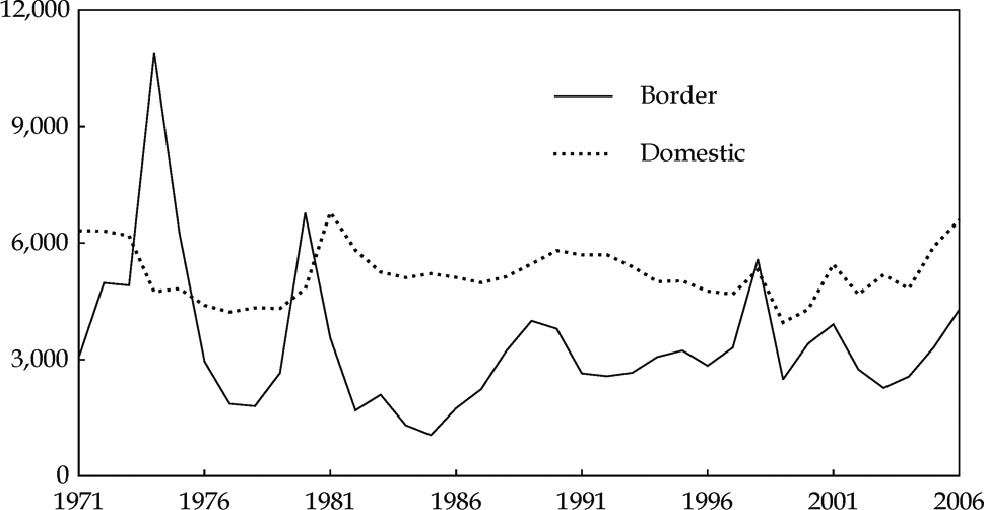

### Recap on the perfect competition

- Prices created by a free market interaction, while buyers & sellers themselves can't control prices.
  - official price is not necessarily the market price.

- Price in a competitive market moves toward equilibrium.
  - Price too low $\Rightarrow$ excess demand
  - Price too high $\Rightarrow$ excess supply
  
- Price change $\rightarrow$ movement along the curve, anything ese $\rightarrow$ shifts the curve

---

# What happened to sugar?

.pull-left[

]

.pull-right[
.s[
"Meski gula sudah di tangan, tapi kondisinya tidak terlalu menguntungkan. Ini lantaran gula yang dibeli dibandrol Rp17 ribu per kg padahal Harga Eceran Tertinggi (HET) resmi pemerintah adalah Rp12.500 per kg."  <br> <br> - quoted from [tirto.id](https://tirto.id/pemerintah-klaim-stok-gula-aman-kok-harga-malah-meroket-langka-fkCl) 6 $^{th}$ of May 2020
]
]

---

# What happened to sugar?

- Official price $\neq$ market price.

- Unlike chip and graphic card (last week's problem), sugar is plentiful in the international market.

- In Indonesia, trade of agricultural products are highly regulated.

  - Why it's so highly regulated?
  - Who are the winners and the losers?

---

## Indonesian sugar price



prices are in 2006 IDR
.xs[
source: Fane, George, and Peter Warr. 2008. "Agricultural protection in indonesia." Bulletin of Indonesian Economic Studies 44 (1): 133-150. https://doi.org/10.1080/00074910802001611.
]

---

# Today's learning

- Measuring welfare
  - Consumer & producer surplus

- Intervention by (mostly) the government
  - Price control
  - Quantity control

- Measuring inefficiency
  - Deadweight loss
  
---

class: middle, center

# Consumer Surplus

---

## Market for a used textbook

- A used textbook is less good:
  - may be stained, worn, contain marks & notes, outdated.
  
- Some would prefer to buy new if the price difference is too small

- Some people would buy a used textbook if it's cheap enough, depending on their **willingness to pay** (WTP)

- We can say that **WTP** is the **maximum price** someone is willing to buy a good.
  
---

## WTP and Consumer Surplus

- WTP is personal and unobservable.
    - If people buy a product, then probably the price of that product is less than his/her WTP.
  
- WTP varies between people/economic agent.
  
  - Businesses value airfare higher than general consumers.
  
- The difference between WTP and the price a consumer actually pay is called **consumer surplus**.

---

## Market for a used textbook

- Suppose we have a brand new economics textbook priced Rp 100.000,- in the market.

- Some people sell the used textbook Rp 50.000,-

- Let there be 5 economics students interested in buying the book.

- They value used books differently:
  - Some requires the book to be very cheap. Otherwise they'd rather buy new.

---

## Used texbook demand schedule

```{r tabel1, echo=FALSE, message=FALSE, warning=FALSE}
library(kableExtra)
buyer <- c("Joy","Kensi","Panca","Livi","Will","total CS")
WTP <- c(70,60,55,45,40,'-')
price <- c(50,50,50,50,50,'-')
CS <- c(20,10,5,"-","-",'35')

data<-data.frame(buyer,WTP,price,CS)
data %>%
  kable("html", align="cc", col.names = c('potential buyer','WTP', 'price','CS=|WTP-price|')) %>%
  kable_styling(bootstrap_options = "striped", font_size = 25) %>%
  footnote('price and WTP in 1.000 IDR')

#  add_header_above(c('P','Q')) %>%
#  add_header_above(c('Price of rice','Rice Consumption'))
```

---

## Demand curve for a used book

```{r grafik1,echo=FALSE, message=FALSE, warning=FALSE}
library(dplyr)
library(ggplot2)
library(ggdark)

data2 <- data_frame(label = c("Joy","Kensi","Panca","Livi","Will"),
                          y = c(70,60,55,45,35),
                          x = c(1,2,3,4,5),
                          xx= x+0.5)
graph<-ggplot()+
  dark_theme_bw(base_size=20)+
  theme(text = element_text(color='#e0e0e0'),
        panel.border = element_blank(),
        panel.grid.major = element_blank(),
        panel.grid.minor = element_blank(),
        axis.line = element_line(colour = "#e0e0e0"))

grafik1 <- graph +
  geom_text(data = data2,
            aes(x = xx, y = y, label = label), parse = TRUE,
            family = "Source Sans Pro", size=8)+
  geom_segment(aes(x = 0, xend=1,y=70,yend=70),color='blue',size=2) +
  geom_segment(aes(x = 1, xend=1,y=70,yend=60),color='blue',size=2) +
  geom_segment(aes(x = 1, xend=2,y=60,yend=60),color='blue',size=2) +
  geom_segment(aes(x = 2, xend=2,y=60,yend=55),color='blue',size=2) +
  geom_segment(aes(x = 2, xend=2,y=60,yend=55),color='blue',size=2) +
  geom_segment(aes(x = 2, xend=3,y=55,yend=55),color='blue',size=2) +
  geom_segment(aes(x = 3, xend=3,y=55,yend=45),color='blue',size=2) +
  geom_segment(aes(x = 3, xend=4,y=45,yend=45),color='blue',size=2) +
  geom_segment(aes(x = 4, xend=4,y=45,yend=35),color='blue',size=2) +
  geom_segment(aes(x = 4, xend=5,y=35,yend=35),color='blue',size=2) +
  geom_segment(aes(x = 5, xend=5,y=35,yend=30),color='blue',size=2) +
  geom_point(data=data2,
             aes(x=x,y=y,ymin=30,xmin=0),color='orange',size=3)+
  labs(x='Q (unit)',y='P (1.000 IDR)')+
  scale_x_continuous(breaks=seq(0,5,1))

grafik1

```

---

## Consumer surplus(es)

```{r grafik2,echo=FALSE, message=FALSE, warning=FALSE, fig.width=10}

grafik2 <- grafik1 +
  geom_hline(yintercept=50, color = "white",size=2)+
  geom_ribbon(aes(x=c(0,1), ymin=50, ymax = 70,
                  fill = "Joy's surplus"), alpha = 0.4)+
  geom_ribbon(aes(x=c(1,2), ymin=50, ymax = 60,
                  fill = "Kensi's surplus"), alpha = 0.4)+
  geom_ribbon(aes(x=c(2,3), ymin=50, ymax = 55,
                  fill = "Panca's surplus"), alpha = 0.4)

grafik2

```

---

## Consumer surplus(es)

.pull-left[
```{r grafik3,echo=FALSE, message=FALSE, warning=FALSE, fig.width=5}

grafik3 <- grafik1+
  geom_hline(yintercept=50, color = "white",size=2)+
  geom_ribbon(aes(x=c(0,1), ymin=50, ymax = 70,
                  fill = "Joy's surplus"), alpha = 0.4, show.legend = FALSE)+
  geom_ribbon(aes(x=c(1,2), ymin=50, ymax = 60,
                  fill = "Kensi's surplus"), alpha = 0.4, show.legend = FALSE)+
  geom_ribbon(aes(x=c(2,3), ymin=50, ymax = 55,
                  fill = "Panca's surplus"), alpha = 0.4, show.legend = FALSE)

grafik3

```
]

.pull-right[
- Calculating surplus in this case is straight-forward:

- We calculate individual surpluses first, then add them up.

- If we lower the price, would the surplus increase or decrease?
]

---

## Producer surplus

- we can easily construct the same thing using the supply schedule and supply curve.

- Let there be 5 seniors who have passed the economics course and are willing to sell their old textbooks.

- Different potential sellers also have different price level they are willing to sell.

- The lowest price at which potential seller is willing to sell is called seller's **cost**

---

## Seller's cost

- In our case, it's funny to call the willingness to sell as 'cost'.

- However, in economics, we consider **opportunity cost** as a cost.
  - Selling the book means giving away their collection.
  - the book might have notes that could be useful for them in the future.
  - the book might also have a personal value.
  
- The term 'cost' is useful generally since a seller will not sell something they can't profit from.

---

## Supply schedule

```{r tabel2, echo=FALSE, message=FALSE, warning=FALSE}

seller <- c("Tony","Natasha","Bruce","Wanda","Steve","total PS")
cost <- c(65,60,50,35,25,'-')
PS <- c("-","-",0,15,25,'40')

data<-data.frame(seller,cost,price,PS)
data %>%
  kable("html", align="cc", col.names = c('potential seller','cost', 'price','PS=|price-cost|')) %>%
  kable_styling(bootstrap_options = "striped", font_size = 25) %>%
  footnote('price and WTP in 1.000 IDR')

```
---

## Producer surplus(es)

```{r grafik4,echo=FALSE, message=FALSE, warning=FALSE, fig.width=10}

data3 <- data_frame(label = c("Tony","Natasha","Bruce","Wanda","Steve"),
                          y = c(65,60,50,35,25),
                          x = c(5,4,3,2,1),
                          yy= y-2)

grafik4 <- graph +
  geom_hline(yintercept=50, color = "white",size=2)+
  geom_text(data = data3,
            aes(x = x, y = yy, label = label), parse = TRUE,
            family = "Source Sans Pro", size=8)+
  geom_ribbon(aes(x=c(0,1), ymin=25, ymax = 50,
                  fill = "Steve's surplus"), alpha = 0.4, size=10)+
  geom_ribbon(aes(x=c(1,2), ymin=35, ymax = 50,
                  fill = "Wanda's surplus"), alpha = 0.4)+
  geom_ribbon(aes(x=c(2,3), ymin=50, ymax = 50,
                  fill = "Bruce's surplus"), alpha = 0.4)+
  geom_segment(aes(x = 0, xend=0,y=18,yend=25),color='red',size=2) +
  geom_segment(aes(x = 0, xend=1,y=25,yend=25),color='red',size=2) +
  geom_segment(aes(x = 1, xend=1,y=25,yend=35),color='red',size=2) +
  geom_segment(aes(x = 1, xend=2,y=35,yend=35),color='red',size=2) +
  geom_segment(aes(x = 2, xend=2,y=35,yend=50),color='red',size=2) +
  geom_segment(aes(x = 2, xend=3,y=50,yend=50),color='red',size=2) +
  geom_segment(aes(x = 3, xend=3,y=50,yend=60),color='red',size=2) +
  geom_segment(aes(x = 3, xend=4,y=60,yend=60),color='red',size=2) +
  geom_segment(aes(x = 4, xend=4,y=60,yend=65),color='red',size=2) +
  geom_segment(aes(x = 4, xend=5,y=65,yend=65),color='red',size=2) +
  geom_point(data=data3,
             aes(x=x,y=y,ymin=18,xmin=0),color='green',size=3)+
  labs(x='Q (unit)',y='P (1.000 IDR)')
  

grafik4

```

---

## Total Surplus

- When we say **consumer surplus**, we often refer to the consumer surplus of the market, not individual CS.

- same goes with **producer surplus**.

- lastly, we can combine the two surpluses to  get the total surplus of the market of the used book.

$$TS=CS+PS$$
- In our used texbook case, $TS=35+40=75$

---

## Total Surplus in a chart

```{r grafik5,echo=FALSE, message=FALSE, warning=FALSE, fig.width=10}

grafik5 <- grafik2 + 
  geom_text(data = data3,
            aes(x = x, y = yy, label = label), parse = TRUE,
            family = "Source Sans Pro", size=8)+
  geom_ribbon(aes(x=c(0,1), ymin=25, ymax = 50,
                  fill = "Steve's surplus"), alpha = 0.4, size=10)+
  geom_ribbon(aes(x=c(1,2), ymin=35, ymax = 50,
                  fill = "Wanda's surplus"), alpha = 0.4)+
  geom_ribbon(aes(x=c(2,3), ymin=50, ymax = 50,
                  fill = "Bruce's surplus"), alpha = 0.4)+
  geom_segment(aes(x = 0, xend=0,y=18,yend=25),color='red',size=2) +
  geom_segment(aes(x = 0, xend=1,y=25,yend=25),color='red',size=2) +
  geom_segment(aes(x = 1, xend=1,y=25,yend=35),color='red',size=2) +
  geom_segment(aes(x = 1, xend=2,y=35,yend=35),color='red',size=2) +
  geom_segment(aes(x = 2, xend=2,y=35,yend=50),color='red',size=2) +
  geom_segment(aes(x = 2, xend=3,y=50,yend=50),color='red',size=2) +
  geom_segment(aes(x = 3, xend=3,y=50,yend=60),color='red',size=2) +
  geom_segment(aes(x = 3, xend=4,y=60,yend=60),color='red',size=2) +
  geom_segment(aes(x = 4, xend=4,y=60,yend=65),color='red',size=2) +
  geom_segment(aes(x = 4, xend=5,y=65,yend=65),color='red',size=2) +
  geom_point(data=data3,
             aes(x=x,y=y,ymin=18,xmin=0),color='green',size=3)

grafik5

```

---


## More general CS & PS

- In a market with many buyers, calculating surplus one by one is impractical.

- moreover, economists often care less about individual surplus, more on the market's CS and PS.

- In a market with many buyers and sellers, the demand and supply curve are smoother.

- Therefore, theoretically, we can calculate surpluses if we know the function of the curves.

---

## CS in general


```{r grafik6,echo=FALSE, message=FALSE, warning=FALSE}
library(tidyverse)

demand <- function(q) 1000-q
x <- seq(0,500,1)

sdb <- data_frame(label = c("D", "S"),
                          y = c(200,725),
                          x = c(900,800))

chart <- graph +
  stat_function(fun = demand,size=1.1, color='blue') +
  annotate("text", x = 750, y = 470, label = "P=500", size=8)+
  labs(x='Q',y='P')+
  xlim(0,900)+
  geom_hline(yintercept=500, color = "white",size=1.1)+
  geom_ribbon(aes(x=x, ymin=500, ymax=demand(x),
                  fill = 'blue'), alpha = 0.4, show.legend = FALSE)+
  scale_fill_manual(values='cyan', name="fill")+
  geom_text(data = sdb,
            aes(x = x[1], y = y[1], label = label[1]), parse = TRUE, size =8, color = '#e0e0e0')
  
chart

```

---

## CS in general

.pull-left[
```{r grafik7,echo=FALSE, message=FALSE, warning=FALSE, fig.width=5}

chart

```
]

.pull-right[
For a linear demand curve (i.e., a straight line), calculating the CS is the same as calculating an area of a triangle

In this case,
$$
CS=0.5 \times 500 \times 500
$$
]

---

## PS in general


```{r grafik8,echo=FALSE, message=FALSE, warning=FALSE}

supply <- function(q) 250+0.5*q
x <- seq(0,500,1)

chart2 <- graph +
  stat_function(fun = supply,size=1.1, color='red') +
  annotate("text", x = 630, y = 470, label = "P*=500", size=8)+
  annotate("text", x = 630, y = 430, label = "Q*=500", size=8)+
  labs(x='Q',y='P')+
  geom_hline(yintercept=500, color = "white",size=1.1)+
  geom_point(aes(x=500,y=500),color='green',size=3)+
  geom_ribbon(aes(x=x, ymax=500, ymin=supply(x), fill='red'),alpha = 0.4, show.legend = FALSE)+
  xlim(0,1000)+
  scale_y_continuous(breaks=seq(250,750,50))+
  geom_text(data = sdb,
            aes(x = x[2], y = y[2], label = label[2]), parse = TRUE, size =8, color = '#e0e0e0')
  
chart2

```
---

<iframe src="https://embed.polleverywhere.com/multiple_choice_polls/fnRGwTgfGi7cgCr3y1Jtz?controls=none&short_poll=true" width="800px" height="600px"></iframe>

---

## Surplus in general

```{r grafik9,echo=FALSE, message=FALSE, warning=FALSE}

sdb2 <- data_frame(label = c("D", "S"),
                          y = c(300,600),
                          x = c(650,600))

chart <- ggplot() +
  stat_function(fun = supply,size=1.1, color='red') +
  stat_function(fun = demand,size=1.1, color='cyan') +
  geom_ribbon(aes(x=x, ymax=500, ymin=supply(x), fill="Producer's surplus"),alpha = 0.4)+
  geom_ribbon(aes(x=x, ymin=500, ymax=demand(x), fill="Consumer's surplus"),alpha = 0.4)+
  xlim(0,750)+
  geom_hline(yintercept=500, color = "white",size=1.1)+
  annotate("text", x = 670, y = 470, label = "P=500", size=8)+
  labs(x='Q',y='P')+
  dark_theme_bw(base_size=25)+
  theme(text=element_text(color='gray'))+
  theme(legend.position = c(0.9,0.9), 
        legend.justification = c(1,1),
        legend.spacing = unit(0, "cm"), 
        legend.margin = margin(0, 0, 0, 0, "cm"))+
  scale_fill_manual(values=c('cyan','red'), name="fill")+
  geom_text(data = sdb2,
            aes(x = x, y = y, label = label), parse = TRUE, size =8, color = '#e0e0e0')
chart

```

---

## Why total surplus matters?

- Economists often use total surplus to measure welfare.

- In general, economists' policy goal is to maximize TS.

- In a perfect market setting, often times market price yields the best welfare outcome in terms of TS.

- We will see how meddling with the market alter these surpluses by setting the price and quantity.

---

class: middle, center

# Price Control

---

## Why governments control prices?

- We learned last week that prices move to an equilibrium that clears their respective market.

- However, not everyone is happy with the market price.
  - buyers always want a lower price.
  - sellers always want a higher price.
  
- Even if buyers and sellers are many, they can try to control market price if they organize.

---

## Why governments control price?

- In a democracy, buyers or sellers can politically influence the government to control price to a point they deem **fair**, e.g.:
  
  - minimum wage;
  - rent control;
  - price ceiling for plane ticket and online taxis;
  - sugar price to protect farmers;
  - nickel price to help smelter owners, etc.
  
- There are two types of price control:
  - upper limit, or **price ceiling**.
  - lower limit, or **price floor**.
  
---

## Formal definition

- Price controls are legal restrictions on how high or low a market price may go.

- Price ceiling is a maximum price sellers are allowed to charge (_batas atas_)

- price floor is a minimum price buyers are required to pay (_batas bawah_)

- In Indonesia, these price controls usually come in the form of a **Peraturan Menteri**

- Unfortunately, all these good intentions usually leads to unpleasant side effects.

---

## Modeling a price ceiling

- suppose we have a hypothetical market for sugar.

```{r tabel3, echo=FALSE, message=FALSE, warning=FALSE}

p <- seq(11,17,1)
sup <- seq(2.1,2.7,.1)
dem <- rev(sup)
sugar<-data.frame(p,sup,dem)
sugar %>%
  kable("html", align="cc",col.names = c('(1.000 IDR per kg)','(million ton)','(million ton)')) %>%
  kable_styling(font_size = 20) %>%
  add_header_above(c('P','Qs','Qd')) %>%
  add_header_above(c('Price of sugar','Sugar production','Sugar consumption'))
```

---

### Sugar market

```{r sugar1, echo=FALSE, message=FALSE, warning=FALSE}

sds <- data_frame(label = c("D", "S"),
                          y = c(11.7,16.3),
                          x = c(2.65,2.65))

sugar1 <- graph +
  geom_path(data=sugar, aes(x=dem,y=p), color='blue',size=2)+
  geom_path(data=sugar, aes(x=sup,y=p), color='red',size=2)+
  geom_point(data=sugar,
             aes(x=dem,y=p),color='yellow',size=3)+
  geom_point(data=sugar,
             aes(x=sup,y=p),color='green',size=3)+
  geom_segment(data = data_frame(q=2.4,p=14),
               aes(x = 2.1, y = p, xend = q, yend = p), lty = "dotted", size=2) +
  geom_segment(data = data_frame(q=2.4,p=14),
               aes(x = q, y = 11, xend = q, yend = p), lty = "dotted", size=2) +
  annotate("text", x = 2.4, y = 14.5, label = "E", size=8)+
  labs(x="Q (Million ton)",
       y="P (1.000 IDR per kg)")+
  geom_text(data = sds,
            aes(x = x, y = y, label = label), parse = TRUE, size =8, color = '#e0e0e0')

sugar1

```

---

## distortion to sugar market

- In the example above, the sugar market settles at $Q^*=2.4$ million ton and $P^*=14.000$ rupiah.

- Suppose that the government think that this price is too high for its poor people $^1$.

- It imposes a Rp 13.000,- price ceiling for sugar.

- at that price,farmers do not have enough incentive to keep planting sugar cane.

---

## distortion to sugar market

.pull-left[

.small[
source: [antara news](https://www.antaranews.com/berita/728259/harga-gula-murah-petani-enggan-tanam-tebu)
]

]

.pull-right[
"lahan tebu sudah berkurang cukup signifikan, dari tahun 2017 seluas 3.200 hektare ... tahun 2018 hanya 2.600."

"Ini menunjukkan petani tebu mulai beralih menanam yang lain."
]

---

### Sugar market with price ceiling = 13

```{r sugar2, echo=FALSE, message=FALSE, warning=FALSE}

sugar2 <- graph+
  geom_path(data=sugar, aes(x=dem,y=p), color='blue',size=2)+
  geom_path(data=sugar, aes(x=sup,y=p), color='red',size=2)+
  geom_hline(yintercept=13, color = "white",size=1)+
  geom_point(aes(x=2.4,y=14),color='orange',size=4)+
  geom_point(aes(x=2.3,y=13),color='white',size=4)+
  geom_point(aes(x=2.5,y=13),color='white',size=4)+
  geom_segment(data = data_frame(q=2.3,p=13),
               aes(x = q, y = 11, xend = q, yend = p), lty = "dotted", size=2) +
  geom_segment(data = data_frame(q=2.5,p=13),
               aes(x = q, y = 11, xend = q, yend = p), lty = "dotted", size=2) +
  geom_curve(aes(x=2.3, xend=2.5, y=13, yend=13),size=2)+
  annotate("text", x = 2.4, y = 14.5, label = "E", size=8)+
  annotate("text", x = 2.3, y = 13.5, label = "A", size=8)+
  annotate("text", x = 2.5, y = 13.5, label = "B", size=8)+
  annotate("text", x = 2.66, y = 13.3, label = "P=13", size=8)+
  annotate("text", x = 2.4, y = 12.1, label = "Shortage of", size=7)+
  annotate("text", x = 2.4, y = 11.7, label = "0.2 mil. ton", size=7)+
  labs(x="Q (Million ton)",
       y="P (1.000 IDR per kg)")+
  scale_x_continuous(breaks=seq(2.1,2.7,0.1))+
  geom_text(data = sds,
            aes(x = x, y = y, label = label), parse = TRUE, size =8, color = '#e0e0e0')

sugar2

```

---

## How price ceiling affects the market

- The new price ceiling below market price makes less efficient farmers out of the market.

- at the same time, more people want to grab the sugar at the lower price.

- price ceiling in theory prevents the price to reach the market price, hence creates excess demand.

- Price ceiling *won't have any effect* if it is placed *above* the market price.

---

## How price ceiling causes inefficiency

While the intention is probably good, price ceiling creates inefficiency:

1. Farmers reduce sugar output and opt to plant something else that is probably less profitable.

1. People who have better access to sugar plantation have an advantage.

1. Farmers may reduces the use of inputs such as time and fertilizer that may reduce quality & quantity even further given the same land area.

---

## Deadweight loss

- Lower price leads to lower quantity. 

- At the new quantity level, there will be buyers who can't get their hands on the sugar (i.e., scarcity)

- Everybody loses under this situation:
  - some farmers can't profit enough from their sugar.
  - some buyers lost access to their sugar.
  
- These loss is called **deadweight loss**.

---

## Deadweight loss

- **Deadweight loss** (DWL) is a loss that no one gain from.

- The intention for price ceiling is often to help consumer.

- However, DWL creates less welfare for consumer as well.

- Calculating the exact DWL is not easy in reality. However with graph we can illustrate that price ceiling creates **lower TS** than the perfect market.

---

### TS in the perfect market setting

```{r sugar3, echo=FALSE, message=FALSE, warning=FALSE}
z<-seq(2.1,2.4,0.01)
supp<-function(q) -10+10*q
demm<-function(q) 38-10*q
sugar3 <- graph +
  geom_path(data=sugar, aes(x=dem,y=p), color='blue',size=2)+
  geom_path(data=sugar, aes(x=sup,y=p), color='red',size=2)+
  geom_ribbon(aes(x = z, ymin = supp(z), ymax = 14,
                  fill = "Producer surplus"), alpha = 0.25) +
  geom_ribbon(aes(x = z, ymin = 14, ymax = demm(z),
                  fill = "Consumer surplus"), alpha = 0.25) +
  geom_point(aes(x=2.4,y=14),color='white',size=4)+
  geom_point(aes(x=2.3,y=13),color='white',size=4)+
  geom_point(aes(x=2.5,y=13),color='white',size=4)+
  annotate("text", x = 2.4, y = 14.5, label = "E", size=8)+
  annotate("text", x = 2.3, y = 13.5, label = "A", size=8)+
  annotate("text", x = 2.5, y = 13.5, label = "B", size=8)+
  scale_fill_manual(values=c('cyan','red'), name="fill")+
  labs(x="Q (Million ton)",
       y="P (1.000 IDR per kg)")+
  scale_x_continuous(breaks=seq(2.1,2.7,0.1))+
  theme(legend.position = c(0.7,.9), 
        legend.justification = c(1,1),
        legend.spacing = unit(0, "cm"), 
        legend.margin = margin(0, 0, 0, 0, "cm"))+
  geom_text(data = sds,
            aes(x = x, y = y, label = label), parse = TRUE, size =8, color = '#e0e0e0')

sugar3

```

---

### Deadweight Loss (DWL)

```{r sugar4, echo=FALSE, message=FALSE, warning=FALSE}
zz<-seq(2.3,2.4,0.01)
zzz<-seq(2.1,2.3,0.01)
supp<-function(q) -10+10*q
demm<-function(q) 38-10*q

grafik<-graph+
  geom_text(data = sds,
            aes(x = x, y = y, label = label), parse = TRUE, size =8, color = '#e0e0e0')+
  theme(legend.position = c(0.7,1), 
        legend.justification = c(1,1),
        legend.spacing = unit(0.1, "cm"), 
        legend.margin = margin(0, 0, 0, 0, "cm"))

sugar4<-grafik+
  geom_path(data=sugar, aes(x=dem,y=p), color='blue',size=2)+
  geom_path(data=sugar, aes(x=sup,y=p), color='red',size=2)+
  geom_hline(yintercept=13, color = "white",size=1)+
  geom_point(aes(x=2.5,y=13),color='white',size=4)+
  geom_point(aes(x=2.3,y=13),color='white',size=4)+
  geom_point(aes(x=2.1,y=14),color='white',size=4)+
  annotate("text", x = 2.4, y = 14.5, label = "E", size=8)+
  annotate("text", x = 2.3, y = 13.5, label = "A", size=8)+
  annotate("text", x = 2.5, y = 13.5, label = "B", size=8)+
  geom_ribbon(aes(x = zz, ymin = supp(zz), ymax = demm(zz),
                  fill = "Deadweight loss"), alpha = 0.25, show.legend=FALSE) +
  geom_ribbon(aes(x = zzz, ymin = supp(zzz), ymax = 13,
                  fill = "Producer surplus"), alpha = 0.25) +
  geom_ribbon(aes(x = zzz, ymin = 13, ymax = demm(zzz),
                  fill = "Consumer surplus"), alpha = 0.25) +
  geom_segment(data = data_frame(q=2.4,p=14),
               aes(x = q, y = 11, xend = q, yend = p), lty = "dotted", size=2) +
  geom_segment(data = data_frame(q=2.4,p=14),
               aes(x = 2.1, y = p, xend = q, yend = p), lty = "dotted", size=2) +
  scale_fill_manual(values=c('cyan','black','red'), name='fill')+
  labs(x="Q (Million ton)",
       y="P (1.000 IDR per kg)")+
  scale_x_continuous(breaks=seq(2.1,2.7,0.1))+
  geom_point(aes(x=2.4,y=14),color='white',size=4)
  
sugar4

```

---

## The final gainers

- As you can see, DWL create losses to the whole economy.

- TS of the perfect market is higher compared to TS of the price ceiling.

- While overall the economy is losing, we can see a small gain for the consumer.

---

## Winners & losers

.pull-left[

```{r sugar5, echo=FALSE, message=FALSE, warning=FALSE, fig.height=9}
zz<-seq(2.3,2.4,0.01)
zzz<-seq(2.1,2.3,0.01)
supp<-function(q) -10+10*q
demm<-function(q) 38-10*q
grafik+
  geom_path(data=sugar, aes(x=dem,y=p), color='blue',size=2)+
  geom_path(data=sugar, aes(x=sup,y=p), color='red',size=2)+
  geom_hline(yintercept=13, color = "white",size=1)+
  geom_point(aes(x=2.5,y=13),color='white',size=4)+
  geom_point(aes(x=2.4,y=14),color='white',size=4)+
  geom_point(aes(x=2.3,y=13),color='orange',size=4)+
  geom_point(aes(x=2.1,y=14),color='orange',size=4)+
  geom_point(aes(x=2.1,y=13),color='orange',size=4)+
  geom_point(aes(x=2.3,y=14),color='orange',size=4)+
  geom_point(aes(x=2.3,y=15),color='orange',size=4)+
  annotate("text", x = 2.4, y = 14.5, label = "E", size=8)+
  annotate("text", x = 2.3, y = 13.2, label = "A", size=8)+
  annotate("text", x = 2.3, y = 14.2, label = "J", size=8)+
  annotate("text", x = 2.3, y = 15.2, label = "C", size=8)+
  annotate("text", x = 2.1, y = 14.2, label = "K", size=8)+
  annotate("text", x = 2.1, y = 13.2, label = "L", size=8)+
  annotate("text", x = 2.5, y = 13.5, label = "B", size=8)+
  geom_ribbon(aes(x = zz, ymin = supp(zz), ymax = demm(zz),
                  fill = "Deadweight loss"), alpha = 0.25, show.legend=FALSE) +
  geom_ribbon(aes(x = zzz, ymin = supp(zzz), ymax = 13,
                  fill = "Producer surplus"), alpha = 0.25, show.legend=FALSE) +
  geom_ribbon(aes(x = zzz, ymin = 13, ymax = demm(zzz),
                  fill = "Consumer surplus"), alpha = 0.25, show.legend=FALSE) +
  geom_segment(data = data_frame(q=2.4,p=14),
               aes(x = q, y = 11, xend = q, yend = p), lty = "dotted", size=2) +
  geom_segment(data = data_frame(q=2.4,p=14),
               aes(x = 2.1, y = p, xend = q, yend = p), lty = "dotted", size=2) +
  scale_fill_manual(values=c('cyan','black','red'), name='fill')+
  labs(x="Q (Million ton)",
       y="P (1.000 IDR per kg)")+
  scale_x_continuous(breaks=seq(2.1,2.7,0.1))+
  geom_point(aes(x=2.4,y=14),color='white',size=4)
  
  
```
]

.pull-right[
- Producers definitely lose.

- Consumers capture some from the producers.

- Consumers gain if $$JEC < LAJK$$

]


---

## Winners and losers

- It is hard to exactly know in the real world how much the consumers gain.

- If the government can't control it, this can leads to a **black market** like in the example earlier.

  - Searching for the good under scarcity incur cost $\rightarrow$ **waste of resources**.

- People who use sugar for production may be able to offer higher price and pass the price hike to their consumers, creates **spillover cost**.

- Controling market also incur cost: more waste.

---

## Winners and losers

- In short, the price ceiling creates problems:
  
  - waste of resources;
  - inefficiency especially with spillover cost;
  - incentivies hoarders & black market activities.
  
- But why the government impose them anyway?

---

## Winners and losers

- It is **popular**: only small number of voters are sugar farmers, but almost all Indonesians are sugar consumers.

- The regulation might benefit small number of highly powerful and organized people.
  - Price control give a great deal of **power** to the government.
  - In sugar case, import is restricted, and import restriction leads to many **corruption** cases such as [beef](https://www.abc.net.au/news/rural/2013-02-01/beef-import-corruption-rocks-indonesian-political/6133612), [garlic](https://www.thejakartapost.com/news/2020/05/07/former-pdi-p-lawmaker-sentenced-to-seven-years-in-prison-in-garlic-import-permit-bribery-case.html), [rice](https://www.newmandala.org/indonesias-rice-racket/), etc.
  
---

## Some other reasons

- Economics can be a litle bit **abstract** & **hard to find strong evidence** that support its analyses.
  
- We love control. It's unintuitive to think that things could be better out without our help.

- Some people often forget how a market without intervention looks like.
  
  - When was the last time we have unregulated sugar, rice or beef market?

- Some government officials and politicians just don't understand economics.

---

class: middle, center

# Price Floor

---

## Price floor

- Price floor is the opposite of price ceiling

- Just like price ceiling, price floor have a good intention.

  - One example is the regulation of floor ceiling for [salt](https://www.cnnindonesia.com/ekonomi/20190725203921-92-415596/pemerintah-akan-atur-harga-eceran-terendah-garam) to help salt producers.
  
  - Perhaps the most prominent price floor is the **minimum wage**

- For the sake of simplicity, let's go back to our **sugar** example.

---

## Price floor illustration

- ***Suppose*** after a very low sugar price, sugar farmers went out on a strike.

- The strike receive a very strong support from the people as it **went viral** on the internet.

- The government try to solve this problem by change the price ceiling to a price floor of Rp 15.000,-

  - That is, a buyer cannot buy the sugar at a price lower than Rp 15.000,-

---

## Remember me?

```{r tabel4, echo=FALSE, message=FALSE, warning=FALSE}

sugar %>%
  kable("html", align="cc",col.names = c('(1.000 IDR per kg)','(million ton)','(million ton)')) %>%
  kable_styling(font_size = 20) %>%
  add_header_above(c('P','Qs','Qd')) %>%
  add_header_above(c('Price of sugar','Sugar production','Sugar consumption'))
```

---

## Sugar perfect market

```{r sugar6, echo=FALSE, message=FALSE, warning=FALSE}
sugar1
```

---

### Sugar market with price floor = 15

```{r sugar7, echo=FALSE, message=FALSE, warning=FALSE}

sugar7<- grafik+
  geom_path(data=sugar, aes(x=dem,y=p), color='blue',size=2)+
  geom_path(data=sugar, aes(x=sup,y=p), color='red',size=2)+
  geom_hline(yintercept=15, color = "white",size=1)+
  geom_point(aes(x=2.4,y=14),color='white',size=4)+
  geom_point(aes(x=2.3,y=15),color='white',size=4)+
  geom_segment(data = data_frame(q=2.3,p=15),
               aes(x = q, y = 11, xend = q, yend = p), lty = "dotted", size=2) +
  geom_segment(data = data_frame(q=2.5,p=15),
               aes(x = q, y = 11, xend = q, yend = p), lty = "dotted", size=2) +
  geom_curve(aes(x=2.5, xend=2.3, y=15, yend=15),size=2)+
  annotate("text", x = 2.4, y = 13.5, label = "E", size=8)+
  annotate("text", x = 2.3, y = 15.5, label = "A", size=8)+
  annotate("text", x = 2.5, y = 15.5, label = "B", size=8)+
  annotate("text", x = 2.66, y = 15.3, label = "P=15", size=8)+
  annotate("text", x = 2.4, y = 16.1, label = "Surplus of", size=7)+
  annotate("text", x = 2.4, y = 15.8, label = "0.2 mil. ton", size=7)+
  labs(x="Q (Million ton)",
       y="P (1.000 IDR per kg)")+
  scale_x_continuous(breaks=seq(2.1,2.7,0.1))+
  geom_point(aes(x=2.4,y=14),color='white',size=4)

sugar7

```

---

### Price floor at P=15

```{r sugar8, echo=FALSE, message=FALSE, warning=FALSE}
zz<-seq(2.3,2.4,0.01)
zzz<-seq(2.1,2.3,0.01)
supp<-function(q) -10+10*q
demm<-function(q) 38-10*q
sugar8<-grafik+
  geom_path(data=sugar, aes(x=dem,y=p), color='blue',size=2)+
  geom_path(data=sugar, aes(x=sup,y=p), color='red',size=2)+
  geom_hline(yintercept=15, color = "white",size=1)+
  geom_point(aes(x=2.5,y=15),color='white',size=4)+
  geom_point(aes(x=2.3,y=15),color='white',size=4)+
  geom_point(aes(x=2.1,y=14),color='white',size=4)+
  annotate("text", x = 2.4, y = 14.5, label = "E", size=8)+
  annotate("text", x = 2.3, y = 15.5, label = "A", size=8)+
  annotate("text", x = 2.5, y = 15.5, label = "B", size=8)+
  geom_ribbon(aes(x = zz, ymin = supp(zz), ymax = demm(zz),
                  fill = "Deadweight loss"), alpha = 0.25, show.legend=FALSE) +
  geom_ribbon(aes(x = zzz, ymin = supp(zzz), ymax = 15,
                  fill = "Producer surplus"), alpha = 0.25) +
  geom_ribbon(aes(x = zzz, ymin = 15, ymax = demm(zzz),
                  fill = "Consumer surplus"), alpha = 0.25) +
  geom_segment(data = data_frame(q=2.4,p=14),
               aes(x = q, y = 11, xend = q, yend = p), lty = "dotted", size=2) +
  geom_segment(data = data_frame(q=2.4,p=14),
               aes(x = 2.1, y = p, xend = q, yend = p), lty = "dotted", size=2) +
  scale_fill_manual(values=c('cyan','black','red'), name='fill')+
  labs(x="Q (Million ton)",
       y="P (1.000 IDR per kg)")+
  scale_x_continuous(breaks=seq(2.1,2.7,0.1))+
  geom_point(aes(x=2.4,y=14),color='white',size=4)

sugar8

```

---

## The final gainers

- As you can see, DWL create losses to the whole economy.

- TS of the perfect market is higher compared to TS of the price ceiling.

- While overall the economy is losing, we can see a small gain for producers.

---

## Winners & losers

.pull-left[

```{r sugar9, echo=FALSE, message=FALSE, warning=FALSE, fig.height=9}
zz<-seq(2.3,2.4,0.01)
zzz<-seq(2.1,2.3,0.01)
supp<-function(q) -10+10*q
demm<-function(q) 38-10*q
sugar9<- grafik + 
  geom_path(data=sugar, aes(x=dem,y=p), color='blue',size=2)+
  geom_path(data=sugar, aes(x=sup,y=p), color='red',size=2)+
  geom_hline(yintercept=15, color = "white",size=1)+
  geom_point(aes(x=2.5,y=13),color='white',size=4)+
  geom_point(aes(x=2.3,y=13),color='orange',size=4)+
  geom_point(aes(x=2.1,y=14),color='orange',size=4)+
  geom_point(aes(x=2.1,y=15),color='orange',size=4)+
  geom_point(aes(x=2.3,y=14),color='orange',size=4)+
  geom_point(aes(x=2.3,y=15),color='orange',size=4)+
  annotate("text", x = 2.4, y = 14.5, label = "E", size=8)+
  annotate("text", x = 2.3, y = 14.2, label = "J", size=8)+
  annotate("text", x = 2.3, y = 15.2, label = "A", size=8)+
  annotate("text", x = 2.1, y = 14.2, label = "K", size=8)+
  annotate("text", x = 2.1, y = 15.2, label = "L", size=8)+
  annotate("text", x = 2.5, y = 13.5, label = "B", size=8)+
  annotate("text", x = 2.3, y = 13.5, label = "C", size=8)+
  geom_ribbon(aes(x = zz, ymin = supp(zz), ymax = demm(zz),
                  fill = "Deadweight loss"), alpha = 0.25, show.legend=FALSE) +
  geom_ribbon(aes(x = zzz, ymin = supp(zzz), ymax = 15,
                  fill = "Producer surplus"), alpha = 0.25, show.legend=FALSE) +
  geom_ribbon(aes(x = zzz, ymin = 15, ymax = demm(zzz),
                  fill = "Consumer surplus"), alpha = 0.25, show.legend=FALSE) +
  geom_segment(data = data_frame(q=2.4,p=14),
               aes(x = q, y = 11, xend = q, yend = p), lty = "dotted", size=2) +
  geom_segment(data = data_frame(q=2.4,p=14),
               aes(x = 2.1, y = p, xend = q, yend = p), lty = "dotted", size=2) +
  scale_fill_manual(values=c('cyan','black','red'), name='fill')+
  labs(x="Q (Million ton)",
       y="P (1.000 IDR per kg)")+
  scale_x_continuous(breaks=seq(2.1,2.7,0.1))+
  geom_point(aes(x=2.4,y=14),color='white',size=4)

sugar9
  
```
]

.pull-right[
- Consumers definitely lose.

- Producers capture some from the producers.

- Ponsumers gain if $$CJE < KJAL$$

]

---

## Price floor causes inefficiency

- just like price ceiling, price floor leads to lower quantity:

  - High price is not useful if you can't sell.

- both ineficiencies determined by the 'short' side of the market.
  - Sellers can't force buyers to buy, buyers can't force sellers to sell.
  
- Inefficient allocation of production: farmers are hesitant to plant anything else.

---

## Price floor causes inefficiency

- Price ceiling can also causes supplier to supply a good with too much quality.

  - When airlines are dominated by BUMN, many flights offer food.
  - Telkomsel's bundle for internet packaging isn't useful for everyone.
  
- Price ceiling also incentivies illegal activities, just like price floor.

  - Indonesia has high number of informal workers, some of them paid below minimum wage.
  
---

class: middle, center

# Quatity control

---

## Quantity control

- Quantity control is another way the government often try to intervene the market.
  - the government regulates how much a good can be sold and bought in a market.

- In many countries, quantity control usually comes in the form of licence.
  - One example in the Krugman and Wells (2016) is the New York taxi market.

---

## Quatity control

- In Indonesia, quantity control usually happens in international trade, but no virtual control over quantity takes place.

- Nevertheless, some form of control may results in a _de facto_ quantity control.

- For the sake of learning, today we creates a hypothetical example out of our sugar market example.

---

## Disruption in the sugar market

- Suppose diabetes become a very huge problem in Indonesia, and the government to treat sugar as a highly addictive substance and control how it is distributed.

- To limit sugar distribution, the government set a lower quantity of sugar in the market to just **2.3 million ton** per year.

- To ensure this target, the government issues a license to plant sugar to only small number of farmers.

---

## The impact of quantity limit

- At Q=2.3 million ton, the demand curve dictates that consumers are willing to pay Rp 15.000,- 

- At this price, of course more farmers can enter the market because it is profitable for them.

- However, since only the licensed farmers can growt a sugarcane, supply can't keep up.

- Q=2.3, the farmers can supply with the price as low as Rp 13.000,-
  - this creates *a wedge*: farmers gain by Rp 2.000,- per kg.

---

### The impact of quantity limit

```{r quota1, echo=FALSE, message=FALSE, warning=FALSE}

quota1 <- graph+
  geom_path(data=sugar, aes(x=dem,y=p), color='blue',size=2)+
  geom_path(data=sugar, aes(x=sup,y=p), color='red',size=2)+
  geom_vline(xintercept=2.3, color = "white",size=1)+
  geom_point(aes(x=2.4,y=14),color='orange',size=4)+
  geom_point(aes(x=2.3,y=13),color='white',size=4)+
  geom_point(aes(x=2.3,y=15),color='white',size=4)+
  geom_segment(data = data_frame(q=2.3,p=13),
               aes(x = 2.1, y = p, xend = q, yend = p), lty = "dotted", size=2) +
  geom_segment(data = data_frame(q=2.3,p=15),
               aes(x = 2.1, y = p, xend = q, yend = p), lty = "dotted", size=2) +
  geom_curve(aes(x=2.3, xend=2.3, y=15, yend=13),size=2)+
  annotate("text", x = 2.4, y = 14.5, label = "E", size=8)+
  annotate("text", x = 2.33, y = 13, label = "A", size=8)+
  annotate("text", x = 2.33, y = 15, label = "B", size=8)+
  annotate("text", x = 2.37, y = 16, label = "Q=2.3", size=8)+
  annotate("text", x = 2.17, y = 14.5, label = "The", size=7)+
  annotate("text", x = 2.17, y = 14, label = "'wedge'", size=7)+
  labs(x="Q (Million ton)",
       y="P (1.000 IDR per kg)")+
  scale_x_continuous(breaks=seq(2.1,2.7,0.1))+
  geom_text(data = sds,
            aes(x = x, y = y, label = label), parse = TRUE, size =8, color = '#e0e0e0')

quota1

```
---

### Deadweight Loss (DWL)

```{r quota2, echo=FALSE, message=FALSE, warning=FALSE}
zz<-seq(2.3,2.4,0.01)
zzz<-seq(2.1,2.3,0.01)
supp<-function(q) -10+10*q
demm<-function(q) 38-10*q

quota2<-grafik+
  geom_path(data=sugar, aes(x=dem,y=p), color='blue',size=2)+
  geom_path(data=sugar, aes(x=sup,y=p), color='red',size=2)+
  geom_vline(xintercept=2.3, color = "white",size=1)+
  geom_point(aes(x=2.3,y=15),color='white',size=4)+
  geom_point(aes(x=2.3,y=13),color='white',size=4)+
  annotate("text", x = 2.4, y = 14.5, label = "E", size=8)+
  annotate("text", x = 2.33, y = 13, label = "A", size=8)+
  annotate("text", x = 2.33, y = 15, label = "B", size=8)+
  geom_ribbon(aes(x = zz, ymin = supp(zz), ymax = demm(zz),
                  fill = "Deadweight loss"), alpha = 0.25) +
  geom_ribbon(aes(x = zzz, ymin = supp(zzz), ymax = 15,
                  fill = "Producer surplus"), alpha = 0.25) +
  geom_ribbon(aes(x = zzz, ymin = 15, ymax = demm(zzz),
                  fill = "Consumer surplus"), alpha = 0.25) +
  geom_segment(data = data_frame(q=2.3,p=13),
               aes(x = 2.1, y = p, xend = q, yend = p), lty = "dotted", size=2) +
  geom_segment(data = data_frame(q=2.3,p=15),
               aes(x = 2.1, y = p, xend = q, yend = p), lty = "dotted", size=2) +
  scale_fill_manual(values=c('cyan','black','red'), name='fill')+
  labs(x="Q (Million ton)",
       y="P (1.000 IDR per kg)")+
  scale_x_continuous(breaks=seq(2.1,2.7,0.1))+
  geom_point(aes(x=2.4,y=14),color='white',size=4)
  
quota2

```

---

## Who gains?

- The impact of quota is somewhat similar with price floor.

- It is clear that consumers are losing $^2$.

- Producer gains, but only producers who get the license.
  - .s[In fact, a producer may have an incentive to bribe the government for a license for Rp 2.000,- per kg]


.footnote[
.s[
[2]: In our case, the loss from consumer may be beneficial to society if the gain from limiting diabetes is big. We will learn more about it later on the course.
]
]

---

# To sum up

- We use **willingness to pay** to measure to an individual consumer surplus. We then aggregate it to create a total **consumer surplus** in the market.

- We use **cost** to measure **producer surplus**.

- The total of the two surpluses is called **total surplus**, which tells us how efficient the economy is.

---

# To sum up

- Even when the market is efficient, the government still have reasons to tilt the market to appea to a certain group's sense of **fairness**.

- These interventions come in the form of **price ceiling**, **price floor** and **quota restriction**.

- **price ceiling** may benefit some consumers, but always harm producers.

- **price floo** and **quota restriction** generally favors producers.

---

# Next week

- Tax is also used to meddle the market.

- we will learn how elasticity (the slope of the curves) matters.