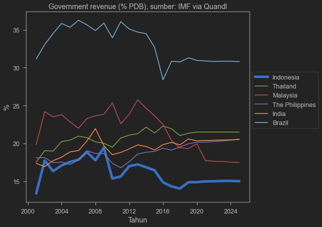
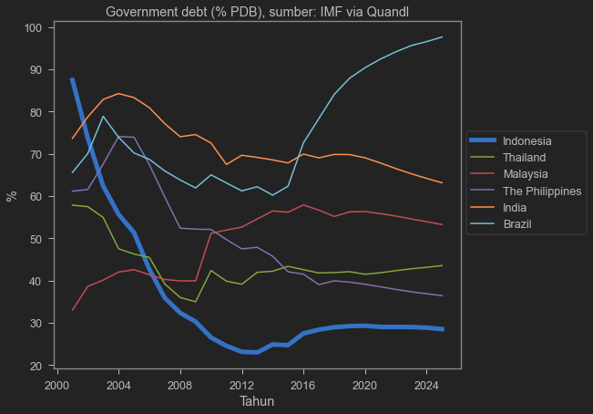
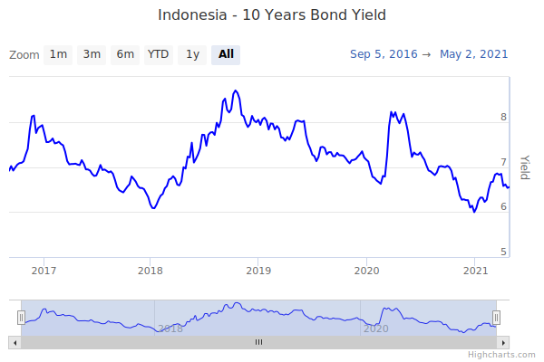

## Recap on last week

Short run impact of shocks:

| shock type | shifts | P | Y |
| --- | --- | --- | --- |
| Positive demand | $\overrightarrow{AD}$ | $\Uparrow$ | $\Uparrow$ |
| Negative demand | $\overleftarrow{AD}$ | $\Downarrow$ | $\Downarrow$ |
| Positive supply | $\overrightarrow{SRAS}$ | $\Downarrow$ | $\Uparrow$ |
| Negative supply | $\overleftarrow{SRAS}$ | $\Uparrow$ | $\Downarrow$ |

---
.s[
## Recap on last week

- In the short-run, wage does not change (sticky wage):
  - when economy expand (ie, when Y $\Uparrow$), unemployment go down (more jobs created).

- In the long-run, wage follows prices:
  - when price went up, wage goes up in the long-run.
  - when price went down, wage goes down in the long-run.
  
- These mechanisms returns $Y$ and unemployment back to their potential/natural level.
]

---

## This week

- The effect of fiscal policy

- Financial system

- the central bank

---

class: middle, center

# Fiscal Policy

---

## Fiscal policy

- Basically related to government expenditure (APBN+APBD)
  - The government gets its revenue from (mostly) taxes
  - Disburse the money through government projects and subsidy transfers

- What we consider **fiscal policy** are:
  - increase/decrease government expenditure.
  - changes in taxes.
  - changes in government debt.

---

## Fiscal policy

- Recall the basic equation of GDP:

$$GDP=C+I+G+X-IM$$

- Increasing government expenditure $=G \Uparrow$

- Decreasing income taxes:
  - More money for people to consume $=C \Uparrow$
  - More money for business to invest $=I \Uparrow$
  
---

## Expansionary fiscal policy

- When there's negative demand shock, the economy enters a recession ($Y \Downarrow$)
  - Unemployment $\Uparrow$ as the economy works under-capacity.

- Government can speed up returns to the potential output level $Y_P$ by using **expansionary fiscal policy** such as:
  - Increase government spending
  - tax cuts.
  - Increase in government transfers (_bansos_,_subsidi_).
  
---

## Contractionary fiscal policy

- On the contrary, an overheat economy causes a big increase in prices.

- $Y \Uparrow$ in the short run but inflation can be uncontrollable and a bubble may burst.

- Government can reduce the speed of price hike by using **contractionary fiscal policy** like:
  - Reduce government spending.
  - Increase taxes.
  - Reduce government transfers.
  
---

## Does it work?

- Expansionary fiscal policy should be done during a recession:
  - During a recession, economy runs below capacity.
  - Only the government can spend without fear of the future.
  
- In general, Indonesian economists are agree to high spending during a recession.

- It may not work to offset a **supply shock**, but most recessions are caused by **demand shock**.

---

## Government spending vs tax cut

- We have learned that taxes distort perfect markets.
  - lowering taxes reduce DWL.

- However, some arguments can be made for government spending:
  - Some will only spend some, but not all (saving instead).
  - Government spending can be 100% purchases.
  
- (Income) Tax cut can be ineffective in a country where most people doesn't pay tax.

---

## Ricardian equivalence

- Without altering tax, increased government spending must come from **debt** which creates **government deficit**.

- Those debt needs to be paid in the future by **rising taxes**.

- Forward looking people knows this. They might reduce consumption and save to pay the future taxes.

--

- This is called **Ricardian Equivalent**: income from government consumption will be saved to pay future taxes, eliminating effects of expansionary policy.

---

## Ricardian equivalent

- In the short-run, people will not save equals to the future tax.
  - They can spread their saving in to a longer time-span.
  
- Most people will not even aware about how to calculate the debt and the tax needed to pay them in the future.

- Therefore, Ricardian equivalent is not a big problem.

---

## Lags in fiscal policy

- Expansionary fiscal policy is also a race against time.

- There are reasons why government disbursement is slow:
  - Lack of data on who to transfers
  - Inefficient bureaucracy

- Disbursement that is too slow risks overheating and inflation if the economy already returned to the optimal output.

---

## Long-run implication of Fiscal Policy

- Without proper tax revenue, government needs to run a **fiscal deficit** which is financed by **debt**.

- Running a deficit and accumulating debt often leads to a more political debate than economics.

- Too much debt is problematic because it erodes trust from borrower.
  - This is the case for Greece and Argentina.
  
- What about Indonesia?

---

## What about Indonesia?

.pull-left[

Compared to some countries, Indonesia's tax revenue is very small. Increasing debt is necessary to boos spending]

.pull-right[

On the contrary, Indonesia's government debt level is low. Debt from 1998 crisis was paid during the good times of commodity boom.]

---

## However...

.s[

Indonesian bond is expensive. at around 6-7% interest rate, this potentially **crowds out** private investment!
]

---

.s[

## COVID recession

| Growth in %   (except stated otherwise) | 2019 |	2020	| 2021 |	2022 |
| --------------------------------------------- | ---- | ---------- | ---- | ------- |
| GDP | 	5.0 | -2.1	| 4.9	| 5.4 |
| private consumption $C$ |	5.2 |	-2.7 |	3.6 |	7.1 |
| Government expenditure $G$ |	3.3 |	1.9 |	-0.3 |	1.0 |
| CPI (inflation) |	3.0 |	1.9 |	2.1 |	3.0 |
| Fiscal balance (% GDP) |	-2.2 |	-6.5 |	-5.7 |	-4.1 |
COVID crushes demand. $G$ helps, and it was financed by debt.
]
.xs[Source: OECD (2021), OECD Economic Surveys: Indonesia 2021, OECD Publishing, Paris, https://doi.org/10.1787/fd7e6249-en.]

---

## Fiscal policy during normal times?

- During normal times, economy runs at 100% capacity:
  - government spending will only crowds out private spending.
  - risks inflation.
  
- Private firms borrows and invest normally.
  - government's debt rises interest rate which is not good for business.

---

## What about negative supply shock?

- For example, oil price increase:
  - We can't just make oil or quickly change our technology

- Fukushima shock: can't just find/make replacement firms.

- Negative supply shock leads to **stagflation**:
  - government has to pick a lesser evil:
      - reduce inflation or reduce unemployment.

---

class: middle, center

#The Financial System

---

## The Financial System

- So far we have talking about AD-AS, also known as **real sector** (sektor riil).

- The other side of the coin is **financial sector**:
  - We do not consume what it produces.
  - But we use it for transaction.
  - We use it to measure everything we do in the real sector.

- This time we will learn about money, banking, and the central bank.

---

## Money

- Before we use money, we **barter**.

- This is inefficient as some goods are:
  - hard to carry around.
  - hard to divide.
  - hard to match.
  - perishable (decreased in value over time)

---
  
## Money

- Probably the oldest "money" 

- This is inefficient as some goods are:
  - hard to carry around.
  - hard to divide.
  - hard to match.
  - perishable (decreased in value over time)

- At some point, people used gold and silver to facilitate barter.

---

## Money

- However, even gold is hard to carry around especially if you are rich.

- People stash their gold in a place called bank, and received "bank note" as a proof that they own the gold.

- Normally, one needed to go to bank, take the gold, and transact.

- But in the end, people use the bank note itself. This bank note is our today's **currency**.

- Nowadays, banks can create money without having to have a gold in their stash.

---

## Money

- **Money** is any asset that can easily be used to purchase goods and services.

- An asset is called **liquid** if we can easily convert it to **cash**.

- We generally consider **cash**, **bank cheques**, and **saving account** as money because they are liquid.

- What are considered non-liquid asset?
  - house, cars, stocks, firms, what else?
  
---

## Main roles of money

1. **Medium of exchange**. Everyone has to believe in its value. We normally use IDR. Sometimes, foreign money is used. Goods can also be used under certain circumstances.

1. **Store of value**. It has consistent value (not perishable over time)

1. **Unit of account**: the commonly accepted measure individuals use to set prices and make economic calculation.

---

## Types of money

1. **Commodity money** is goods that is valuable to many people. Gold and silver, cigarettes, alcohol.

1. **Commodity-backed money** is a "paper money" that we can use to redeem a commodity (usually gold). Holders of these bank notes are guaranteed the gold (or other commodity) stated in the notes.

1. **Fiat money** is the money we know today. It only backed by the government's word.

---

## Advantages

- **Commodity-backed money** makes transaction quicker than commodity money because a bank can generate more notes than it has gold.
  
  - In normal times, people won't redeem 100% of the gold. Banks just need to keep gold enough to satisfy daily demand.
  
- **Fiat money** is even faster because banks do not need to hold anything. Some problems tho:
  - It's easier for counterfeit money to exists.
  - Some central banks print too much money which leads to the money losing its value.
  
---

## Measuring money supply

- **M1** is the narrow definition:
  - consists of cash, traveler's checks, and other checkable bank deposits.
  
- **M2** is a broader definition. It is M1 plus:
  - saving account and time deposit (deposito).
  
- How much M1 and M2 circulate in the economy is largely controlled by the Central Bank
  - Bank of Indonesia in our case.
  
---

class: middle, center

# Monetary roles of banks

---

## Bank roles

- Bank uses **liquid assets** in the form of **deposit** to finance **illiquid investments** of borrowers.

- Banks cannot lend all of its assets: it has to store a small fraction in their own vault or in the central bank.
  - These stored asset is called **bank reserves**.
  - Bank reserves is not circulated in the market, hence not counted in M1 and M2.
  
- In Indonesia, bank needs to have a reserve equals to **3.5% of its total loan**.
  - Also called **reserve requirement ratio**.

---

## Bank Runs

- In normal times, people usually don't do anything with their saving account.

- This way, banks can lend most of the money and reserve some for liquidity.

- But if many lenders suddenly would like to withdraw money, bank would not have enough money.
  - they might have to sell some asset.
  
- When many people wants to withdraw money at the same time, we call it **bank run**.

---

## Bank Runs

- Bank runs happen when borrowers hear Bank is near collapsing.

- However, just a rumour could create a real collapse if lenders decided to withdraw money together at the same time.

- This can be contagious: a lost of faith in one bank could lead to lost of faith to the entire system.
  - This happened in 1998 when several banks were closed.
  
---

## Bank regulations

1. **Deposit insurance**. Indonesian depositors is insured (partially) by Lembaga Penjamin Simpanan (LPS)

1. **Capital requirements**. Bank is required to have a minimum capital or asset to be able to operate in Indonesia.

1. **Reserve requirements**. Currently is 3.5% but it used to be higher. It was lowered due to COVID-19 recession.

1. **Discount window**, where the central bank can lend money to private banks so they don't have to sell their asset.

---

## Money Creation

- Bank control how much money circulated in the market by moving deposits between loanable funds and its reserves

- Suppose Panca has a Rp1 million in his pocket. He decided to deposit it to Bank BeCAk.
  - Panca give Bank BeCAk his Rp1 million which reduces money supply
  - But Bank BeCAk credits Panca's account by Rp1 million which increases money supply
  - Hence no change in money supply
  
---

## Money Creation

- But then Joy come to Bank BeCAk to borrow Rp900k to buy shoes.

- Bank BeCAk use its reserve it get from Panca:
  - Bank BeCAk keep Rp 100k of its reserve, which comes from Panca
  - Bank BeCAk credits Joy's account Rp900k.
  
- This leads to increased Rp900k in money supply: now there are Rp1.900k of money supply in the market!

---

## Money multiplier

- Suppose Joy buy the shoes from Liv.

- Liv then deposit the money to another bank named Bank Madara.
  - Bank Madara adds Rp900k to its reserve.
  - Also credit Liv's account Rp900k.
  
- But like Bank BeCAk, Bank Madara can loan some of the fund and reducing its reserve!

- The more money is circulated, the more expansionary the monetary condition is.

---

## Next week

- Money supply is reduced when:
  - People keep their money out of the financial system
  - Banks increase its reserves

- These are usually happening in an uncertain time: a recession or even worse, a crisis.

- Next week, we will learn how money supply and money demand interact with the real sector

- We will also learn how Bank Indonesia plays a role in the economy.

---

class: middle, center

# The End