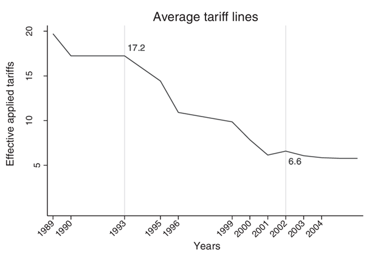
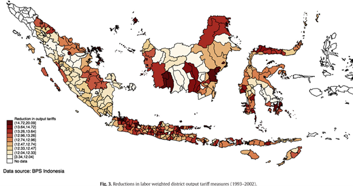
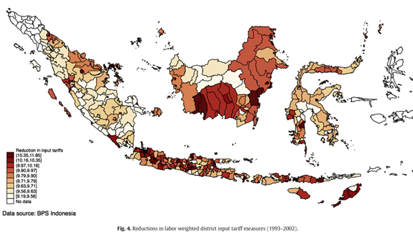

## Roadmap (2 hours)

::: {.m}
**Part I — Why and what (≈45 min)**

1. Recap from Krugman: HOS, SFM, gains and losers
2. The within-country empirical problem
3. The Bartik (shift-share) construct
4. Identification: Goldsmith-Pinkham vs. Borusyak-Hull-Jaravel
5. Diagnostics and inference

**Part II — Applications and hands-on (≈75 min)**

6. Topalova (2010) — India
7. Autor, Dorn & Hanson (2013, 2016) — China shock
8. Kis-Katos & Sparrow (2015) — Indonesia
9. Hands-on in R with `dat.xlsx`
10. Frontier and limitations
:::

# Part I — Why and What {.center}

## From Krugman: gains exist, distribution is messy

- Aggregate gains from trade are robust across HOS, Ricardian, and new-trade models.
- *Who* gains and loses depends on factor mobility.
- HOS: gains accrue to the abundant factor (Stolper-Samuelson), *assuming factors move freely across industries.*
- SFM (Specific Factor Model): in the short run, some factors are tied to a sector → clear winners and losers.

## The textbook distinction in one line

::: {.incremental}
- HOS: long run, perfect mobility, factor-price equalization.
- SFM: short run, sector-specific factors, sectoral wage gaps.
- **Empirical reality:** the "short run" can last a decade or more, and the location of immobile factors is *regional*.
- This is what shift-share designs let us see in the data.
:::

## The within-country problem

::: {.m}
- Cross-country evidence on gains from trade is settled.
- *Within*-country evidence is mixed and politically explosive.
- Why? Adjustment is **spatial**: districts, commuting zones, and provinces specialize in different sectors and absorb shocks differently.
- Reasons for imperfect mobility:
  - skill mismatch (sector-specific human capital)
  - geographic immobility (housing, family ties, language)
  - institutional frictions (labor laws, licensing)
:::

## What we want to estimate

::: {.m}
We want a local causal effect of a trade shock:

$$
Y_\ell = \alpha + \delta\,X_\ell + \varepsilon_\ell
$$

- $Y_\ell$ — outcome in region $\ell$ (employment, wages, poverty)
- $X_\ell$ — local exposure to the trade shock (e.g., change in import penetration)
- $\delta$ — the parameter we care about

**Problem.** $X_\ell$ is endogenous: regions that import more are also regions where productivity, demand, or politics differ in unobserved ways.

→ We need an **instrument** for $X_\ell$.
:::

## The Bartik (shift-share) idea

::: {.m}
Two ingredients:

- **Shares** $s_{\ell k}$ — region $\ell$'s pre-period exposure to sector $k$ (employment, output, or expenditure share)
- **Shifts** $g_{k}$ — a common (national or world) shock to sector $k$

Combine into a single regional exposure measure:

$$
Z_\ell \;=\;\sum_k s_{\ell k}\,g_{k}
$$

The instrument predicts *how hard* region $\ell$ should be hit by a common shock, given its industrial structure.
:::

## Why call it "Bartik"?

::: {.m}
- Tim Bartik (1991) used national industry growth rates interacted with local industry mix to predict local labor demand growth.
- The construct predates him (Perloff 1957, Freeman 1980) but the name stuck after Blanchard & Katz (1992) popularized it.
- In trade: replace national growth with *tariff changes* (Topalova) or *import surges* (ADH).
- @paulgp formalize it as a GMM problem with the shares as instruments.
:::

## A first numerical look {.m}

::: {.m}
3 regions × 2 sectors. Tariffs fall between 1987 and 1988.

| region | $L_{\text{Agri}}$ | $L_{\text{Manuf}}$ | $s_{\text{Agri}}$ | $s_{\text{Manuf}}$ |
|:------:|:--------:|:---------:|:--------:|:---------:|
| A | 100  | 9 000 | 0.011 | 0.989 |
| B | 1 000 | 400  | 0.714 | 0.286 |
| C | 700  | 3 000 | 0.189 | 0.811 |

National tariff change 1987→1988: Agri 30 → 10, Manuf 20 → 5.

Bartik exposure $Z_\ell = s_{\ell,\text{Agri}}\Delta\log t_{\text{Agri}} + s_{\ell,\text{Manuf}}\Delta\log t_{\text{Manuf}}$:

| region | $Z_\ell$ (Δlog) | $Z_\ell$ (Δlevel) |
|:------:|:--------------:|:----------------:|
| A | −1.38 | −15.1 |
| B | −1.18 | −18.6 |
| C | −1.33 | −15.9 |

Note the **ranking flips**: log change makes A most exposed; level change makes B most exposed.
:::

## What just happened?

::: {.incremental}
- Manuf had the larger *proportional* cut: $\log(5/20)=-1.39$ vs. $\log(10/30)=-1.10$.
- Agri had the larger *absolute* cut: $-20$ pp vs. $-15$ pp.
- Which one matters? Depends on the **outcome model**: log-log specifications need $\Delta\log t$, level specifications need $\Delta t$.
- Lesson: the Bartik is only as well-motivated as the production-side or trade-elasticity model behind it.
:::

## First stage, reduced form, IV

::: {.m}
The Bartik is used as an instrument:

**First stage** $\quad X_\ell = \pi_0 + \pi_1 Z_\ell + u_\ell$

**Reduced form** $\quad Y_\ell = \rho_0 + \rho_1 Z_\ell + v_\ell$

**2SLS** $\quad \widehat\delta_{\text{IV}} = \rho_1/\pi_1$

- Many papers (ADH 2013, Topalova) report the reduced-form coefficient $\rho_1$ directly, calling $Z_\ell$ "exposure."
- The 2SLS scaling requires $\pi_1\neq 0$ and the exclusion restriction $E[Z_\ell \varepsilon_\ell]=0$.
:::

## Identification: two camps

::: {.m}
@paulgp ask the central question: *which assumption makes the Bartik valid?*

| Camp | Source of identification | Champion paper |
|------|--------------------------|----------------|
| **Share-based** | Shares $s_{\ell k}$ are exogenous to unobservables | Goldsmith-Pinkham, Sorkin & Swift (2020) |
| **Shock-based** | Shifts $g_k$ are quasi-randomly assigned | Borusyak, Hull & Jaravel (2022) |

Both deliver consistent IV under different conditions. The right diagnostic depends on which assumption you lean on.
:::

## Share exogeneity (GP framework)

::: {.m}
@paulgp prove: the Bartik 2SLS estimator equals a GMM estimator where each **share** $s_{\ell k}$ acts as a separate instrument, weighted by **Rotemberg weights** $\alpha_k$.

$$
\widehat\delta_{\text{Bartik}} = \sum_k \alpha_k\,\widehat\delta_k
$$

- $\widehat\delta_k$ — just-identified IV using share $s_{\cdot k}$ alone
- $\alpha_k$ — Rotemberg weight, $\sum_k \alpha_k = 1$, can be negative
- A few industries usually carry most of the weight → the design hinges on the exogeneity of those few shares.
:::

## Diagnostics from Rotemberg weights

::: {.m}
@paulgp recommend reporting:

1. **Concentration of weights** — Herfindahl of $|\alpha_k|$. If 2–3 industries dominate, your identification is really about those industries.
2. **Top-5 industries** — list them and ask: are their *shares* plausibly exogenous to local outcome trends?
3. **Pre-trend checks** on $Z_\ell$ — does pre-shock $Z_\ell$ predict pre-shock changes in $Y_\ell$?
4. **Just-identified IV by industry** — if $\widehat\delta_k$ varies wildly across top industries, the pooled estimate is fragile.
:::

## Shock exogeneity (BHJ framework)

::: {.m}
@bhj2022 take a different route. Treat the **shifts** $g_k$ as random and the shares as exposure weights.

- Identification: $g_k$ is uncorrelated with sector-average residuals.
- Works well when shifts come from outside the system you study (e.g., supply-driven Chinese import surge from China's TFP and WTO accession).
- Diagnostic: tests for shock balance — does $g_k$ correlate with pre-shock industry characteristics?
- The ADH "instrument with other rich countries' imports from China" exploits exactly this — it isolates the supply-driven component of the shock.
:::

## Inference: don't use OLS standard errors

::: {.m}
@akm2019 show that conventional cluster-robust SEs **over-reject** with shift-share regressors:

- Residuals are correlated across regions that share industry mix.
- Their fix: an exposure-robust SE that treats *industries* as the clusters of randomness.
- In R, you can implement AKM SEs via the `ShiftShareSE` package or replicate by IV with industry-level data.
- Rule of thumb for class: if you see Bartik with white SEs only, be skeptical.
:::

## Limitations to keep in mind

::: {.incremental}
- **Pre-period shares can be endogenous** (industries locate for a reason).
- **Common shocks may be heterogeneous** across sub-periods → time-varying $g_k$.
- **Placebo tests** on pre-period $Y$ are essential.
- **Weighting**: by region size, by inverse SE, by employment — affects which observations drive the result.
- **Aggregation** matters: districts vs. provinces vs. commuting zones give different answers.
:::

# Part II — Applications and Hands-on {.center}

## Topalova (2010): India 1991

::: {.m}
- India's 1991 liberalization cut tariffs unevenly across industries.
- Cross-district variation in pre-reform industry mix → cross-district variation in exposure.
- Difference-in-differences with Bartik exposure as the treatment.

**Identification:** the *pace* of tariff cuts was dictated by external (IMF) pressure and was negotiated industry-by-industry without regard to district outcomes → shocks plausibly exogenous to district trends.
:::

## Topalova: instrument

$$
Z_\ell^{\text{Top}} = \sum_k s_{\ell k}^{\,1987}\,\Delta\log(\text{Tariff}_k)
$$

- $s_{\ell k}^{1987}$ — district $\ell$'s pre-reform employment share in industry $k$
- $\Delta\log(\text{Tariff}_k)$ — national log-change in industry $k$'s tariff between 1987 and 1997

**Outcomes:** district-level poverty headcount, poverty gap, consumption growth.

## Topalova: specification

::: {.m}
First stage:
$$
\widehat{X}_\ell = \alpha + \beta\, Z_\ell^{\text{Top}} + \mathbf{W}'_\ell\gamma + u_\ell
$$

Second stage (or reduced form):
$$
\Delta Y_\ell = \mu + \delta\,\widehat X_\ell + \mathbf{W}'_\ell\lambda + \varepsilon_\ell
$$

with $\mathbf{W}_\ell$ pre-period district controls and state fixed effects.
:::

## Topalova: findings

::: {.m}
- Rural districts more exposed to tariff cuts → **slower decline in poverty**, lower consumption growth.
- Effect concentrated among the geographically immobile and least skilled.
- **Mechanism**: rigid labor laws → costly to fire and to expand → factor reallocation stalls.
- In states with flexible labor regulation, the poverty effect of exposure is statistically zero.

**Takeaway:** Bartik captures *exposure*; institutions decide *adjustment*.
:::

## Autor, Dorn & Hanson (2013): the China shock

::: {.m}
- @adh2013 examine US commuting zones (CZs) 1990–2007.
- China's WTO accession (2001) and supply-side reforms drove a sustained import surge.
- Variation across CZs comes from pre-shock industry mix.
:::

## ADH: the instrument

::: {.m}
$$
\Delta IPW_{c\tau} = \sum_k \frac{L_{ck,t_0}}{L_{k,t_0}}\cdot \frac{\Delta M^{US}_{k\tau}}{L_{c,t_0}}
$$

- $L_{ck,t_0}$ — start-of-period employment in CZ $c$, industry $k$
- $\Delta M^{US}_{k\tau}$ — change in US imports from China in industry $k$

**To address shock endogeneity** (US demand could pull in imports too), ADH instrument $\Delta M^{US}$ with $\Delta M^{OTH}$ — imports from China to *eight other rich countries.* This isolates the China-side supply shock.
:::

## ADH: main results

::: {.incremental}
- High-exposure CZs lose more manufacturing jobs.
- Wages fall, esp. among non-college workers.
- **No offsetting employment gains** in other sectors at the local level.
- Effects persist for at least a decade.
- @autor (2016 review) extends to job churning, lifetime earnings, social spending, marriage rates, mortality.
:::

## Why ADH matters methodologically

::: {.m}
- Cleanest example of the **shock-based** identification logic in BHJ.
- The "other rich countries" instrument is the canonical move for purging demand-side endogeneity from a Bartik.
- Sparked the AKM (2019) literature on inference because their headline SEs were too tight.
- Their data and Stata replication files are widely used in teaching.
:::

## Kis-Katos & Sparrow (2015): Indonesia 1993–2002 {.m}

:::: columns
::: {.column width="50%"}

:::
::: {.column width="50%"}
::: {.m}
- 259 districts; outcome is district-level poverty.
- Two waves of tariff cuts: WTO 1995 + IMF program 1999.
- Innovation: separate **output** and **input** tariff exposure using a 1990 input-output table.
:::
:::
::::

## Output vs. input tariffs

::: {.m}
$$
Ot_{kt}=\sum_{s=1}^S \left(\frac{Q_{sk,t=0}}{Q_{k,t=0}}\times t_{st}\right)
$$

$$
It_{kt}=\sum_{s=1}^S \left(\frac{Q_{sk,t=0}}{Q_{k,t=0}}\times \sum_{j=1}^J \frac{M_{js,1990}}{M_{s,1990}} t_{jt} \right)
$$

::: {.s}
sector $s$, district $k$, time $t$, input sector $j$, labor $Q$, tariff $t$
:::

The first share weights output tariffs by district industry mix; the second additionally weights through the I-O matrix to capture *imported intermediate inputs* embodied in each sector.
:::

## Output tariff exposure



## Input tariff exposure



## Kis-Katos & Sparrow: findings

::: {.m}
$$
\Delta y_{kt}=\alpha + \beta_1 Ot_{kt} + \beta_2 It_{kt} + \gamma \Delta X'_{kt} + I'_k \theta + \lambda_{rt} + \Delta \epsilon_{kt}
$$

- $\beta_1 > 0$ — output tariff cuts **raise** poverty (import competition story).
- $\beta_2 < 0$ and **larger in magnitude** — input tariff cuts **reduce** poverty (cheaper intermediates → firm competitiveness → low-skill work participation and middle-skill wages rise).

**Net effect on Indonesian poverty is negative** — but only because input tariff liberalization dominates. The distributional story matters.
:::

## Three applications side by side {.m}

::: {.m}
| | Topalova (2010) | ADH (2013) | KK & Sparrow (2015) |
|---|---|---|---|
| Country | India | US | Indonesia |
| Episode | 1991 reform | 1990–2007 | 1993–2002 |
| Unit | districts | commuting zones | districts (259) |
| Shock | tariff cuts | China imports | tariff cuts (2 waves) |
| Share | 1987 employment | start-period emp. | I-O × employment |
| Outcome | poverty, consumption | jobs, wages | poverty |
| Direction | exposure ↑ → poverty ↑ | exposure ↑ → jobs ↓ | output↑ poverty↑, input↓ poverty↓ |
:::

# Hands-on with R {.center}

## The dataset

::: {.m}
`dat.xlsx` — 3 regions, 2 sectors, 2 years. Toy data so you can verify by hand.

```r
library(readxl)
library(dplyr)
library(tidyr)

dat <- read_excel("dat.xlsx")
dat
```

```
# A tibble: 12 × 5
    year region sector tariff  labor
   <dbl> <chr>  <chr>   <dbl>  <dbl>
 1  1987 A      Agri       30    100
 2  1987 B      Agri       30   1000
 3  1987 C      Agri       30    700
 4  1987 A      Manuf      20   9000
 5  1987 B      Manuf      20    400
 6  1987 C      Manuf      20   3000
 7  1988 A      Agri       10    110
 8  1988 B      Agri       10   1100
 ...
```
:::

## Step 1 — compute 1987 employment shares

::: {.m}
```r
shares <- dat |>
  filter(year == 1987) |>
  group_by(region) |>
  mutate(share = labor / sum(labor)) |>
  select(region, sector, share)

shares
```

```
# A tibble: 6 × 3
  region sector  share
  <chr>  <chr>   <dbl>
1 A      Agri   0.0110
2 A      Manuf  0.989
3 B      Agri   0.714
4 B      Manuf  0.286
5 C      Agri   0.189
6 C      Manuf  0.811
```
:::

## Step 2 — compute national tariff shocks

::: {.m}
```r
shocks <- dat |>
  distinct(year, sector, tariff) |>
  arrange(sector, year) |>
  group_by(sector) |>
  summarise(
    dlog_t = log(last(tariff)) - log(first(tariff)),
    dlev_t = last(tariff) - first(tariff)
  )
shocks
```

```
# A tibble: 2 × 3
  sector dlog_t dlev_t
  <chr>   <dbl>  <dbl>
1 Agri    -1.10    -20
2 Manuf   -1.39    -15
```
:::

## Step 3 — assemble the Bartik

::: {.m}
```r
bartik <- shares |>
  left_join(shocks, by = "sector") |>
  group_by(region) |>
  summarise(
    Z_log = sum(share * dlog_t),
    Z_lev = sum(share * dlev_t)
  )
bartik
```

```
# A tibble: 3 × 3
  region  Z_log  Z_lev
  <chr>   <dbl>  <dbl>
1 A       -1.38  -15.1
2 B       -1.18  -18.6
3 C       -1.33  -15.9
```

Region A is most exposed in log, region B most exposed in levels — same point we made earlier, now in code.
:::

## Step 4 — the (would-be) 2SLS

::: {.m}
With only 3 districts there's nothing to estimate. In a real Topalova-style exercise:

```r
library(fixest)

# pretend `panel` has many districts × years with outcome `dpov`,
# realised exposure `Xkt`, instrument `Zkt`, controls W, state-year FE.
m <- feols(
  dpov ~ W1 + W2 | state^year | Xkt ~ Zkt,
  data = panel,
  cluster = ~ industry_topshare
)
summary(m)
```

For AKM-corrected SEs, use the `ShiftShareSE` package and pass the share matrix.
:::

## Exercise (10 min, in pairs)

::: {.m}
Using only `dat.xlsx`:

1. Recompute $Z_\ell$ assuming the *1988* shares (not 1987). What's different and why?
2. Now compute it using **employment growth** as the shift instead of tariffs. Does the ranking of regions change?
3. Region A is essentially a "manufacturing town." If we drop A, what happens to the cross-sectional variation in $Z$? What does that tell you about the Rotemberg-weight diagnostic in GP?
4. Suppose we observed poverty rates falling by 5pp in A, 2pp in B, 4pp in C. Compute the reduced-form slope of $\Delta$poverty on $Z_\ell$. Interpret with care — what assumption are you making?
:::

## What to read next {.m}

::: {.m}
- @paulgp — the canonical methods paper. Tables 5–6 are the diagnostic template you should copy in your own work.
- @bhj2022 — when shocks (not shares) carry identification.
- @akm2019 — the inference paper. The R package `ShiftShareSE` implements it.
- @adh2013 + @autor (review) — the China shock canon.
- @topalova — the trade-and-poverty workhorse for developing countries.
- @sparrow — the closest Indonesian benchmark for your own work.
:::

## Frontier and Indonesian context

::: {.m}
- I-O Bartik: extend KK & Sparrow's input/output split to services value-added (GVC trade).
- **Granular instruments**: large firms as shock units instead of sectors (Gabaix-Koijen 2024).
- **Uncertainty as a shift**: ongoing work by **Pane, Massie & Gupta (2025)** uses a geopolitical uncertainty index in place of tariff changes — the share captures exposure to *uncertain* trading partners rather than to specific industries [@pane25].
- Whatever the shift, the identification logic is the same: argue for either share exogeneity or shock exogeneity, then *show diagnostics consistent with that argument.*
:::

## Wrap-up

::: {.incremental}
- Bartik = shares × shifts → predicted regional exposure.
- Two identification stories; pick one and live by it.
- Always report Rotemberg weights or shock-balance tests.
- Use AKM SEs, not white SEs.
- The trade-policy applications (Topalova, ADH, KK & Sparrow) give you a recipe you can transplant onto any Indonesian liberalization episode.
:::

## References
