# Bagian 1 — Anatomi

## Apa yang disebut krisis? {.m}

Definisi paling sederhana [@frankelrose1996]: **depresiasi nominal lebih dari 25% dalam setahun**, dan minimal 10 poin persentase lebih cepat dibanding tahun sebelumnya. Syarat kedua mencegah negara berinflasi tinggi kronis tercatat "krisis" tiap tahun.

Cacat seriusnya:

- Ia hanya mencatat **serangan spekulatif** (*speculative attack*) yang **berhasil menjatuhkan peg** — ketika pasar beramai-ramai melepas rupiah dan bank sentral menyerah.

- Inggris 1992 menaikkan bunga 10% → 12% dalam sehari dan tetap kalah: **tercatat**.

- Negara yang diserang, kehilangan sepertiga cadangan, tetapi **pegnya selamat**: **tidak tercatat**. Padahal keduanya krisis.

## Tekanan muncul di tiga tempat {.m}

Kalau hanya melihat kurs, serangan yang berhasil dilawan tidak terlihat. Maka lihat ketiganya [@erw1995]:

- **Depresiasi kurs** — tekanan yang dibiarkan lewat ke harga.

- **Cadangan devisa** — tekanan yang diserap dengan menjual dolar.

- **Diferensial suku bunga** — tekanan yang diserap dengan menaikkan bunga.

Ketiganya saling menggantikan:

- Menahan kurs berarti cadangan turun, bunga naik, atau keduanya.

- Membiarkan kurs bergerak menghemat cadangan dan bunga.

- Karena itu **satu indikator saja selalu menyesatkan**.

## Tiga komponen di Indonesia {.m}

::: {.s}
Kurs, cadangan devisa bruto, dan diferensial suku bunga terhadap AS, bulanan 1995-2001. Garis putus-putus: 14 Agustus 1997, Januari 1998, Mei 1998. Sumber: BIS, FRED.
:::

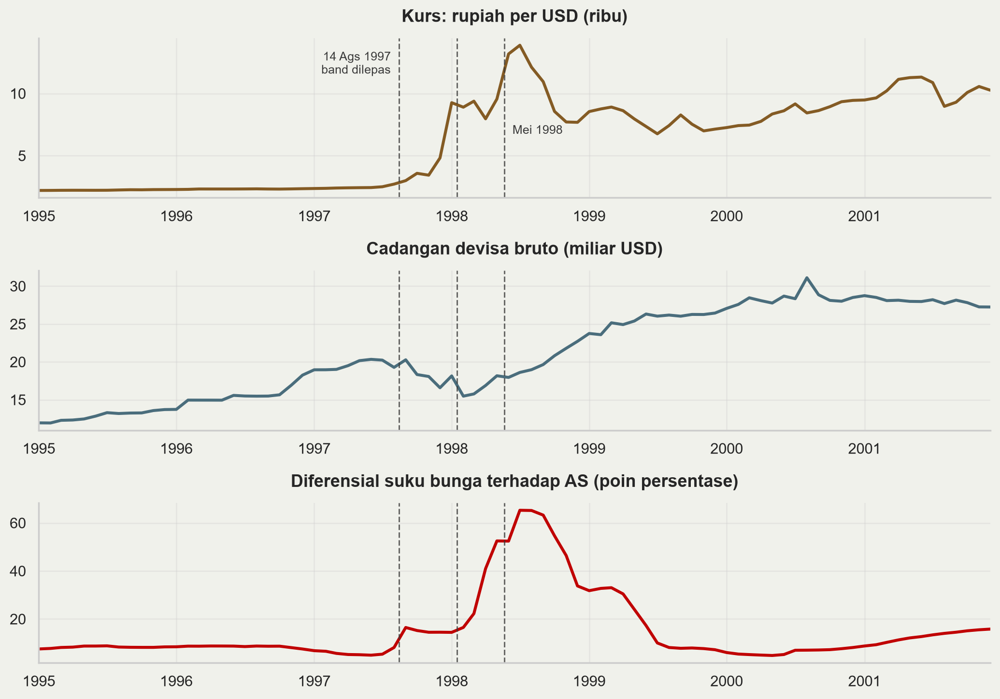{fig-align="center" width="76%"}

## Yang diceritakan ketiganya {.m}

- Ketiga deret **tenang sampai Juli 1997**. Tidak ada peringatan dini dari satu pun indikator.

- Indonesia **tidak membela dengan membakar cadangan**: *band* dilepas 14 Agustus 1997. Cadangan bruto hanya turun dari 20,2 ke 16,6 miliar USD.

- Tekanan muncul di **kurs** (2,4 → 15,3 ribu per USD) lalu di **bunga** (diferensial memuncak 65 poin persentase, Juli 1998).

- Meksiko 1994 dan Argentina 2001 nanti menunjukkan pola **terbalik**: kurs datar, cadangan terkuras.

- Catatan: cadangan **bruto** ditopang pencairan IMF sejak November 1997. Posisi **neto** jauh lebih buruk.

## Mekanika sebuah peg {.s}

Neraca bank sentral yang disederhanakan:

| Aset | Kewajiban |
|---|---|
| Cadangan devisa $R$ | Uang primer $M$ |
| Kredit domestik $D$ | |

$$ M = R + D $$

$M$ uang primer, $R$ cadangan devisa, $D$ kredit domestik (klaim atas pemerintah dan perbankan). Identitas akuntansi, selalu berlaku.

**Membela peg tanpa sterilisasi.** Masyarakat menyetor rupiah, menarik dolar. $R$ turun; rupiah keluar dari peredaran sehingga $M$ turun; $D$ tetap.

- Likuiditas rupiah mengetat, **suku bunga domestik naik**.

- Bunga naik membuat rupiah lebih menarik dipegang, sehingga **arus keluar mereda dengan sendirinya**.

- Harganya: kredit seret, ekonomi melambat. Ini trilemma — kurs tetap ditambah modal bebas berarti suku bunga bukan lagi milik Anda.

## Sterilisasi dan tanggal kedaluwarsa {.s}

**Sterilisasi.** Bank sentral menyuntikkan kembali rupiah yang tersedot, dengan membeli SBN atau memberi pinjaman ke perbankan. $D$ naik sebesar turunnya $R$, sehingga $M$ tetap.

| | $R$ | $D$ | $M$ | Bunga domestik |
|---|---|---|---|---|
| Awal | 100 | 50 | 150 | — |
| Intervensi 10, tanpa sterilisasi | 90 | 50 | **140** | naik |
| Intervensi 10, dengan sterilisasi | 90 | **60** | **150** | tetap |

Cadangan terkuras sama saja. Yang berubah hanya konsekuensi moneternya.

Mengapa ada tanggal kedaluwarsa:

1. Bunga tidak naik, jadi insentif menukar rupiah ke dolar tidak berkurang dan **kuras berlanjut dengan laju yang sama**. Sterilisasi meniadakan mekanisme koreksi yang tadi bekerja.

2. Ulangi sepuluh kali: $R = 0$, $D = 150$, $M = 150$.

3. $R \geq 0$ dan stoknya terbatas, sehingga tanggal habisnya **dapat dihitung siapa pun**, termasuk spekulan. Itulah $t_0$ di Bagian 2.

Sterilisasi memadai untuk guncangan sementara. Untuk tekanan persisten, hasilnya ditentukan aritmetika di atas.

## Tiga cara sebuah peg mati {.m}

1. **Cadangan habis.** Pemerintah membiayai defisit dengan mencetak uang; $D$ tumbuh, $R$ terkuras sampai nol.

2. **Membela jadi terlalu mahal.** Cadangan masih ada, tetapi suku bunga yang diperlukan menimbulkan pengangguran dan beban utang yang tak tertanggungkan. Pemerintah **memilih** melepas.

3. **Neraca swasta hancur lebih dulu.** Perusahaan berutang dolar tetapi berpendapatan rupiah. Depresiasi kecil pun membangkrutkan mereka, dan kebangkrutan itu memicu depresiasi berikutnya.

Ketiga jalur ini persis **tiga generasi model krisis** yang akan kita bahas.

## Peta tiga generasi {.s}

| | Generasi pertama | Generasi kedua | Generasi ketiga |
|---|---|---|---|
| **Rujukan** | @krugman1979; @floodgarber1984 | @obstfeld1996 | @krugman1999; @changvelasco2001 |
| **Pemicu** | Defisit fiskal dimonetisasi | Trade-off kebijakan domestik | *Mismatch* mata uang & jatuh tempo |
| **Peran pemerintah** | Pasif, mekanis | Mengoptimalkan, bisa memilih | Penjamin implisit |
| **Ekspektasi** | Mengikuti fundamental | **Membentuk** hasil | Memperkuat kerusakan neraca |
| **Dapat diprediksi?** | Ya, tanggalnya bisa dihitung | Tidak, ada ekuilibrium ganda | Sebagian, lewat indikator neraca |
| **Kasus tipikal** | Amerika Latin 1970-80an, Meksiko 1994 | ERM 1992-93 | Asia 1997-98 |
| **Obat yang disarankan** | Disiplin fiskal | Kredibilitas, kurs fleksibel | Kelola *mismatch*, awasi neraca |

Ketiganya bukan saling menggantikan. Krisis nyata selalu campuran.

# Bagian 2 — Generasi pertama

## Krugman, Flood & Garber {.m}

Logika intinya satu kalimat: **defisit fiskal yang dibiayai dengan mencetak uang tidak kompatibel dengan kurs tetap.**

1. Pemerintah defisit dan bank sentral membiayainya, sehingga kredit domestik $D$ tumbuh dengan laju tetap $\mu$.

2. Agar *peg* bertahan, uang primer $M$ tidak boleh tumbuh. Dari $M = R + D$, maka $R$ harus **turun dengan laju yang sama** $\mu$.

3. Cadangan menurun linear. Semua orang dapat menghitung kapan ia habis.

Butir 1 sampai 3 hanya aritmetika. Kesimpulan pentingnya ada di slide berikutnya.

## Shadow exchange rate {.m}

**Definisi.** Kurs yang akan berlaku seandainya *peg* dilepas hari ini dan cadangan sudah nol — kurs mengambang yang konsisten dengan $D$ saat itu.

Karena $D$ terus tumbuh, *shadow rate* terus naik. Kurs resmi tertahan di $\bar{E}$.

- *Shadow rate* **di bawah** $\bar{E}$: menyerang berarti membeli dolar di harga $\bar{E}$ lalu memegang aset yang lebih rendah nilainya. Rugi, tidak ada yang menyerang.

- *Shadow rate* **melampaui** $\bar{E}$: menyerang berarti membeli dolar murah dan langsung untung. Semua menyerang, serentak.

Serangan terjadi tepat saat keduanya berpotongan.

## Serangan mendahului kurasnya {.m}

::: {.s}
Simulasi model generasi pertama. Kiri: cadangan devisa terhadap waktu. Kanan: kurs dan *shadow rate*. $t^{*}$ saat serangan, $t_0$ saat cadangan akan habis tanpa serangan.
:::

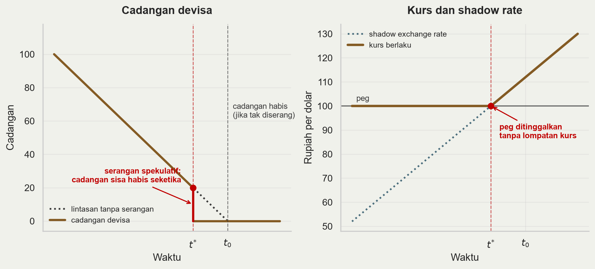{fig-align="center" width="100%"}

## Mengapa $t^{*} < t_0$? {.s}

Argumennya: **tidak boleh ada keuntungan tanpa risiko**.

- Andaikan *peg* baru runtuh pada $t_0$, ketika cadangan nol. Maka kurs akan **melompat** dari $\bar{E}$ ke tingkat yang jauh lebih lemah.

- Lompatan itu dapat diantisipasi semua orang. Membeli dolar sedetik sebelum $t_0$ memberi keuntungan besar tanpa risiko.

- Maka semua membeli sedetik sebelumnya, yang memajukan keruntuhan. Argumen yang sama berlaku lagi, dan lagi.

- Proses mundur ini berhenti hanya di titik yang **tidak** menghasilkan lompatan kurs: ketika *shadow rate* persis sama dengan $\bar{E}$. Itulah $t^{*}$.

**Implikasinya:** cadangan tersisa lenyap dalam hitungan jam, bukan bulan. Krisis tampak mendadak, padahal sepenuhnya deterministik.

::: aside
@krugman1979; @floodgarber1984; @obstfeld1986
:::

## Meksiko 1994 {.m}

::: {.s}
Peso per USD (coklat, kiri) dan cadangan devisa dalam miliar USD (biru, kanan), 1993-1996. Sumber: BIS, FRED.
:::

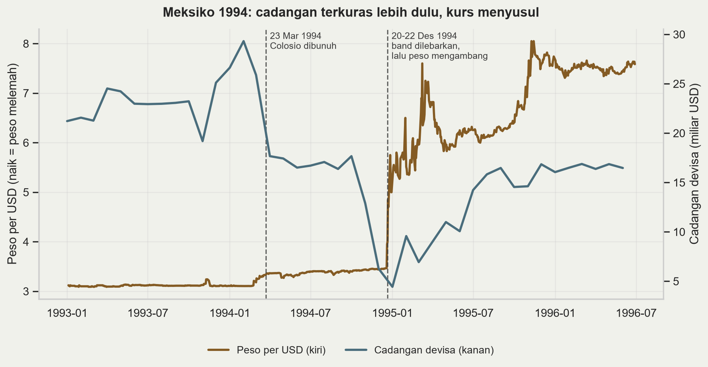{fig-align="center" width="100%"}

## Meksiko 1994: yang terjadi {.m}

- Sepanjang 1994 kurs praktis **datar** di dalam *band*, sementara cadangan anjlok dari **USD 29 miliar ke bawah USD 6 miliar**. Stabilitas dibayar dari cadangan, bukan dari kurs.

- Ini sterilisasi yang tadi kita bahas, terlihat dalam data.

- Utang peso diganti *tesobonos* — surat utang jangka pendek terindeks dolar. Beban riilnya melonjak begitu peso jatuh.

- Guncangan politik: pemberontakan Chiapas (Januari), pembunuhan Colosio (Maret).

- 20 Desember *band* dilebarkan; dua hari kemudian peso mengambang, melemah dari 3,4 ke lebih dari 7 per dolar.

- @calvomendoza1996 menyebutnya *"a chronicle of a death foretold"*.

## Diskusi: Meksiko murni gen-1? {.s}

Argumen **ya**:

- Cadangan terkuras sistematis, pembiayaan defisit bergeser ke instrumen jangka sangat pendek, keruntuhan dapat diramalkan dari neraca.

Argumen **tidak**:

- Defisit fiskal Meksiko tidak besar. Yang membengkak adalah defisit **transaksi berjalan** sekitar 7% PDB, dan itu didorong swasta.

- Pembiayaannya bergantung arus modal portofolio yang bisa berbalik seketika — *sudden stop*, bukan monetisasi fiskal.

- Ada unsur ekspektasi yang mewujudkan diri: *tesobonos* hanya jadi masalah **jika** peso jatuh.

Kesimpulan jujur: Meksiko 1994 adalah jembatan ke generasi berikutnya.

# Bagian 3 — Generasi kedua

## Masalah dengan generasi pertama {.m}

- Model generasi pertama memperlakukan pemerintah sebagai **robot**: membela *peg* sampai cadangan terakhir, lalu menyerah.

- Pemerintah sungguhan tidak begitu. Inggris 1992 masih punya cadangan dan akses pinjaman ketika keluar dari ERM.

- Ia **memilih** keluar.

- @obstfeld1996 mengganti robot itu dengan pihak yang mengoptimalkan. Hasilnya berubah mendasar.

## Trade-off pemerintah {.m}

**Biaya mempertahankan peg** naik seiring ekspektasi devaluasi:

- Lewat UIP: jika pasar mengharapkan depresiasi $E^e$, suku bunga domestik harus naik kira-kira sebesar itu untuk menahan modal.

- Bunga tinggi berarti investasi turun, pengangguran naik, beban utang pemerintah membengkak, neraca bank memburuk.

**Biaya melepas peg** relatif tetap:

- Hilangnya kredibilitas bertahun-tahun, inflasi lebih tinggi, biaya politik mengingkari janji.

Pemerintah melepas ketika biaya mempertahankan melampaui biaya melepas. Yang menentukan adalah **ekspektasi pasar**, dan itu bukan variabel eksogen.

## Ekuilibrium ganda {.m}

::: {.s}
Simulasi. Sumbu datar: ekspektasi devaluasi (%). Sumbu tegak: biaya bagi pemerintah. Coklat = biaya mempertahankan *peg*, merah = biaya melepasnya. Yang berbeda antarpanel hanya kekuatan fundamental.
:::

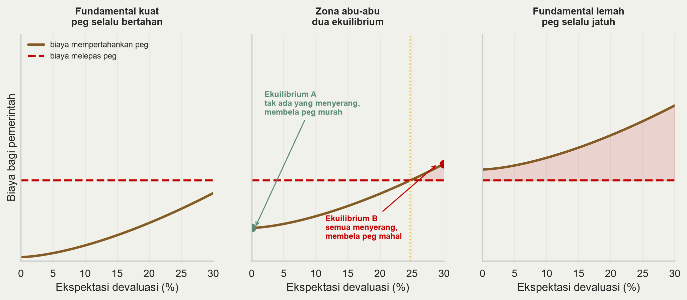{fig-align="center" width="100%"}

## Membaca ketiga panel {.s}

- **Fundamental kuat** (kiri): mempertahankan lebih murah daripada melepas, bahkan jika seluruh pasar menyerang. Serangan tidak pernah berhasil, jadi tidak ada yang menyerang. Satu ekuilibrium.

- **Fundamental lemah** (kanan): mempertahankan lebih mahal bahkan ketika tidak seorang pun menyerang. *Peg* jatuh tanpa perlu spekulan. Satu ekuilibrium.

- **Zona abu-abu** (tengah): **dua** ekuilibrium, keduanya konsisten secara internal.
    - *A*: pasar tak mengharapkan devaluasi → bunga rendah → membela murah → *peg* bertahan → ekspektasi terbukti.
    - *B*: pasar mengharapkan devaluasi → bunga harus tinggi → membela mahal → pemerintah menyerah → ekspektasi terbukti.

Fundamental tidak berubah di antara keduanya. Yang berubah hanya **keyakinan**.

## Implikasi {.m}

- Di zona abu-abu, krisis **tidak dapat diprediksi secara prinsipil**. Bukan karena data kurang, melainkan karena modelnya memang tidak menentukan hasil.

- *Escape clause*: kurs tetap yang boleh dilepas dalam keadaan buruk memberi fleksibilitas, tetapi justru karena itu kurang kredibel dan lebih mudah diserang.

- **Penularan** jadi masuk akal. Krisis Thailand dapat memindahkan negara lain dari ekuilibrium A ke B tanpa ada yang berubah pada fundamentalnya.

- Kritik utamanya jelas: teori yang membolehkan segala hasil sesungguhnya tidak meramalkan apa pun.

## Apa itu ERM? {.s}

***Exchange Rate Mechanism***, inti *European Monetary System* sejak 1979, dan jalan menuju euro.

- **Tetap tapi dapat disesuaikan.** Tiap mata uang punya paritas pusat dan wajib bergerak dalam pita ±2,25% — ±6% untuk sebagian anggota, termasuk Inggris.

- **Kewajiban dua arah.** Saat sebuah mata uang menyentuh tepi pita, bank sentral negara lemah **dan** negara kuat sama-sama wajib intervensi. Di atas kertas tanpa batas.

- **Mark Jerman jangkarnya.** Secara de facto Bundesbank menentukan kebijakan moneter seluruh sistem. Inilah sumber masalah 1992.

- Inggris masuk Oktober 1990 pada **2,95 mark per pound**, keluar 16 September 1992.

- Setelah krisis 1992-93 pita dilebarkan ke **±15%** (Agustus 1993), praktis mengosongkan maknanya. ERM II masih dipakai calon pengguna euro.

## ERM 1992 {.m}

::: {.s}
Atas: pound per USD, harian (naik = pound melemah). Bawah: suku bunga pasar uang Inggris, rata-rata bulanan. Garis putus-putus: 16 September 1992. Sumber: BIS, FRED.
:::

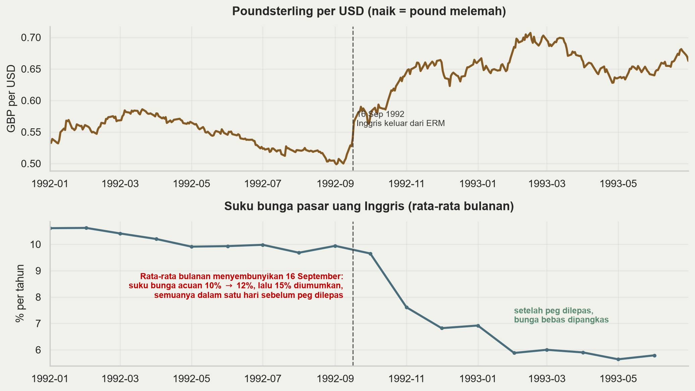{fig-align="center" width="94%"}

## ERM 1992: yang terjadi {.m}

- Paritas masuk 2,95 mark per pound banyak dinilai **terlalu kuat**, dengan inflasi Inggris lebih tinggi daripada Jerman.

- Reunifikasi Jerman memaksa Bundesbank menaikkan bunga. Lewat *peg*, kebijakan itu diimpor ke seluruh ERM, termasuk Inggris yang sedang resesi. Ini trilemma: kurs tetap ditambah modal bebas berarti tidak ada kebijakan moneter independen.

- 16 September 1992: bunga acuan naik 10% → 12%, lalu 15% diumumkan, semuanya dalam satu hari. Sore itu Inggris keluar dari ERM; kenaikan ke 15% tak pernah berlaku.

- Pound melemah sekitar **18% terhadap dolar** dalam tiga bulan. Soros dilaporkan meraih sekitar USD 1 miliar.

::: aside
@obstfeld1996; @eichengreenwyplosz1993
:::

## Bukti terkuat generasi kedua {.m}

- Sebelum 16 September, bunga Inggris tertahan sekitar 10% demi *peg*, bukan karena kebutuhan domestik.

- Setelah keluar dari ERM, bunga turun ke sekitar 6% dalam beberapa bulan, dan ekonomi Inggris pulih lebih cepat daripada tetangganya yang bertahan.

- Melepas *peg* memberi manfaat yang persis diprediksi model generasi kedua. Inggris tidak kehabisan cadangan; ia memutuskan harga bertahan terlalu mahal.

- Komitmen Bundesbank juga punya batas: kewajiban intervensinya tak terbatas di atas kertas, tetapi membeli pound berarti mencetak mark, sehingga ia menolak menjalankannya sampai habis.

Keruntuhan adalah **keputusan**, bukan kehabisan cadangan.

## Catatan: global games {.m}

- Keberatan terhadap ekuilibrium ganda: modelnya tidak menentukan hasil, sehingga sulit diuji.

- Asumsi diam-diam Obstfeld: semua spekulan **mengetahui hal yang sama persis** tentang fundamental.

- @morrisshin1998 melonggarkan itu — tiap spekulan diberi sinyal pribadi yang sedikit berbeda — dan ekuilibrium ganda **runtuh menjadi satu**.

- Ada nilai fundamental ambang yang unik: di atasnya *peg* selalu bertahan, di bawahnya selalu jatuh.

- Konsekuensi kebijakan: **transparansi dan komunikasi bank sentral** jadi variabel yang menentukan, karena yang berperan adalah struktur informasi pasar.

## Diskusi: fundamental 1992 {.m}

Pertanyaan untuk kelas:

- Inggris masuk ERM pada paritas yang diperdebatkan terlalu kuat, dengan inflasi lebih tinggi daripada Jerman. "Fundamental lemah" atau sekadar "zona abu-abu"?

- Jika fundamentalnya memang lemah, apakah 1992 justru kasus generasi **pertama** yang menyamar?

- Bagaimana membedakannya secara empiris, jika di zona abu-abu keduanya menghasilkan keruntuhan yang tampak sama?

Memisahkan "fundamental buruk" dari "ekspektasi buruk" adalah masalah identifikasi yang belum terselesaikan.

# Bagian 4 — Generasi ketiga

## Asia 1997 tidak cocok {.m}

Menjelang 1997, Asia Timur menunjukkan:

- **Surplus** atau defisit fiskal sangat kecil — bukan monetisasi defisit, sehingga generasi pertama tidak berlaku.

- Inflasi rendah, pertumbuhan 7-8% per tahun selama satu dekade, pengangguran rendah, tabungan tinggi.

- Tidak ada *trade-off* pengangguran-versus-*peg*, sehingga generasi kedua juga kurang pas.

- Bank Dunia baru menerbitkan *The East Asian Miracle* pada 1993.

Namun antara Juli 1997 dan Juni 1998 rupiah kehilangan lebih dari **80% nilainya**. Kedua model tidak dapat menjelaskan itu.

## Jawabannya ada di neraca {.m}

Yang tidak dilihat kedua model sebelumnya: **komposisi** kewajiban sektor swasta.

- ***Currency mismatch***: berutang dolar, berpendapatan rupiah. Depresiasi menaikkan nilai kewajiban tanpa menaikkan nilai aset.

- ***Maturity mismatch***: utang jangka pendek membiayai proyek jangka panjang. Perpanjangan harus terus diminta, dan penolakan bersifat serentak.

- ***Original sin*** [@ehp2007]: negara berkembang umumnya tidak dapat meminjam ke luar dalam mata uangnya sendiri. *Mismatch* ini struktural, bukan kesalahan manajerial.

Akibatnya kurs berhenti menjadi sekadar harga relatif. Ia menjadi **variabel neraca**.

## Depresiasi yang kontraksioner {.m}

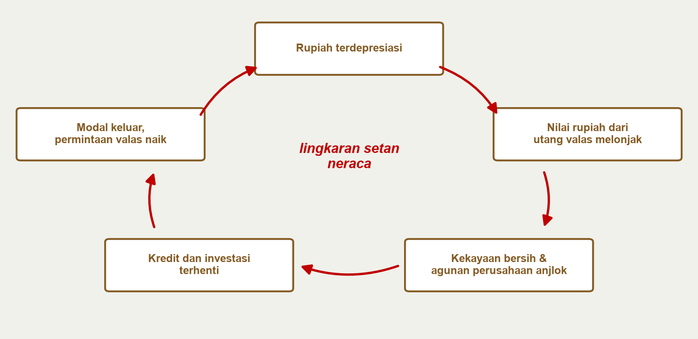{fig-align="center" width="100%"}

::: {.s}
Setiap kotak adalah akibat dari kotak sebelumnya; panah merah menutup lingkaran kembali ke depresiasi.
:::

::: aside
@krugman1999; @abb2001
:::

## Membalik IS-LM-FX {.s}

Dalam **IS-LM-FX** yang sudah kita kuasai, depresiasi bersifat **ekspansioner**: menaikkan $NX$, menggeser IS ke kanan, menaikkan output.

$$ Y = C + I(q) + G + NX(q), \qquad \frac{\partial NX}{\partial q} > 0, \quad \frac{\partial I}{\partial q} < 0 $$

di mana $q$ adalah kurs riil dan kenaikan $q$ berarti depresiasi riil.

- Saluran kedua itulah yang baru: depresiasi menaikkan nilai rupiah dari utang valas, menurunkan kekayaan bersih dan agunan, sehingga **investasi jatuh**.

- Jika utang valas cukup besar, saluran neraca mengalahkan saluran perdagangan dan $\partial Y / \partial q < 0$.

- Depresiasi menjadi **kontraksioner**. Inilah sebabnya resep "biarkan kurs menyesuaikan" gagal di Indonesia pada 1998.

## Dua varian model {.s}

Literatur generasi ketiga terbelah dua soal mengapa *mismatch* menumpuk.

**Rush ke likuiditas** [@changvelasco2001]:

- Perbankan menjalankan transformasi jatuh tempo dengan pendanaan luar negeri jangka pendek.

- Tercipta ekuilibrium ganda ala *bank run*, tetapi pelakunya kreditur asing. Jika semua menolak memperpanjang, semua benar untuk menolak. Tidak perlu ada kesalahan kebijakan.

**Moral hazard** [@cpr1999]:

- Jaminan pemerintah yang implisit membuat utang valas dinilai terlalu murah.

- Modal mengalir ke proyek berimbal hasil rendah dan berisiko tinggi. Krisis adalah saat pasar menyadari jaminan itu tak mungkin ditepati.

Bedanya bukan akademis: yang pertama menuntut **pemberi pinjaman terakhir internasional**, yang kedua menuntut **pembersihan dan reformasi**. IMF 1997 bertindak seolah diagnosisnya yang kedua.

## Sudden stop {.m}

@calvo1998 menyorot sisi arus modalnya. Ingat identitas neraca pembayaran:

$$ CA + FA = 0 $$

di mana $CA$ saldo transaksi berjalan dan $FA$ saldo neraca finansial.

- Defisit transaksi berjalan 5% PDB dibiayai arus masuk modal 5% PDB.

- Jika arus itu berhenti — bukan berbalik, **hanya berhenti** — transaksi berjalan harus bergerak ke nol dalam hitungan bulan.

- Penyesuaian sebesar itu hanya lewat dua saluran: depresiasi riil besar dan kontraksi impor tajam. Keduanya berarti resesi.

**Poinnya:** defisit transaksi berjalan berbahaya bukan karena besarnya, melainkan karena **cara pembiayaannya**.

## Twin crises {.m}

@kaminskyreinhart1999 memeriksa 76 krisis nilai tukar dan 26 krisis perbankan:

- Krisis perbankan dan krisis nilai tukar **berkorelasi erat**, tetapi tidak simetris.

- Krisis **perbankan biasanya mendahului** krisis nilai tukar, lalu krisis nilai tukar memperdalam krisis perbankan.

- Mekanismenya: masalah perbankan memaksa bank sentral menyuntik likuiditas, yang tidak konsisten dengan *peg*; setelah *peg* pecah, *mismatch* mata uang membangkrutkan bank yang tersisa.

- Krisis kembar jauh lebih mahal daripada masing-masingnya sendirian.

Inilah alasan kuliah **krisis keuangan** berikutnya adalah kelanjutan langsung, bukan topik terpisah.

## Lima mata uang Asia {.m}

::: {.s}
Indeks kurs terhadap USD, harian, 30 Juni 1997 = 100. Naik = mata uang melemah. Sumber: BIS.
:::

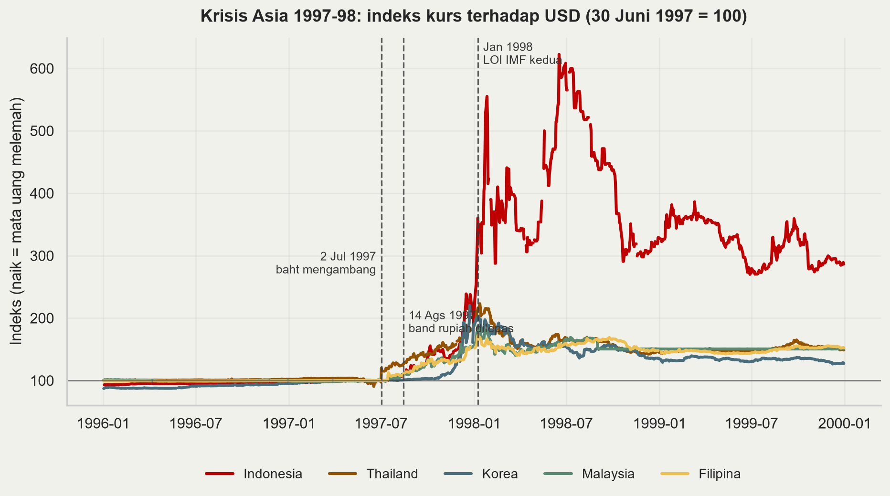{fig-align="center" width="95%"}

## Kronologi Indonesia 1997-98 {.m}

- **2 Juli 1997** Thailand melepas baht setelah cadangannya habis dipakai membela.

- **14 Agustus 1997** Indonesia menghapus *band* dan membiarkan rupiah mengambang. Saat itu dipuji sebagai langkah proaktif.

- **1 November 1997** enam belas bank ditutup **tanpa skema penjaminan yang jelas**, memicu penarikan dana dari bank swasta lain.

- **Januari 1998** LOI kedua dengan IMF. Rupiah menembus 10.000 per dolar.

- **Mei 1998** krisis politik. Puncak kurs pertengahan Juni 1998 sekitar **15.250 per dolar**, dari 2.445 pada Juni 1997 — turun **84% nilainya**.

Empat mata uang lain melemah 72-123% pada puncaknya. Rupiah jauh lebih dalam, dan pulih jauh lebih lambat.

## Mengapa Indonesia terparah {.m}

::: {.s}
Cadangan devisa (biru) dan utang luar negeri jangka pendek (merah), miliar USD. Sumber: World Bank WDI.
:::

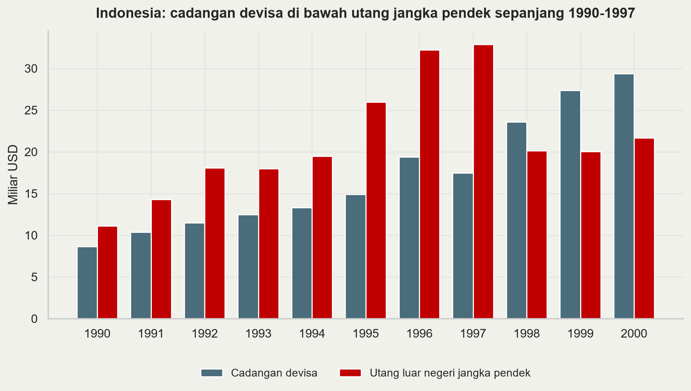{fig-align="center" width="87%"}

::: {.s}
Pada 1996: cadangan **USD 19,4 miliar** melawan utang jangka pendek **USD 32,2 miliar** — rasio **0,60**. Pada 1997 turun ke **0,53**.
:::

## Aritmetika kerentanan {.s}

- Rasio 0,60 berarti: **jika seluruh kreditur jangka pendek menolak memperpanjang serentak, Indonesia hanya mampu membayar 60% dari mereka.**

- Ini persis struktur *bank run*. Dalam @changvelasco2001, struktur seperti ini cukup menciptakan ekuilibrium "semua lari" tanpa perlu ada yang salah pada fundamental lain.

- Sebagian besar adalah **utang korporasi swasta** yang tidak dipantau terpusat. Pemerintah baru tahu besaran sebenarnya setelah krisis berjalan.

- Tidak ada indikator fiskal konvensional yang menangkap risiko ini. Rasio utang pemerintah terhadap PDB Indonesia 1996 tergolong rendah.

Pelajarannya: **yang penting bukan besarnya utang, melainkan siapa yang berutang, dalam mata uang apa, dan berapa lama jatuh temponya.**

## Ongkos krisis {.m}

::: {.s}
Pertumbuhan PDB riil dan inflasi IHK tahunan (kiri, tengah) serta suku bunga pasar uang bulanan (kanan), 1993-2003, persen per tahun. Sumber: World Bank WDI, FRED.
:::

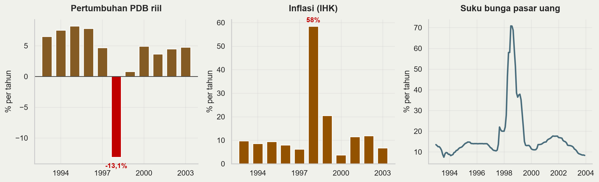{fig-align="center" width="100%"}

::: {.s}
PDB riil **−13,1%**, inflasi **58,5%**, bunga pasar uang memuncak **70,8%**. Biaya rekapitalisasi perbankan diperkirakan melebihi 50% PDB [@enoch2001; @laevenvalencia2020].
:::

## Respons kebijakan yang berbeda {.s}

| Negara | Respons | Hasil jangka pendek |
|---|---|---|
| **Indonesia** | Program IMF, bunga sangat tinggi, 16 bank ditutup tanpa penjaminan | Kontraksi terdalam, krisis politik |
| **Korea** | Program IMF, ditambah perpanjangan utang bank yang dikoordinasi kreditur | Pulih relatif cepat |
| **Thailand** | Program IMF, konsolidasi fiskal | Pemulihan lambat tapi stabil |
| **Malaysia** | **Menolak IMF**, kontrol modal dan mematok ringgit (Sep 1998) | Pemulihan setara, tanpa program IMF |

Perbedaan hasil ini menjadi inti perdebatan yang belum selesai.

## Perdebatan yang belum selesai {.s}

- **@radeletsachs1998**: ini kepanikan likuiditas, bukan kebangkrutan. Bunga tinggi dan konsolidasi fiskal memperdalam resesi dan menghancurkan neraca yang hendak diselamatkan. Yang dibutuhkan perpanjangan utang terkoordinasi.

- **@furmanstiglitz1998**: bukti empiris tidak mendukung bahwa bunga sangat tinggi menstabilkan kurs di negara dengan korporasi rapuh. Justru sebaliknya.

- **Posisi IMF**: kelemahan struktural dan tata kelola memang ada; tanpa reformasi kepercayaan tidak kembali. Bunga tinggi diperlukan untuk menghentikan pelarian modal.

- Penilaian retrospektif IMF kemudian mengakui pengetatan fiskal awal terlalu keras dan penutupan bank Indonesia salah kelola.

**Saya tidak memberi kesimpulan di sini.** Isu ini masih politis, dan Bapak/Ibu punya cukup bekal untuk menimbangnya sendiri.

# Bagian 5 — Pencegahan

## Bisakah krisis diramalkan? {.m}

- **Pendekatan sinyal** [@klr1998]: pantau banyak indikator; sebuah indikator "memberi sinyal" jika melewati ambangnya; urutkan berdasarkan rasio derau terhadap sinyal.

- **Evaluasi lintas krisis** [@frankelsaravelos2012]: dari puluhan indikator yang pernah diusulkan, hanya dua yang konsisten berguna — **tingkat cadangan devisa** relatif terhadap kewajiban jangka pendek, dan **overvaluasi nilai tukar riil**.

- Yang tidak konsisten memprediksi: defisit transaksi berjalan, pertumbuhan, posisi fiskal, keterbukaan perdagangan.

- Perhatikan kaitannya dengan teori: yang bertahan persis variabel kunci generasi pertama dan ketiga. Yang gugur adalah fokus generasi kedua — sebab di sana hasil memang tidak ditentukan.

## Kecukupan cadangan {.m}

::: {.s}
Rasio cadangan devisa terhadap utang luar negeri jangka pendek, 1996 (merah) versus 2024 (biru). Garis putus-putus: aturan Greenspan-Guidotti, rasio 1. Sumber: World Bank WDI.
:::

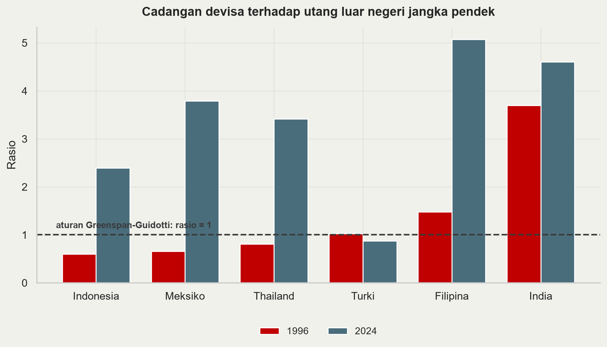{fig-align="center" width="92%"}

## Membaca rasio cadangan {.m}

- Pada 1996, **Indonesia (0,60), Meksiko (0,64) dan Thailand (0,80) semuanya di bawah 1** — dan ketiganya mengalami krisis.

- Pada 2024 ketiganya jauh di atas 1: Indonesia 2,4, Thailand 3,4, Meksiko 3,8. Ini **penumpukan cadangan pasca-krisis**, asuransi mandiri yang dibeli Asia setelah 1998.

- **Turki satu-satunya yang memburuk**, dari sekitar 1,0 ke 0,87. Kita kembali ke Turki dua slide lagi.

- Asuransi ini tidak gratis: cadangan berimbal hasil rendah sementara negara meminjam lebih mahal. Selisihnya biaya tahunan untuk menghindari pengulangan 1998.

## Dari trilemma ke dilemma {.m}

- **Trilemma** yang sudah kita pelajari: dari kurs tetap, modal bebas, dan moneter independen, hanya dua yang bisa dipilih.

- @rey2015: dengan **siklus keuangan global**, pilihan itu lebih sempit lagi. Kondisi keuangan global menjalar ke semua negara, **termasuk yang kursnya mengambang**.

- Maka kurs mengambang **tidak cukup** mengisolasi ekonomi domestik.

- *Trade-off* sesungguhnya adalah **dilemma**: moneter independen atau modal bebas, titik. Rezim kurs hanya mengubah bentuk penyesuaian.

- Konsekuensinya: pengelolaan arus modal dan makroprudensial menjadi bagian sah dari kotak perkakas, bukan penyimpangan.

## Kotak perkakas modern {.s}

*Integrated Policy Framework* [@imf2020ipf; @basu2020] menolak resep tunggal: **bauran optimal bergantung pada kondisi awal** sebuah negara.

| Instrumen | Paling berguna ketika |
|---|---|
| Suku bunga kebijakan | Ekspektasi inflasi terjangkar, *mismatch* neraca kecil |
| Intervensi valas | Pasar valas dangkal, guncangan bersifat sementara |
| *Capital flow management* | Arus masuk deras dan berjangka pendek |
| Makroprudensial | *Mismatch* mata uang menumpuk di neraca swasta |

- Bandingkan 1997, ketika resepnya seragam: naikkan bunga, perketat fiskal, biarkan kurs menyesuaikan.

- Bagi ekonomi dengan utang valas swasta besar, resep itu memperkuat lingkaran setan neraca.

- IMF merevisi *Institutional View* [@imf2022iv] untuk mengakui pengelolaan arus modal secara preventif.

## Jaring pengaman {.s}

Cadangan devisa adalah asuransi mandiri yang mahal. Alternatifnya asuransi bersama.

- ***Swap lines* bank sentral.** The Fed membukanya pada 2008 dan 2020. Sangat efektif, tetapi aksesnya **selektif dan tidak dijanjikan**, jadi tidak bisa diandalkan sebagai rencana.

- **CMIM dan BSA ASEAN+3.** Lahir langsung dari 1997-98. Kapasitasnya nyata, tetapi sebagian besar penarikan masih ditautkan pada program IMF.

- **Flexible Credit Line IMF.** Jalur pencegahan untuk negara berfundamental kuat. Masalahnya **stigma**: memintanya bisa dibaca pasar sebagai sinyal bahaya.

Satu pertanyaan di balik ketiganya: bagaimana menyediakan likuiditas darurat tanpa menciptakan *moral hazard* yang memicu krisis berikutnya.

## Argentina 2001-02 {.m}

::: {.s}
Peso per USD (coklat, kiri) dan cadangan devisa dalam miliar USD (biru, kanan), 1999-2003. Sumber: BIS, FRED.
:::

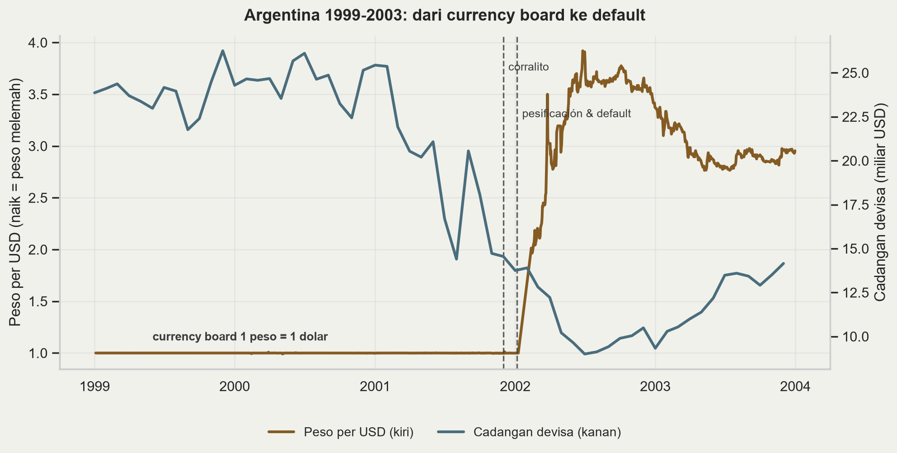{fig-align="center" width="100%"}

## Argentina dan krisis utang {.s}

- Sejak 1991 Argentina menjalankan **currency board**: satu peso sama dengan satu dolar, dijamin undang-undang. Bentuk komitmen paling kaku, sehingga seharusnya paling kredibel.

- Pola yang sama dengan Meksiko: sepanjang 2001 **kurs datar di 1,00 sementara cadangan anjlok dari USD 25 miliar ke sekitar USD 14 miliar**. Kekakuan kurs menyembunyikan tekanan, tidak menghilangkannya.

- Desember 2001: ***corralito***, pembatasan penarikan simpanan. Menyusul gagal bayar sekitar USD 80-100 miliar.

- Januari-Februari 2002: ***pesificación* asimetris** — utang bank dikonversi 1:1, simpanan 1,4:1. Peso mencapai hampir **4 per dolar**.

**Urutannya:** krisis nilai tukar, krisis perbankan, krisis utang berdaulat, dalam hitungan minggu. Kuliah krisis utang melanjutkan dari titik ini.

::: aside
@hausmannvelasco2002
:::

## Episode kontemporer {.m}

::: {.s}
Indeks kurs terhadap USD, bulanan, Januari 2018 = 100, **skala logaritmik**. Naik = mata uang melemah. Sumber: BIS.
:::

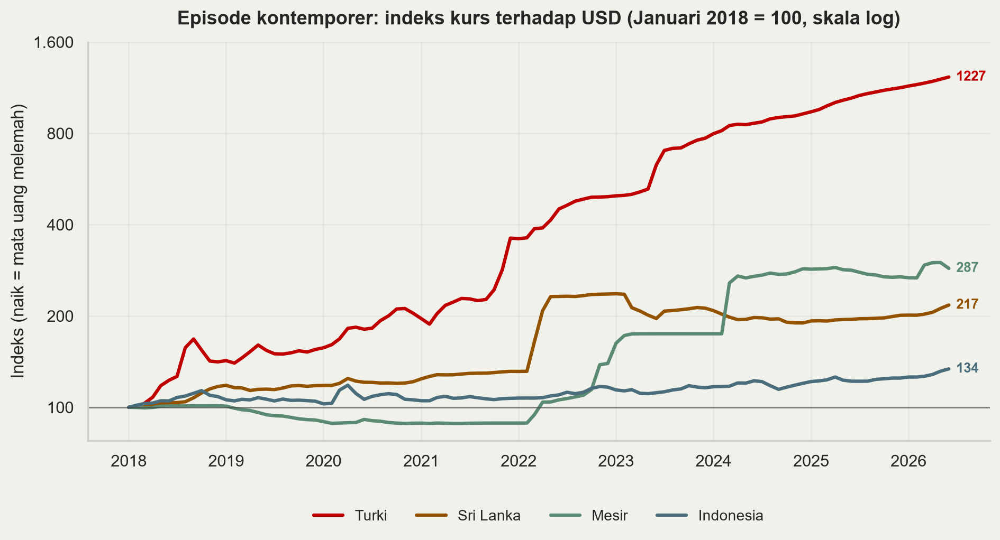{fig-align="center" width="98%"}

## Membaca episode kontemporer {.s}

- **Turki** paling ekstrem: indeks sekitar 1.227, artinya lira kehilangan sekitar 92% nilainya sejak 2018. Pemicunya penurunan suku bunga di tengah inflasi tinggi — kebalikan resep ortodoks. Skema deposito terlindung kurs (KKM) sejak akhir 2021 memindahkan risiko kurs ke neraca negara.

- **Sri Lanka** pola klasik: kurs ditahan datar sampai awal 2022, lalu terjun ketika cadangan habis. Diikuti gagal bayar utang luar negeri — lagi-lagi nilai tukar lalu utang.

- **Mesir** pola tangga: beberapa devaluasi terpisah, masing-masing setelah periode penahanan kurs.

- **Indonesia** di 134 — melemah, tetapi berbeda ordo besarannya.

Ciri yang sama pada ketiga episode pertama: kurs ditahan lebih lama daripada yang didukung cadangan.

## Indonesia hari ini {.m}

::: {.s}
Rupiah per USD dalam ribuan (merah, kiri) dan cadangan devisa dalam miliar USD (cyan, kanan), bulanan, 2010-2026. Sumber: BIS, FRED.
:::

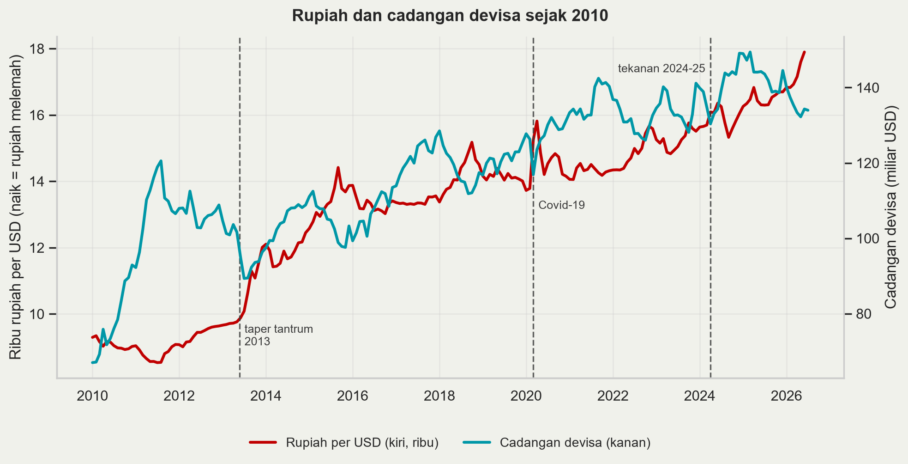{fig-align="center" width="100%"}

## Menilai posisi Indonesia {.s}

- **2013, *taper tantrum*.** Indonesia masuk *fragile five*. Pemicunya eksternal murni, tetapi dalamnya tekanan ditentukan kerentanan domestik: defisit transaksi berjalan dan ketergantungan arus portofolio [@basri2017].

- **2024-25.** Rupiah tertekan seiring bunga AS tinggi dan ketidakpastian global. Respons BI: SRBI untuk menahan arus keluar, intervensi spot, DNDF dan SBN, serta retensi devisa hasil ekspor SDA (PP 8/2025).

- **Bandingkan 1996**: rasio cadangan terhadap utang jangka pendek naik dari 0,60 ke sekitar 2,4; kurs mengambang, bukan dipatok; utang valas korporasi dipantau dan wajib lindung nilai.

**Pertanyaan untuk kelas:** dengan kerangka mana tekanan rupiah 2024-25 dinilai, dan apakah retensi devisa itu manajemen arus modal yang sah atau distorsi?

# Penutup

## Sintesis {.s}

| | Yang dijelaskan dengan baik | Yang dilewatkan |
|---|---|---|
| **Generasi pertama** | Krisis berakar fiskal; mengapa keruntuhan mendadak meski fundamental terbaca | Krisis pada negara berfiskal sehat |
| **Generasi kedua** | Keruntuhan sebagai pilihan; penularan; mengapa kredibilitas bernilai | Daya prediksi; peran neraca |
| **Generasi ketiga** | Asia 1997; depresiasi kontraksioner; mengapa mata uang dan bank jatuh bersama | Pemicu; kapan lingkaran mulai |

- Ketiganya melengkapi, bukan menggantikan.

- **Indonesia 1997-98** pada intinya generasi ketiga — *mismatch* neraca dan *sudden stop* — dengan unsur generasi kedua setelah Mei 1998, ketika ketidakpastian politik menggeser ekspektasi secara mandiri.

## Kesimpulan {.m}

1. **Krisis mendadak karena arbitrase, bukan karena kejutan.** Keruntuhan yang dapat diantisipasi tidak bisa menjadi ekuilibrium.

2. **Yang menentukan bukan besarnya utang, melainkan strukturnya**: mata uang, jatuh tempo, dan siapa yang menanggungnya.

3. **Depresiasi tidak selalu ekspansioner.** Dengan utang valas besar ia kontraksioner, dan itu membalik intuisi IS-LM-FX.

4. **Cadangan devisa dan overvaluasi riil** adalah dua indikator peringatan dini yang bertahan dari puluhan yang diusulkan.

5. **Tidak ada rezim kurs yang bebas biaya.** Yang ada hanya pilihan di mana penyesuaian muncul: kurs, cadangan, suku bunga, atau output.

## Minggu depan {.m}

- **Krisis keuangan.** Mengapa bank rentan secara bawaan (*bank run*, transformasi jatuh tempo), bagaimana penjaminan simpanan dan pemberi pinjaman terakhir bekerja, apa yang membuat 2008 berbeda. Sambungannya: *twin crises* [@kaminskyreinhart1999] dan penutupan 16 bank November 1997.

- **Krisis utang.** Mengapa negara berdaulat gagal bayar padahal tidak ada pengadilan yang bisa menyitanya, bagaimana restrukturisasi berjalan, apa itu *debt intolerance*. Sambungannya: Argentina 2001-02 dan Sri Lanka 2022.

Indonesia 1998 adalah ketiganya sekaligus. Itulah sebabnya ketiga kuliah ini satu kesatuan.

## Referensi {.s}

:::: columns

::: {.column width="49%"}
- Aghion, Bacchetta & Banerjee (2001), *EER*
- Basri (2017), *BIES*
- Basu dkk. (2020), IMF WP/20/121
- Calvo (1998), *JAE*
- Calvo & Mendoza (1996), *JIE*
- Chang & Velasco (2001), *QJE*
- Corsetti, Pesenti & Roubini (1999), *EER*
- Eichengreen, Hausmann & Panizza (2007)
- Eichengreen, Rose & Wyplosz (1995), *Economic Policy*
- Eichengreen & Wyplosz (1993), *BPEA*
- Enoch dkk. (2001), IMF WP/01/52
- Feenstra & Taylor (2017), bab 20
- Flood & Garber (1984), *JIE*
- Frankel & Rose (1996), *JIE*
- Frankel & Saravelos (2012), *JIE*
:::

::: {.column width="49%"}
- Furman & Stiglitz (1998), *BPEA*
- Hausmann & Velasco (2002), *Brookings Trade Forum*
- IMF (2020), *Integrated Policy Framework*
- IMF (2022), *Institutional View*
- Ilzetzki, Reinhart & Rogoff (2019), *QJE*
- Kaminsky, Lizondo & Reinhart (1998), *IMF SP*
- Kaminsky & Reinhart (1999), *AER*
- Krugman (1979), *JMCB*
- Krugman (1999), *ITPF*
- Laeven & Valencia (2020), *IMF Econ Rev*
- Morris & Shin (1998), *AER*
- Obstfeld (1986), *AER*; (1996), *EER*
- Obstfeld, Shambaugh & Taylor (2010), *AEJ: Macro*
- Radelet & Sachs (1998), *BPEA*
- Rey (2015), NBER WP 21162
:::

::::
